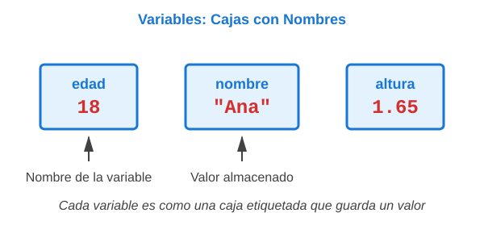
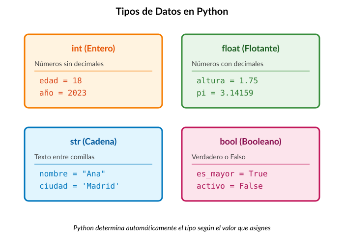
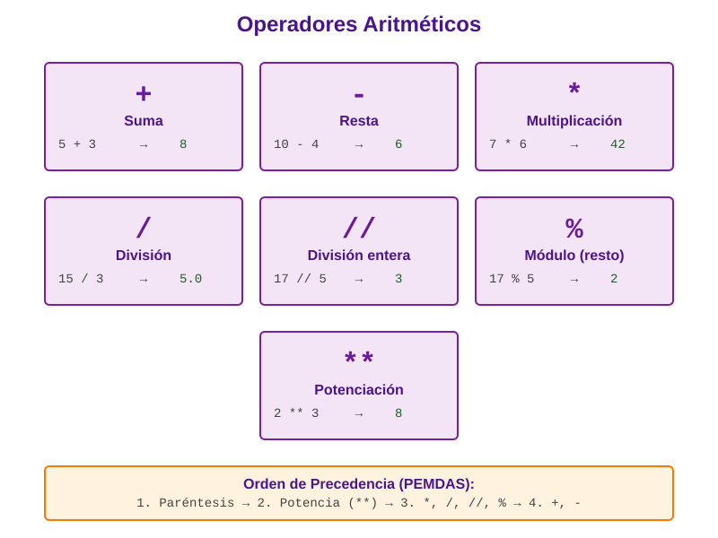
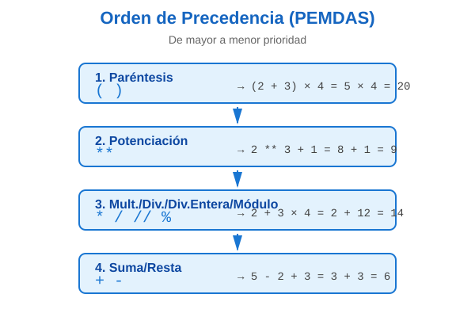
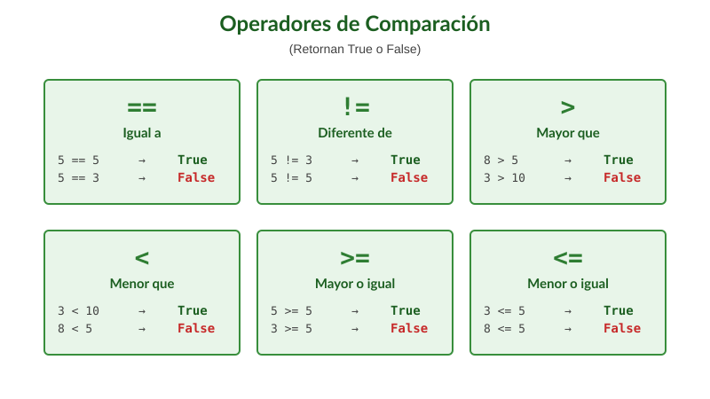
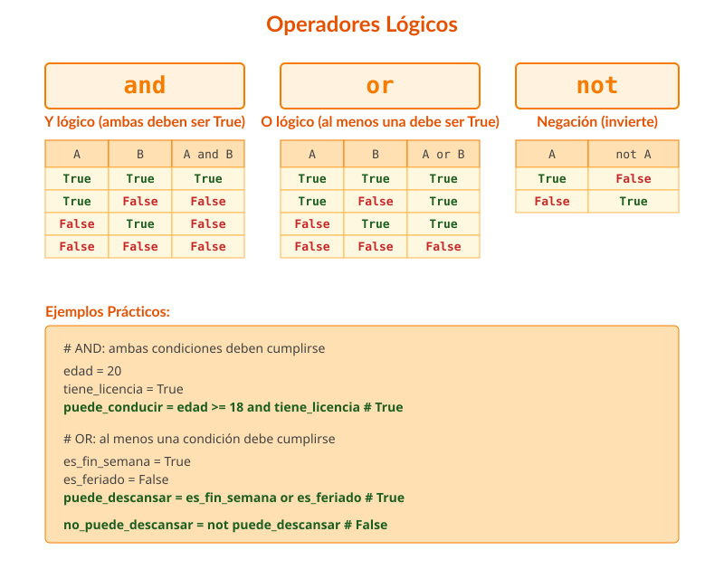
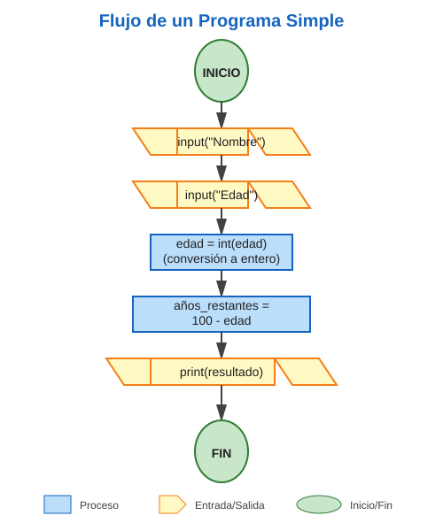
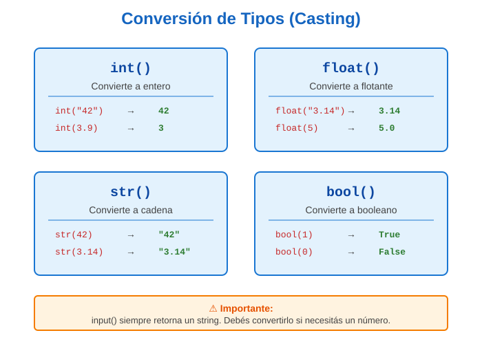

(fundamentos)=
# Fundamentos de Programación en Python

::::{tip} Mapa del Capítulo
:class: dropdown

Este capítulo es tu introducción al mundo de la programación. Vas a aprender los conceptos básicos que usarás **todos los días** como programador.

```{mermaid}
graph TD
    A[Introducción] --> B[Variables]
    B --> C[Tipos de Datos]
    C --> D[Operadores]
    D --> E[Entrada/Salida]
    E --> F[Conversión de Tipos]
    F --> G[Errores Comunes]
    G --> H[Ejercicios]
    
    style A fill:#e3f2fd
    style B fill:#e3f2fd
    style C fill:#e3f2fd
    style D fill:#e3f2fd
    style E fill:#e3f2fd
    style F fill:#e3f2fd
    style G fill:#fff3e0
    style H fill:#c8e6c9
```

**⏱️ Tiempo estimado:** 4-6 horas (incluye lectura, práctica y ejercicios)

**Lo que vas a aprender:**
- Cómo crear y usar variables para guardar información
- Los 4 {term}`tipos de datos <Tipo de dato>` básicos: números, texto y booleanos
- Operadores para hacer cálculos y comparaciones
- Cómo interactuar con el usuario
- Errores comunes y cómo evitarlos

**Al final de este capítulo podrás:**
- Escribir programas simples que pidan datos y muestren resultados
- Hacer cálculos matemáticos en Python
- Entender mensajes de error y corregirlos
::::

## Introducción y Motivación

### ¿Qué es programar? 

Imaginate que tenés un robot muy obediente, pero que solo entiende instrucciones muy precisas. No podés decirle "hacé la tarea", sino que tenés que explicarle paso por paso: "tomá el lápiz", "abrí el cuaderno en la página 5", "escribí tu nombre", etc. **Programar es exactamente eso: dar instrucciones muy detalladas y precisas a una computadora para que resuelva problemas.**

La computadora es como ese robot: increíblemente rápida y precisa, pero necesita que le expliques **exactamente** qué hacer. A través de este capítulo, vas a aprender el "lenguaje" para comunicarte con ella.

### ¿Por qué Python? 🐍

Python es como el español de los lenguajes de programación: es claro, fácil de leer y lo entiende mucha gente (o mejor dicho, muchas computadoras). Compará estos dos ejemplos:

:::::{grid} 1 1 2 2

::::{grid-item-card} Otros lenguajes (más complicados)
```java
public class HelloWorld {
    public static void main(String[] args) {
        System.out.println("¡Hola Mundo!");
    }
}
```
::::

::::{grid-item-card} Python (¡simple!)
```python
print("¡Hola Mundo!")
```
::::

:::::

¿Ves la diferencia? Python te permite concentrarte en **qué** querés hacer, no en detalles técnicos complicados.

::::{important} ¿Por qué estos conceptos son importantes?
Los fundamentos que vas a aprender en este capítulo son **universales** en programación. Son como aprender a sumar, restar y multiplicar: una vez que los sabés, podés aplicarlos en cualquier contexto. Lo mismo pasa con variables, {term}`tipos de datos <Tipo de dato>` y operadores: los vas a usar en **cualquier** lenguaje de programación que aprendas en el futuro.

```{mermaid}
graph LR
    A[Fundamentos<br/>Python] --> B[JavaScript]
    A --> C[Java]
    A --> D[C++]
    A --> E[Cualquier<br/>lenguaje]
    
    style A fill:#e3f2fd,stroke:#1976d2,stroke-width:3px
    style B fill:#fff3e0,stroke:#f57c00
    style C fill:#fff3e0,stroke:#f57c00
    style D fill:#fff3e0,stroke:#f57c00
    style E fill:#fff3e0,stroke:#f57c00
```
::::

---

(primer-programa)=
## Tu Primer Programa

### El legendario "Hola Mundo" 👋

Desde 1972, **todos** los programadores del mundo empiezan con el mismo programa: mostrar "Hola Mundo" en la pantalla. Es una tradición que conecta a millones de personas que aprenden a programar. ¡Ahora te toca a vos!

```{code-cell} ipython3
print("¡Hola Mundo!")
```

:::{tip} ¡Felicitaciones!

Si ejecutaste ese código y viste `"¡Hola Mundo!"` en la pantalla, **ya sos un programador**. No importa si no entendés todo todavía: acabás de darle una instrucción a la computadora, que ejecutó, y eso, es programar.
:::

### Anatomía de tu primer programa 

Diseccionemos ese programa línea por línea:

:::::{grid} 1 1 2 2

::::{grid-item}
```python
print("¡Hola Mundo!")
```
::::

::::{grid-item}
```{mermaid}
graph LR
    A["print("] --> B["'¡Hola Mundo!'"]
    B --> C[")"]
    
    style A fill:#e3f2fd
    style B fill:#fff3e0
    style C fill:#c8e6c9
```
::::

:::::

- **`print`** es una **función** (un comando que hace algo)
- **`(...)`** los paréntesis indican que es una función
- **`"¡Hola Mundo!"`** es el texto (string) que queremos mostrar

:::{note} Nota sobre las comillas
El texto **siempre** va entre comillas (`"..."` o `'...'`). Sin comillas, Python pensaría que es el nombre de una {term}`variable`.

```python
print("Hola")  # ✓ Correcto: muestra "Hola"
print(Hola)    # ✗ Error: busca una variable llamada "Hola"
```
:::

La función {term}`print()` muestra texto en la pantalla. El texto entre comillas se llama **cadena de texto** o **string**.

:::{tip} Ejecutando código Python
Para ejecutar código Python:
1. Visita nuestro Jupyterlite en el cuaderno [bienvenida.ipynb](https://ingcom-unrn.github.io/jupyterlite/lab/index.html?path=hola.ipynb)
2. Hacé un click en la celda con el código del saludo y ejecutalo con ▶️ o con el atajo de teclado CTRL + Enter.
3. Mirá el resultado
:::

**¡Probalo vos mismo!** Modificá el mensaje y volvé a ejecutarlo:

```{code-cell} ipython3
print("¡Hola Mundo!")
print("Esta es mi primera línea de código en Python")
```

---

(variables)=
## Variables: Almacenando Información

### ¿Qué es una variable? 

Imaginate que tenés muchas cajas para guardar cosas. Cada caja tiene una **etiqueta** con un nombre (como "juguetes", "libros", "ropa") y **adentro** guardás algo específico. Una {term}`variable` en programación es exactamente eso: una caja con un nombre donde guardás información.



::::{tip} Analogía del mundo real

Pensá en tu mochila escolar:
- **Variable**: `peso_mochila`
- **Valor**: `5` (kilogramos)

Cuando decís "mi mochila pesa 5 kilos", estás creando mentalmente una "variable" llamada `peso_mochila` que almacena el valor `5`. En Python hacemos exactamente lo mismo, pero escribiéndolo:

```python
peso_mochila = 5
```
::::

La diferencia es que en la computadora podés tener un montón de estas "cajas" ({term}`variables <Variable>`) al mismo tiempo, y Python te ayuda a organizarlas.

### Crear una Variable

En Python, crear una {term}`variable` es muy simple: elegís un nombre y le asignás un valor usando el {term}`operador de asignación <Asignación>` `=`:

```{code-cell} ipython3
edad = 18
nombre = "Ana"
altura = 1.65
es_estudiante = True
```

**¡Probalo interactivamente!** Creá tus propias variables y mostrá sus valores:

```{code-cell} ipython3
# Creamos variables
edad = 18
nombre = "Ana"
altura = 1.65
es_estudiante = True

# Mostramos los valores
print(f"Nombre: {nombre}")
print(f"Edad: {edad}")
print(f"Altura: {altura}m")
print(f"¿Es estudiante?: {es_estudiante}")
```

:::{note} Nomenclatura de variables 

Según la {ref}`0x0001h`, los nombres de variables deben ser descriptivos, cuando hay pocas cajas es relativamente fácil seguir que hacen en el programa, pero esto ser claro los va a ayudar a leer de forma más directa sus programas. Y por, otro lado, en Python, se usa {term}`snake_case`: palabras en minúscula separadas por guiones bajos.

**Nombres apropiados:**
- `edad_usuario`
- `precio_total`
- `cantidad_productos`

**Nombres inapropiados:**
- `x`, `a`, `dato` (poco descriptivos)
- `PrecioTotal` (no es snake_case)

:::

### Reglas para nombres de variables

1. Deben comenzar con una letra y pueden comenzar con guión bajo (`_`)
2. Pueden contener letras, números y guiones bajos
3. No pueden contener espacios ni caracteres especiales
4. Son sensibles a mayúsculas y minúsculas (`edad` ≠ `Edad`)
5. No pueden ser {term}`palabras reservadas <Palabra reservada>` de Python (`if`, `for`, `while`, etc.)

```python
# Válido
nombre = "Carlos"
edad_2023 = 20
_valor_privado = 100

# Inválido
# 2nombre = "Error"      # No puede empezar con número
# mi-variable = 5        # No puede contener guiones
# for = 10               # No puede ser palabra reservada
```

### Reasignación de Variables

Podés cambiar el valor de una {term}`variable` en cualquier momento:

```{code-cell} ipython3
contador = 0
print(contador)  # Salida: 0

contador = 5
print(contador)  # Salida: 5

contador = contador + 1
print(contador)  # Salida: 6
```

**Experimentá con reasignación:**

```{code-cell} ipython3
# Inicializa el contador
contador = 0
print(f"Valor inicial: {contador}")

# Cambio el valor
contador = 5
print(f"Después de asignar 5: {contador}")

# Incremento en 1
contador = contador + 1
print(f"Después de incrementar: {contador}")

# Experimento: duplicamos el valor
contador = contador * 2
print(f"Después de duplicar: {contador}")
```

:::{important} Inicialización de Variables
Según la {ref}`0x0003h`, siempre debés inicializar las {term}`variables <Variable>` antes de usarlas. Python te dará un error si intentás usar una {term}`variable` que no existe:

```python
# Incorrecto
print(resultado)  # NameError: name 'resultado' is not defined

# Correcto
resultado = 0
print(resultado)  # Salida: 0
```
:::

---

(tipos-datos)=
## Tipos de Datos Básicos

### ¿Por qué existen diferentes tipos? 

Así como en el mundo real usamos diferentes tipos de información (números para contar, palabras para hablar, respuestas de sí/no para decidir), Python necesita saber **qué tipo** de información estás guardando en cada variable. No es lo mismo sumar números (`5 + 3 = 8`) que unir palabras (`"Hola" + "Mundo" = "HolaMundo"`).

Python tiene cuatro tipos básicos que son como los "bloques de construcción" de cualquier programa:



Veamos cada uno en detalle:

### Números Enteros (`int`) 

Los **enteros** son números sin decimales. Son los que usarías para contar cosas: personas, días, años, etc.

::::{grid} 1 1 2 2

:::{grid-item}
**Ejemplos de la vida real:**
- Tu edad: 18 años
- Días de la semana: 7
- Temperatura bajo cero: -5°C
- Habitantes de una ciudad: 1.000.000
:::

:::{grid-item}
**En Python:**
```python
edad = 18
temperatura = -5
año = 2023
poblacion = 1000000
```
:::

::::

:::{tip} ¿Cuándo usar `int`?
Usá enteros cuando:
- Contás cosas que no se pueden dividir (personas, autos, libros)
- Trabajás con años, días, edades
- No necesitás precisión decimal
:::

```{code-cell} ipython3
edad = 18
temperatura = -5
año = 2023
poblacion = 1000000

print(f"Edad: {edad}")
print(f"Temperatura: {temperatura}°C")
print(f"Año: {año}")
print(f"Población: {poblacion:,} habitantes")
```

### Números de Punto Flotante (`float`) 

Los **flotantes** son números con decimales. Reciben el nombre de "punto flotante" por la forma en la que se guardan las partes enteras y decimales en memoria. Los detalles de esto tienen que ver con que entre dos números decimales hay infinitos números decimales, mientras que la memoria de la computadora es limitada, sin embargo, lo veremos durante la cursada de la carrera, ya que tiene algunos efectos interesantes.

::::{grid} 1 1 2 2

:::{grid-item}
**Ejemplos de la vida real:**
- Tu altura: 1.75 metros
- El valor de π (pi): 3.14159
- Temperatura precisa: 36.5°C
:::

:::{grid-item}
**En Python:**
```python
altura = 1.75
pi = 3.14159
temperatura = 36.5
precio = 99.99
```
:::

::::

:::{attention} Los decimales en Python
En Python (y en casi todos los lenguajes de programación), los decimales se escriben con **punto** (`.`), no con coma (`,`). Esta distinción es muy importante, porque utilizar la coma dará código válido pero con un significado completamente diferente.

```python
# ✓ Correcto
precio = 99.99

# ✗ Incorrecto
precio = 99,99  # ¡Esto crea algo diferente! Es código Python válido
```
:::

```{code-cell} ipython3
altura = 1.75
pi = 3.14159
temperatura = 36.5
precio = 99.99

print(f"Altura: {altura} m")
print(f"Pi: {pi}")
print(f"Temperatura: {temperatura}°C")
print(f"Precio: ${precio}")
```

:::{warning} Precisión de flotantes
Los números de punto flotante pueden tener pequeños errores de redondeo:
```{code-cell} ipython3
resultado = 0.1 + 0.2
print(resultado)  # Salida: 0.30000000000000004
```
Para comparaciones de números decimales, no uses `==`. Esto se verá más adelante en la carrera y está relacionado con el hecho de que los decimales son infinitos entre cualquier par de ellos mientras que la memoria de la computadora no lo es.
:::

### Cadenas de Texto (`str`) 

Las **cadenas**(o *strings* en inglés) son simplemente **texto**: palabras, frases, letras. Se llaman "cadenas" porque son como una cadena de caracteres (letras) unidos uno tras otro.

::::{grid} 1 1 2 2

:::{grid-item}
**Ejemplos de la vida real:**
- Tu nombre: "María"
- Un mensaje: "¡Hola!"
- Una dirección: "Calle 123"
- Una pregunta: "¿Cómo estás?"
:::

:::{grid-item}
**En Python:**
```python
nombre = "María"
apellido = 'González'
mensaje = "¡Hola! ¿Cómo estás?"
direccion = 'Calle 123, Ciudad'
```
:::

::::

:::{note} Comillas simples vs. dobles
En Python podés usar comillas simples `'...'` o dobles `"..."`, ¡son exactamente lo mismo! Elegí la que más te guste, pero no olvides ser consistente:

```python
nombre1 = "Ana"      # Con comillas dobles
nombre2 = 'Pedro'    # Con comillas simples
# Ambas son válidas y equivalentes
```

La única diferencia es cuando querés incluir comillas **dentro** del texto:
```python
mensaje1 = "Ella dijo: 'Hola'"   # Simples dentro de dobles ✓
mensaje2 = 'Él dijo: "Hola"'     # Dobles dentro de simples ✓
```
:::

```{code-cell} ipython3
nombre = "María"
apellido = 'González'
mensaje = "¡Hola! ¿Cómo estás?"
direccion = 'Calle 123, Ciudad'

print(nombre)
print(apellido)
print(mensaje)
print(direccion)
```

**Cadenas multilínea:**

```{code-cell} ipython3
texto_largo = """Este es un texto
que ocupa múltiples
líneas."""

print(texto_largo)
```

**Operaciones con strings:**

```{code-cell} ipython3
# Concatenación (unir strings)
nombre = "Juan"
apellido = "Pérez"
nombre_completo = nombre + " " + apellido
print(nombre_completo)  # Salida: Juan Pérez

# Repetición
separador = "-" * 20
print(separador)  # Salida: --------------------

# Longitud
mensaje = "Hola Mundo"
largo = len(mensaje)
print(largo)  # Salida: 10
```

### Booleanos (`bool`)

Los **booleanos** son el tipo más simple: solo pueden tener **dos valores posibles**: `True` (verdadero) o `False` (falso). Es como un interruptor de luz: está prendido o apagado, no hay término medio.

::::{grid} 1 1 2 2

:::{grid-item}
**Ejemplos de la vida real:**
- ¿Es mayor de edad? Sí/No
- ¿Está lloviendo? Verdadero/Falso
- ¿Tenés descuento? True/False
- ¿El usuario está logueado? ✓/✗
:::

:::{grid-item}
**En Python:**
```python
es_mayor_edad = True
tiene_descuento = False
esta_lloviendo = False
usuario_activo = True
```
:::

::::

:::{important} ¿Para qué sirven?
Los booleanos son **fundamentales** para que tu programa tome decisiones. Por ejemplo:

```python
if es_mayor_edad:
    print("Puede votar")
else:
    print("No puede votar todavía")
```

Vas a ver esto en detalle en el próximo capítulo, pero la idea es: los booleanos permiten que tu programa haga cosas diferentes según si algo es verdadero o falso.
:::

:::{caution} Primera letra en mayúscula
En Python, los valores booleanos se escriben con la **primera letra en MAYÚSCULA**:

```python
# ✓ Correcto
activo = True
inactivo = False

# ✗ Incorrecto
activo = true    # ¡Error! Python no reconoce "true"
activo = TRUE    # ¡Error! Tampoco "TRUE"
```
:::

```{code-cell} ipython3
es_mayor_edad = True
tiene_descuento = False
esta_lloviendo = False

print(f"¿Es mayor de edad? {es_mayor_edad}")
print(f"¿Tiene descuento? {tiene_descuento}")
print(f"¿Está lloviendo? {esta_lloviendo}")
```

### Verificar el Tipo de una Variable

Usá la función `type()` para conocer el tipo de una {term}`variable`:

```{code-cell} ipython3
edad = 25
print(type(edad))  # Salida: <class 'int'>

altura = 1.75
print(type(altura))  # Salida: <class 'float'>

nombre = "Ana"
print(type(nombre))  # Salida: <class 'str'>

activo = True
print(type(activo))  # Salida: <class 'bool'>
```

**Experimentá con {term}`tipos de datos <Tipo de dato>`:**

```{code-cell} ipython3
# Diferentes tipos de datos
edad = 25
altura = 1.75
nombre = "Ana"
activo = True

# Verificamos los tipos
print(f"edad es de tipo: {type(edad)}")
print(f"altura es de tipo: {type(altura)}")
print(f"nombre es de tipo: {type(nombre)}")
print(f"activo es de tipo: {type(activo)}")

# Ejemplo: tipo de operaciones
resultado_suma = 5 + 3
resultado_division = 10 / 2
print(f"\n5 + 3 = {resultado_suma}, tipo: {type(resultado_suma)}")
print(f"10 / 2 = {resultado_division}, tipo: {type(resultado_division)}")
```

### Tabla resumen de tipos básicos

| Tipo | Nombre | Ejemplo | Descripción |
|------|--------|---------|-------------|
| `int` | Entero | `42`, `-10`, `0` | Números enteros sin decimales |
| `float` | Flotante | `3.14`, `-0.5`, `2.0` | Números con decimales |
| `str` | Cadena | `"Hola"`, `'Python'` | Texto entre comillas |
| `bool` | Booleano | `True`, `False` | Valores de verdad |

---

(operadores-aritmeticos)=
## Operadores Aritméticos

### ¿Qué son los operadores? 

Los {term}`operadores <Operador>` son símbolos que le dicen a Python qué operación matemática querés hacer. Es como los botones de una calculadora: cada uno hace algo diferente (sumar, restar, multiplicar, etc.).



Python tiene los {term}`operadores <Operador>` que ya conocés de matemática, ¡y algunos extras muy útiles!

### Operadores básicos

```{code-cell} ipython3
# Suma
resultado = 5 + 3
print(resultado)  # Salida: 8

# Resta
resultado = 10 - 4
print(resultado)  # Salida: 6

# Multiplicación
resultado = 7 * 6
print(resultado)  # Salida: 42

# División (siempre retorna float)
resultado = 15 / 3
print(resultado)  # Salida: 5.0

# División entera (descarta decimales)
resultado = 17 // 5
print(resultado)  # Salida: 3

# Módulo (resto de la división)
resultado = 17 % 5
print(resultado)  # Salida: 2

# Potenciación
resultado = 2 ** 3
print(resultado)  # Salida: 8
```

**¡Experimentá con operadores aritméticos!**

```{code-cell} ipython3
# Operadores aritméticos básicos
print("=== OPERADORES ARITMÉTICOS ===")
print(f"5 + 3 = {5 + 3}")
print(f"10 - 4 = {10 - 4}")
print(f"7 * 6 = {7 * 6}")
print(f"15 / 3 = {15 / 3}")
print(f"17 // 5 = {17 // 5} (división entera)")
print(f"17 % 5 = {17 % 5} (módulo/resto)")
print(f"2 ** 3 = {2 ** 3} (potencia)")

# Ejemplo práctico: cálculo de área
base = 5
altura = 10
area = (base * altura) / 2
print(f"\nÁrea de triángulo (base={base}, altura={altura}): {area}")
```

:::{note} Espaciado en Operadores
Siguiendo la {ref}`0x0004h`, siempre debés colocar un espacio antes y después de cada operador binario:

```python
# Incorrecto
resultado=10+5*2

# Correcto
resultado = 10 + 5 * 2
```
:::

### Orden de Precedencia

Cuando tenés varias operaciones en una misma expresión, Python necesita saber **en qué orden** hacerlas. Imaginate que tenés que resolver: `2 + 3 × 4`. ¿Hacés primero la suma o la multiplicación? 

Python sigue el orden matemático estándar que aprendiste en la escuela (PEMDAS):



:::{important} La regla PEMDAS
1. **P**aréntesis → Primero lo que está entre `( )`
2. **E**xponenciación → Después las potencias `**`
3. **M**ultiplicación → `*`
4. **D**ivisión → Luego , `/`, `//`, `%` (de izquierda a derecha)
4. **AS**dición / Resta → Por último `+`, `-` (de izquierda a derecha)
:::

```{code-cell} ipython3
# Sin paréntesis
resultado = 2 + 3 * 4
print(resultado)  # Salida: 14 (primero 3*4, luego +2)

# Con paréntesis
resultado = (2 + 3) * 4
print(resultado)  # Salida: 20 (primero 2+3, luego *4)
```

:::{tip} Usar paréntesis para claridad
Aunque conozcas la precedencia de operadores, usar paréntesis hace el código explícitamente claro:

```{code-cell} ipython3
# Menos claro
total = precio * cantidad + descuento * 0.1

# Más claro
total = (precio * cantidad) + (descuento * 0.1)
```
:::

### Tabla Resumen de Operadores Aritméticos

::::{tab-set}

:::{tab-item} Operadores Básicos
| Operador | Operación | Ejemplo | Resultado | Tipo |
|----------|-----------|---------|-----------|------|
| `+` | Suma | `5 + 3` | `8` | `int` |
| `-` | Resta | `10 - 4` | `6` | `int` |
| `*` | Multiplicación | `7 * 6` | `42` | `int` |
| `/` | División | `15 / 3` | `5.0` | `float` |
:::

:::{tab-item} Operadores Avanzados
| Operador | Operación | Ejemplo | Resultado | ¿Para qué sirve? |
|----------|-----------|---------|-----------|------------------|
| `//` | División entera | `17 // 5` | `3` | Descarta decimales |
| `%` | Módulo (resto) | `17 % 5` | `2` | Da el resto de la división |
| `**` | Potenciación | `2 **3` | `8` | Eleva a una potencia |
:::

:::{tab-item} Ejemplos Prácticos
```python
# División normal vs. entera
print(17 / 5)   # 3.4 (resultado con decimales)
print(17 // 5)  # 3 (solo la parte entera)

# Módulo: útil para saber si un número es par
print(10 % 2)   # 0 (es par, resto 0)
print(11 % 2)   # 1 (es impar, resto 1)

# Potenciación: para áreas y volúmenes
radio = 5
area = 3.14159 * radio **2  # π × r²
print(f"Área del círculo: {area}")
```
:::

::::

---

(operadores-comparacion)=
## Operadores Relacionales

### Comparando valores 

Los **operadores de comparación** comparan dos valores y te dicen si algo es verdadero o falso. Es como cuando comparás tu altura con la de un amigo: "¿Soy más alto que Juan?" → la respuesta es Sí (`True`) o No (`False`).

Estos operadores **siempre** devuelven un valor booleano: `True` o `False`.



:::{tip} Pensalo así
Cada comparación es una **pregunta** que Python responde con verdadero o falso:
- `edad >= 18` → "¿La edad es mayor o igual a 18?"
- `nombre == "Ana"` → "¿El nombre es igual a 'Ana'?"
- `precio < 100` → "¿El precio es menor que 100?"
:::

```{code-cell} ipython3
# Igualdad
print(5 == 5)   # Salida: True
print(5 == 3)   # Salida: False

# Desigualdad
print(5 != 3)   # Salida: True
print(5 != 5)   # Salida: False

# Mayor que
print(8 > 5)    # Salida: True
print(3 > 10)   # Salida: False

# Menor que
print(3 < 10)   # Salida: True
print(8 < 5)    # Salida: False

# Mayor o igual que
print(5 >= 5)   # Salida: True
print(5 >= 3)   # Salida: True
print(3 >= 5)   # Salida: False

# Menor o igual que
print(3 <= 5)   # Salida: True
print(5 <= 5)   # Salida: True
print(8 <= 5)   # Salida: False
```

**Probá operadores de comparación:**

```{code-cell} ipython3
# Operadores de comparación
print("=== OPERADORES DE COMPARACIÓN ===")

edad = 18
print(f"edad = {edad}")
print(f"edad == 18: {edad == 18}")
print(f"edad != 16: {edad != 16}")
print(f"edad > 16: {edad > 16}")
print(f"edad >= 18: {edad >= 18}")
print(f"edad < 21: {edad < 21}")
print(f"edad <= 18: {edad <= 18}")

# Ejemplo práctico
precio = 100
descuento_disponible = precio > 50
print(f"\nPrecio: ${precio}")
print(f"¿Descuento disponible? (precio > 50): {descuento_disponible}")
```

:::{important} Comparación vs Asignación
No confundas el operador de comparación `==` con el de asignación `=`:

```{code-cell} ipython3
# Asignación: guarda un valor en una variable
edad = 18

# Comparación: compara dos valores
es_mayor = edad == 18  # True
```
:::

### Comparando Cadenas

Los strings se comparan lexicográficamente (orden del diccionario):

```{code-cell} ipython3
print("a" < "b")        # Salida: True
print("manzana" < "pera")  # Salida: True
print("Ana" == "ana")   # Salida: False (sensible a mayúsculas)
```

### Tabla de Operadores de Comparación

| Operador | Significado | Ejemplo | Resultado |
|----------|-------------|---------|-----------|
| `==` | Igual a | `5 == 5` | `True` |
| `!=` | Diferente de | `5 != 3` | `True` |
| `>` | Mayor que | `8 > 5` | `True` |
| `<` | Menor que | `3 < 10` | `True` |
| `>=` | Mayor o igual que | `5 >= 5` | `True` |
| `<=` | Menor o igual que | `3 <= 5` | `True` |

---

(operadores-logicos)=
## Operadores Lógicos

### Combinando condiciones 

A veces necesitás verificar **múltiples** cosas al mismo tiempo. Por ejemplo: "¿Puedo conducir?" → Necesitás tener 18 años **Y** tener licencia. Acá es donde entran los **operadores lógicos**: te permiten combinar varias condiciones (varios `True`/`False`) en una sola respuesta.



Son solo tres, pero muy poderosos:

:::::{grid} 1 1 3 3

::::{grid-item-card} `and` (Y)
**Ambas** condiciones deben ser verdaderas

```python
edad >= 18 and tiene_licencia
```

Solo es `True` si **las dos**son `True`
::::

::::{grid-item-card} `or` (O)
**Al menos una** debe ser verdadera

```python
es_finde or es_feriado
```

Es `True` si **alguna** (o ambas) es `True`
::::

::::{grid-item-card} `not` (NO)
Invierte el valor

```python
not esta_lloviendo
```

Convierte `True` en `False` y viceversa
::::

:::::

### Operador `and` (Y lógico)

Retorna `True` solo si **ambas** condiciones son verdaderas.

```{code-cell} ipython3
edad = 20
tiene_licencia = True

puede_conducir = edad >= 18 and tiene_licencia
print(puede_conducir)  # Salida: True

# Tabla de verdad de and
print(True and True)    # Salida: True
print(True and False)   # Salida: False
print(False and True)   # Salida: False
print(False and False)  # Salida: False
```

### Operador `or` (O lógico)

Retorna `True` si **al menos una** condición es verdadera.

```{code-cell} ipython3
es_fin_semana = True
es_feriado = False

puede_descansar = es_fin_semana or es_feriado
print(puede_descansar)  # Salida: True

# Tabla de verdad de or
print(True or True)     # Salida: True
print(True or False)    # Salida: True
print(False or True)    # Salida: True
print(False or False)   # Salida: False
```

### Operador `not` (Negación)

Invierte el valor booleano.

```{code-cell} ipython3
esta_lloviendo = False
hace_buen_tiempo = not esta_lloviendo
print(hace_buen_tiempo)  # Salida: True

# Tabla de verdad de not
print(not True)   # Salida: False
print(not False)  # Salida: True
```

**Experimentá con operadores lógicos:**

```{code-cell} ipython3
# Operadores lógicos
print("=== OPERADORES LÓGICOS ===")

edad = 20
tiene_licencia = True
tiene_seguro = False

# AND: ambas deben ser verdaderas
puede_conducir = edad >= 18 and tiene_licencia
print(f"Edad: {edad}, Tiene licencia: {tiene_licencia}")
print(f"¿Puede conducir? (edad >= 18 AND tiene_licencia): {puede_conducir}")

# OR: al menos una debe ser verdadera
es_fin_semana = True
es_feriado = False
puede_descansar = es_fin_semana or es_feriado
print(f"\n¿Fin de semana?: {es_fin_semana}, ¿Feriado?: {es_feriado}")
print(f"¿Puede descansar? (fin_semana OR feriado): {puede_descansar}")

# NOT: invierte el valor
esta_lloviendo = False
buen_tiempo = not esta_lloviendo
print(f"\n¿Está lloviendo?: {esta_lloviendo}")
print(f"¿Hace buen tiempo? (NOT lloviendo): {buen_tiempo}")

# Combinación compleja
print(f"\n¿Puede conducir legalmente?")
puede_conducir_legal = edad >= 18 and tiene_licencia and tiene_seguro
print(f"(edad >= 18 AND licencia AND seguro): {puede_conducir_legal}")
```

### Combinando Operadores Lógicos

```{code-cell} ipython3
edad = 25
tiene_experiencia = True
tiene_titulo = False

# Múltiples condiciones
puede_aplicar = edad >= 21 and (tiene_experiencia or tiene_titulo)
print(puede_aplicar)  # Salida: True
```

:::{tip} Claridad en Condiciones Complejas
Según la {ref}`0x000Dh`, las condiciones complejas deben simplificarse:

```{code-cell} ipython3
# Menos claro
if edad >= 18 and tiene_dni and (es_argentino or tiene_residencia) and not esta_inhabilitado:
    print("Puede votar")

# Más claro
cumple_edad = edad >= 18
tiene_documentacion = tiene_dni
es_residente = es_argentino or tiene_residencia
puede_votar = cumple_edad and tiene_documentacion and es_residente and not esta_inhabilitado

if puede_votar:
    print("Puede votar")
```
:::

### Tabla de Operadores Lógicos

| Operador | Significado | Ejemplo | Resultado |
|----------|-------------|---------|-----------|
| `and` | Y lógico | `True and False` | `False` |
| `or` | O lógico | `True or False` | `True` |
| `not` | Negación | `not True` | `False` |

---

(entrada-salida)=
## Entrada y Salida Básica

### Hablando con el usuario 

Hasta ahora tu programa ha estado "hablando solo". Pero los programas útiles necesitan **interactuar**: pedirle información al usuario y mostrarle resultados. Es como una conversación:

```{mermaid}
sequenceDiagram
    participant Usuario
    participant Programa
    
    Programa->>Usuario: "¿Cuál es tu nombre?"
    Usuario->>Programa: "Ana"
    Programa->>Usuario: "¡Hola Ana!"
    
    Note over Usuario,Programa: Entrada y Salida
```

Para esto usamos dos funciones fundamentales: `input()` (entrada) y `print()` (salida).

### Salida: `print()`

La función `print()` muestra información en la pantalla.

```{code-cell} ipython3
# Imprimir texto
print("Hola Mundo")

# Imprimir variables
nombre = "Ana"
print(nombre)

# Imprimir múltiples valores
edad = 20
print("Nombre:", nombre, "Edad:", edad)
```

#### Construyendo cadenas con F-strings:

Los f-strings son la forma recomendada para la construcción de mensajes y cadenas de texto, es al mismo tiempo la más simple y poderosa. Tanto que amerita su propio apunte, disponible en la [Guía f-strings](./A_fstrings.md)


```{code-cell} ipython3
nombre = "Carlos"
edad = 25

# F-string: coloca f antes de las comillas
print(f"Mi nombre es {nombre} y tengo {edad} años")
# Salida: Mi nombre es Carlos y tengo 25 años

# Formateo de números
precio = 19.99
print(f"El precio es ${precio:.2f}")
# Salida: El precio es $19.99
```

**Experimentá con `print()` y f-strings:**

```{code-cell} ipython3
# Salida con print()
print("=== SALIDA CON PRINT ===")

nombre = "Carlos"
edad = 25
altura = 1.75
precio = 99.99

# Diferentes formas de imprimir
print("Hola Mundo")
print("Nombre:", nombre)
print("Edad:", edad, "años")

# F-strings (preferidos)
print(f"\n=== F-STRINGS ===")
print(f"Mi nombre es {nombre} y tengo {edad} años")
print(f"Mido {altura}m de altura")

# Formateo numérico
print(f"\nPrecio sin formato: ${precio}")
print(f"Precio con 2 decimales: ${precio:.2f}")
print(f"Precio con 0 decimales: ${precio:.0f}")

# Expresiones dentro de f-strings
print(f"\nEl próximo año tendré {edad + 1} años")
print(f"Mi nombre tiene {len(nombre)} letras")

# Alineación y formato
for i in range(1, 6):
    cuadrado = i ** 2
    print(f"{i:2d} al cuadrado es {cuadrado:3d}")
```

:::{tip} Usá f-strings antes que las alternativas
Los f-strings, disponibles a partir de Python 3.6 son la forma más simple y legible de construir cadenas. Preferílos sobre concatenaciones, `%` o `.format()`.
:::

### Entrada: `input()`

La función {term}`input()` lee texto desde el teclado. **Siempre retorna un string**.

```{code-cell} ipython3
# Leer texto
nombre = input("Ingrese su nombre: ")
print(f"Hola, {nombre}!")
```

**Conversión de tipos:**

Como `input()` siempre retorna un string, debés convertir explícitamente a otros tipos, formalmente esta operación se llama {term}`cast`, y veremos algunos de sus detalles más adelante.

```{code-cell} ipython3
# Leer un número entero
edad_str = input("Ingrese su edad: ")
edad = int(edad_str)  # Convertir string a int

# O en una línea
edad = int(input("Ingrese su edad: "))

# Leer un número flotante
altura = float(input("Ingrese su altura en metros: "))

print(f"Tiene {edad} años y mide {altura}m")
```

:::{warning} Validación de Entrada
En este capítulo asumimos que el usuario ingresa datos válidos. En capítulos posteriores aprenderás a validar y manejar errores de entrada.

```python
# Esto dará error si el usuario no ingresa un número
edad = int(input("Edad: "))  # Si escribe "veinte" → ValueError
```
:::

### Ejemplo Completo: Tu Primer Programa Interactivo 🎮

Ahora que conocés entrada, salida y procesamiento, veamos cómo se juntan en un programa completo:



Todo programa sigue tres pasos simples:
1. **Entrada**: Recibir información
2. **Procesamiento**: Hacer cálculos/operaciones
3. **Salida**: Mostrar resultados

```{code-cell} ipython3
# Programa que calcula el área de un rectángulo

# 1. ENTRADA: Pedimos datos al usuario
print("=== Calculadora de Área de Rectángulo ===")
base = float(input("Ingrese la base en metros: "))
altura = float(input("Ingrese la altura en metros: "))

# 2. PROCESAMIENTO: Hacemos el cálculo
area = base * altura
perimetro = 2 * (base + altura)

# 3. SALIDA: Mostramos los resultados
print(f"\nResultados:")
print(f"   Área: {area:.2f} m²")
print(f"   Perímetro: {perimetro:.2f} m")
```

:::{exercise} Desafío: Mejorá este programa
:class: dropdown

¿Podés agregar una validación para que no acepte números negativos? 
(Pista: usá un `if` para verificar que `base > 0` y `altura > 0`)

Vas a aprender sobre `if` en el próximo capítulo, pero ¡intentalo si te animás!
:::

---

(conversion-tipos)=
## Conversión de Tipos (Casting)

### Cambiando de un tipo a otro 

A veces tenés información en un tipo, pero necesitás usarla como otro. Por ejemplo: el usuario ingresa su edad como texto (`"18"`), pero vos necesitás un número (`18`) para hacer cálculos. Ahí es donde entra la **conversión de tipos** (o {term}`cast`).



:::{important} ¿Cuándo necesitás convertir?
El caso más común es con `input()`:

```python
# input() SIEMPRE devuelve un string
edad = input("Tu edad: ")  # Si ingresás "18", edad = "18" (string)

# Para hacer matemática, necesitás convertir a int
edad = int(edad)  # Ahora edad = 18 (número)
edad_futuro = edad + 5  # Ahora sí podés sumar
```

Sin la conversión, `"18" + 5` daría error (¡no podés sumar texto con números!).
:::

Es como tener un traductor entre diferentes "idiomas" de datos.

### Funciones de Conversión

```{code-cell} ipython3
# String a int
numero_str = "42"
numero_int = int(numero_str)
print(numero_int + 8)  # Salida: 50

# String a float
precio_str = "19.99"
precio_float = float(precio_str)
print(precio_float * 2)  # Salida: 39.98

# Int/float a string
edad = 25
edad_str = str(edad)
mensaje = "Tengo " + edad_str + " años"
print(mensaje)  # Salida: Tengo 25 años

# Float a int (descarta decimales)
altura = 1.85
altura_int = int(altura)
print(altura_int)  # Salida: 1

# Cualquier valor a bool
print(bool(1))      # Salida: True
print(bool(0))      # Salida: False
print(bool("hola")) # Salida: True
print(bool(""))     # Salida: False
```

**¡Experimentá con conversiones de tipos!**

```{code-cell} ipython3
# Conversión de tipos (casting)
print("=== CONVERSIÓN DE TIPOS ===\n")

# String a número
numero_str = "42"
numero_int = int(numero_str)
print(f"String '{numero_str}' convertido a int: {numero_int}")
print(f"Tipo: {type(numero_int)}")

precio_str = "19.99"
precio_float = float(precio_str)
print(f"\nString '{precio_str}' convertido a float: {precio_float}")
print(f"Tipo: {type(precio_float)}")

# Número a string
edad = 25
edad_str = str(edad)
print(f"\nInt {edad} convertido a string: '{edad_str}'")
print(f"Tipo: {type(edad_str)}")

# Float a int (trunca decimales)
altura = 1.85
altura_int = int(altura)
print(f"\nFloat {altura} convertido a int: {altura_int} (se truncan decimales)")

# Conversiones a bool
print("\n=== CONVERSIÓN A BOOL ===")
print(f"bool(1) = {bool(1)}")
print(f"bool(0) = {bool(0)}")
print(f"bool('hola') = {bool('hola')}")
print(f"bool('') = {bool('')}")
print(f"bool(3.14) = {bool(3.14)}")
print(f"bool(0.0) = {bool(0.0)}")
```

### Conversiones Implícitas

Python realiza algunas conversiones automáticamente:

```{code-cell} ipython3
# int + float → float
resultado = 5 + 3.5
print(resultado)  # Salida: 8.5 (float)
print(type(resultado))  # <class 'float'>

# Operaciones con strings requieren conversión explícita
edad = 25
# print("Tengo " + edad + " años")  # ❌ TypeError
print("Tengo " + str(edad) + " años")  # ✓ Correcto
```

### Tabla de Funciones de Conversión

| Función | Convierte a | Ejemplo |
|---------|-------------|---------|
| `int()` | Entero | `int("42")` → `42` |
| `float()` | Flotante | `float("3.14")` → `3.14` |
| `str()` | String | `str(42)` → `"42"` |
| `bool()` | Booleano | `bool(1)` → `True` |

**Practicá conversiones de tipos:**

```{code-cell} ipython3
# Conversión de tipos (casting)
print("=== CONVERSIÓN DE TIPOS ===")

# String a número
numero_str = "42"
numero_int = int(numero_str)
print(f"String '42' a int: {numero_int}, tipo: {type(numero_int)}")

precio_str = "19.99"
precio_float = float(precio_str)
print(f"String '19.99' a float: {precio_float}, tipo: {type(precio_float)}")

# Número a string
edad = 25
edad_str = str(edad)
print(f"Int 25 a string: '{edad_str}', tipo: {type(edad_str)}")

# Float a int (trunca decimales)
altura = 1.85
altura_int = int(altura)
print(f"\nFloat 1.85 a int: {altura_int} (se truncan decimales)")

# Conversiones implícitas
resultado = 5 + 3.5  # int + float = float
print(f"\n5 (int) + 3.5 (float) = {resultado}, tipo: {type(resultado)}")

# Valores "truthy" y "falsy"
print("\n=== CONVERSIÓN A BOOLEANO ===")
print(f"bool(1): {bool(1)}")
print(f"bool(0): {bool(0)}")
print(f"bool('hola'): {bool('hola')}")
print(f"bool(''): {bool('')}")
print(f"bool([1, 2, 3]): {bool([1, 2, 3])}")
print(f"bool([]): {bool([])}")
```

---

(errores-comunes)=
## Errores Comunes

:::{tip} ¡No te asustes con los errores!

Los errores son **normales** y **buenos** (sí, leíste bien). Son la forma que tiene Python de decirte: "Hey, acá hay algo que no entendí". 

Incluso los programadores con años de experiencia cometen errores TODO el tiempo. La diferencia es que saben leerlos y corregirlos rápido. ¡Vos también vas a aprender!

:::

### 1. Usar una variable sin inicializarla

:::::{grid} 1 1 2 2

::::{grid-item-card} ❌ Error común
```python
print(total)  # NameError: name 'total' is not defined
```

**¿Por qué falla?**
Python no sabe qué es `total`. Es como si le preguntaras a alguien "¿cuánto vale X?", sin haberle dicho antes qué es X.

:::{danger}
**Error que verás:**
```
NameError: name 'total' is not defined
```
:::
::::

::::{grid-item-card} ✅ Solución
```python
total = 0  # Primero la creamos
print(total)  # Ahora sí podemos usarla
```

**¿Por qué funciona?**
Primero le decimos a Python "existe una variable llamada `total` y vale 0", **después** la usamos.

:::{tip}
**Regla de oro:** Siempre inicializá tus variables antes de usarlas.
:::
::::

:::::

### 2. Confundir `=` con `==` 

:::::{grid} 1 1 2 2

::::{grid-item-card} ❌ Error común
```python
if edad = 18:  # SyntaxError
    print("Mayor de edad")
```

**¿Por qué falla?**
`=` es para **asignar** (guardar un valor)  
`==` es para **comparar** (verificar si son iguales)

Los confundiste al revés.
::::

::::{grid-item-card} ✅ Solución
```python
if edad == 18:  # Comparación ✓
    print("Tiene 18 años")
```

**Memotécnica:**
- `=` → un solo igual → **guardar**(asignar)
- `==` → doble igual → **preguntar**"¿son iguales?"
::::

:::::

```{mermaid}
graph TD
    A[¿Qué querés hacer?] --> B{Guardar un valor}
    A --> C{Comparar valores}
    B --> D[Usá =<br/>edad = 18]
    C --> E[Usá ==<br/>if edad == 18]
    
    style B fill:#fff3e0
    style C fill:#e3f2fd
    style D fill:#ffe0b2
    style E fill:#bbdefb
```

### 3. Olvidar convertir `input()` a número 

:::::{grid} 1 1 2 2

::::{grid-item-card} ❌ Error común
```python
numero = input("Ingrese un número: ")
# Usuario ingresa: 5
# numero = "5"  (¡es texto!)

resultado = numero * 2
print(resultado)  # Muestra: 55 😱
```

**¿Por qué pasa esto?**
`input()` **siempre** devuelve texto (string).  
`"5" * 2` repite el texto 2 veces → `"55"`
::::

::::{grid-item-card} ✅ Solución
```python
numero = input("Ingrese un número: ")
numero = int(numero)  # Convertir a int
# Ahora numero = 5 (número)

resultado = numero * 2
print(resultado)  # Muestra: 10 ✓
```

**O en una sola línea:**
```python
numero = int(input("Ingrese un número: "))
```
::::

:::::

:::{danger} 🚨 Cuidado
Este es **EL ERROR MÁS COMÚN** de los principiantes. 

**Recordá:**`input()` devuelve **string**, SIEMPRE. Si necesitás hacer matemática, convertí con `int()` o `float()`.
:::

### 4. División por cero

```{code-cell} ipython3
# ❌ Error en ejecución
resultado = 10 / 0  # ZeroDivisionError

# ✓ Validar antes
divisor = int(input("Divisor: "))
if divisor != 0:
    resultado = 10 / divisor
    print(resultado)
else:
    print("No se puede dividir por cero")
```

### 5. Errores de indentación

```{code-cell} ipython3
# ❌ Incorrecto (mezcla de espacios y tabs, o indentación inconsistente)
# Python es muy estricto con la indentación

# ✓ Correcto: siempre 4 espacios por nivel
def saludar():
    nombre = "Ana"
    print(f"Hola {nombre}")
```

---

(buenas-practicas)=
## Buenas Prácticas

:::{important} Principios fundamentales
Estas buenas prácticas están basadas en las reglas de estilo documentadas en el capítulo {ref}`0x0000h`.
:::

### 1. Nombres Descriptivos

Según {ref}`0x0001h`, usá nombres que describan claramente el propósito:

```{code-cell} ipython3
# ❌ Poco descriptivo
x = 25
y = 1.75

# ✓ Descriptivo
edad = 25
altura_metros = 1.75
```

### 2. Inicializar Variables

Según {ref}`0x0003h`, inicializá siempre las variables:

```{code-cell} ipython3
# ✓ Correcto
contador = 0
suma_total = 0
lista_nombres = []
```

### 3. Espaciado en Operadores

Según {ref}`0x0004h`, usá espacios alrededor de operadores:

```{code-cell} ipython3
# ❌ Difícil de leer
resultado=base*altura+10

# ✓ Fácil de leer
resultado = base * altura + 10
```

### 4. Comentarios Útiles

Los comentarios deben explicar **por qué**, no **qué**:

```{code-cell} ipython3
# ❌ Comentario obvio
edad = 18  # Asigna 18 a edad

# ✓ Comentario útil
edad = 18  # Edad mínima para votar en Argentina
```

### 5. Usar Constantes para Valores Fijos

```{code-cell} ipython3
# ✓ Constantes en MAYÚSCULAS
TASA_IVA = 0.21
MAX_INTENTOS = 3
PI = 3.14159

precio_sin_iva = 100
precio_con_iva = precio_sin_iva * (1 + TASA_IVA)
```

---

(uso-ia-fundamentos)=
## Uso Ético y Efectivo de la IA en Fundamentos

:::{important} La IA: Tu Asistente de Aprendizaje, No Tu Reemplazo
El objetivo de este curso es que **vos** aprendas a programar. La IA puede ser una herramienta poderosa para complementar tu aprendizaje, pero nunca debe reemplazar tu esfuerzo intelectual. **Vos sos, y debés ser siempre, el protagonista de tu aprendizaje.**
:::

### Buenas prácticas para esta parte del curso de ingreso

En el contexto de variables, tipos de datos y operaciones básicas, podés usar la IA de estas formas productivas:

#### Generar Ejercicios Adicionales

Si comprendiste cómo funcionan las variables y querés practicar más:

- *"Genera cinco ejercicios sobre conversión de tipos en Python que involucren `int()`, `float()` y `str()`"*
- *"Crea ejercicios de práctica sobre operadores aritméticos con números enteros y flotantes"*
- *"Dame ejemplos de uso de `input()` con validación básica"*

#### Obtener Pistas (No Soluciones)

Si estás atascado en un ejercicio:

- *"Estoy trabajando en un ejercicio de promedio de tres números. Ya tengo las tres variables con los valores, ¿cuál sería el siguiente paso lógico?"*
- *"No entiendo por qué mi variable edad da error al sumarle 1. La inicialicé con `input()`. ¿Qué podría estar faltando?"*
- *"¿Cómo puedo formatear la salida de `print()` para que muestre solo 2 decimales?"*

#### Refactorizar y Mejorar tu Código

Una vez que hayas resuelto un ejercicio:

- *"Escribí este código para calcular el área de un rectángulo. ¿Sigue las buenas prácticas de PEP 8?"*
- *"¿Los nombres de mis variables son suficientemente descriptivos?"*
- *"¿Hay alguna forma más 'Pythonica' de intercambiar dos variables?"*

#### Aclarar Conceptos

Si un tema te resulta confuso:

- *"Explicame la diferencia entre `int` y `float` con ejemplos cotidianos"*
- *"¿Por qué necesito convertir el resultado de `input()` a `int` antes de hacer operaciones matemáticas?"*
- *"Dame un resumen de los operadores de comparación en Python con ejemplos"*

#### Debugging de Errores

Si encuentras un mensaje de error que no entendés:

- *"Tengo este error: `TypeError: can only concatenate str (not 'int') to str`. ¿Qué significa?"*
- *"Mi programa dice `NameError: name 'resultado' is not defined`. ¿Qué debo hacer?"*

### Malas Prácticas que Debes Evitar

:::{danger} No muy sabio, copiar soluciones directamente
**Nunca hagas esto:**
- Copiar el enunciado del ejercicio y pedir: *"Dame el código completo para esto"*
- Pedir que la IA escriba el programa por vos
- Usar código que no entendés "para salir del paso"

**Consecuencias:**
- No desarrollarás las habilidades de resolución de problemas
- Te encontrarás perdido en módulos siguientes
- No aprenderás a pensar algorítmicamente
- Estarás haciendo trampa contigo mismo

**El objetivo no es "entregar el ejercicio", sino "aprender a resolverlo".**
:::

### Ejemplo de Uso Correcto de IA en este Módulo

**Situación**: Estás trabajando en el Ejercicio 1.5 (calculadora de IMC) y no entendés cómo calcular la potencia.

**Uso Incorrecto**:
```
Prompt: "Dame el código completo del ejercicio 1.5 de IMC"
```

**Uso Correcto**:
```
Prompt: "Estoy calculando el IMC. Tengo el peso y la altura, 
pero no recuerdo cómo elevar la altura al cuadrado en Python. 
¿Cuál es el operador?"
```

**Respuesta apropiada de la IA**: "Para elevar al cuadrado en Python, usás el operador `**`. Por ejemplo: `altura ** 2`"

Ahora **vos** entendés el operador y podés completar tu solución.

:::{tip} Progresión en el uso de IA
A medida que avances en el curso, tu forma de interactuar con la IA debería evolucionar:

- **Módulo 1-2**: Preguntas sobre sintaxis básica y clarificación de errores
- **Módulo 3-4**: Refactorización de código y mejora de estilo
- **Módulo 5-6**: Exploración de alternativas de diseño y patrones

La IA es más útil cuando **ya sabés lo que estás haciendo** y querés pulir o explorar.
:::

---

## Resumen Visual 

Antes de terminar, repasemos todo lo que aprendiste en este capítulo con un mapa visual:

```{mermaid}
mindmap
  root((Fundamentos<br/>Python))
    Variables
      Nombres descriptivos
      Inicialización
      Reasignación
    Tipos de Datos
      int números enteros
      float números decimales
      str texto
      bool True/False
    Operadores
      Aritméticos
        + - * /
        // % **
      Comparación
        == != > < >= <=
      Lógicos
        and or not
    Entrada/Salida
      input lectura
      print salida
      Conversión de tipos
```

:::::{grid} 1 1 2 2

::::{grid-item-card} Variables
Son "cajas" con nombres donde guardamos información.
```python
edad = 18
nombre = "Ana"
```
::::

::::{grid-item-card} Tipos de Datos
Diferentes "sabores" de información.
```python
int:   42
float: 3.14
str:   "Hola"
bool:  True
```
::::

::::{grid-item-card} Operadores
Herramientas para hacer cálculos y comparaciones.
```python
5 + 3       # → 8
edad >= 18  # → True
a and b     # → combina
```
::::

::::{grid-item-card} E/S
Interactuamos con el usuario.
```python
nombre = input("Nombre: ")
print(f"Hola {nombre}")
```
::::

:::::

:::{tip} Checklist de lo aprendido:

Marcá lo que ya dominás:

- [ ] Crear y usar variables con nombres descriptivos
- [ ] Distinguir entre `int`, `float`, `str` y `bool`
- [ ] Usar operadores aritméticos (+, -, *, /, //, %, **)
- [ ] Comparar valores con ==\, \!=, >, <, >=, <=
- [ ] Combinar condiciones con and, or, not
- [ ] Leer entrada del usuario con `input()`
- [ ] Mostrar salida con `print()` y f\-strings
- [ ] Convertir entre tipos con `int()`, `float()`, `str()`
- [ ] Identificar y corregir errores comunes

Si marcaste todo, ¡estás listo para el próximo capítulo! 

:::

---

### ¿Qué sigue? 

Estos fundamentos son como los ladrillos de una casa: **todo** lo que construyas de ahora en adelante se apoya en ellos. En el próximo capítulo vas a aprender algo muy importante: **cómo hacer que tu programa tome decisiones** usando `if`, `elif` y `else`.

```{mermaid}
graph LR
    A[Capítulo 1<br/>Fundamentos] --> B[Capítulo 2<br/>Control de Flujo]
    B --> C[Capítulo 3<br/>Estructuras de Datos]
    C --> D[Capítulo 4<br/>Funciones]
    
    style A fill:#c8e6c9,stroke:#2e7d32,stroke-width:3px
    style B fill:#fff9c4,stroke:#f57f17
    style C fill:#e1f5fe,stroke:#0277bd
    style D fill:#f3e5f5,stroke:#7b1fa2
```

:::{important} 💪 Practica, practica, practica

**La programación NO se aprende leyendo, se aprende HACIENDO.**

No pases al siguiente capítulo hasta que puedas:
1. Resolver **todos** los ejercicios sin mirar las soluciones
2. Explicarle a alguien más (o a un patito de goma 🦆) qué es una variable
3. Escribir un programa simple de entrada → procesamiento → salida sin ayuda

**Recordá:** Los mejores programadores del mundo no llegaron ahí por ser genios, sino por **practicar constantemente**. Cada error que cometas hoy es una lección que no olvidarás mañana.

¡Vamos Manaos!

:::


---

(glosario-fundamentos)=
## Glosario

```{glossary}
Variable
: Espacio en memoria con un nombre que almacena un valor. Ejemplo: `edad = 25` crea una variable llamada `edad` que guarda el número 25. Las variables pueden cambiar de valor durante la ejecución del programa.

Tipo de dato
: Categoría que define qué clase de información puede almacenar una {term}`variable` y qué operaciones se pueden hacer con ella. Los tipos básicos son {term}`int<Entero>`, {term}`float<Flotante>`, {term}`str<Cadena>` y {term}`bool<Booleano>`.

Entero
: El {term}`Tipo de dato` `int` se utiliza para números enteros (sin decimales). Ejemplos: `42`, `-17`, `0`. También conocido como **entero** o **integer** en inglés.

Flotante
: El {term}`Tipo de dato` `float` se utiliza para números con decimales (punto flotante). Ejemplos: `3.14`, `-0.5`, `2.0`. También conocido como **flotante** o **float** en inglés.

Cadena
: El {term}`Tipo de dato` `str` se utiliza para texto. Se escribe entre comillas simples o dobles. Ejemplos: `"Hola"`, `'Python'`, `"123"`. También conocido como **string**, **cadena** o **cadena de caracteres**.

Booleano
: El {term}`Tipo de dato` bool se utiliza para condiciones lógicas que solo puede ser `True` (verdadero) o `False`. También conocido como **booleano** o **boolean** en inglés.

Operador
: Símbolo que realiza una operación sobre uno o más valores. Ejemplos: `+` (suma), `-` (resta), `==` (igual a), `and` (y lógico).

Expresión
: Combinación de valores, variables y {term}`operadores <operador>` que Python puede evaluar para producir un resultado. Ejemplos: `2 + 3`, `edad >= 18`, `nombre + " García"`.

Asignación
: Acción de guardar un valor en una {term}`variable` usando el operador `=`. Ejemplo: `x = 10` asigna el valor 10 a la variable x. **No confundir** con comparación de igualdad `==`.

Literal
: Valor escrito directamente en el código. Ejemplos: `42` (literal entero), `3.14` (literal flotante), `"texto"` (literal string), `True` (literal booleano).

Comentario
: Texto en el código que Python ignora, usado para explicar el código. Se escribe con `#`. Ejemplo: `# Esto es un comentario`.

input()
: Función que pide datos al usuario. Siempre devuelve una {term}`Cadena`. Ejemplo: `nombre = input("Tu nombre: ")` muestra el mensaje y guarda lo que escribe el usuario.

print()
: Función que muestra información en la pantalla. Ejemplo: `print("Hola")` muestra el texto Hola. Puede mostrar múltiples valores separados por comas.

f-string
: {term}`Cadena` que permite insertar valores de variables usando `f"..."` y llaves `{}`. Ejemplo: `f"Hola {nombre}"` inserta el valor de la variable nombre en el string.

Cast

: Es la conversión del {term}`tipo de dato` de una variable a otro.Funciones: `int()` convierte a entero, `float()` a flotante, `str()` a string, `bool()` a booleano.

Concatenación
: Unir dos o más {term}`Cadena` usando el operador `+`. Ejemplo: `"Hola" + " " + "Mundo"` resulta en `"Hola Mundo"`.

Precedencia
: Orden en que Python evalúa los **operadores** en una **expresión**. Similar a la matemática: primero `**`, luego `* / // %`, luego `+ -`. Usá paréntesis `()` para cambiar el orden.

Palabra reservada
: Palabra especial del lenguaje que tiene un significado fijo y no puede usarse como nombre de **variable**. Ejemplos: `if`, `for`, `while`, `True`, `False`, `and`, `or`, `not`. Tambien conocido en Inglés como "Keyword"

snake_case
: Convención para nombres de variables donde las palabras se separan con guiones bajos y todo en minúsculas. Ejemplos: `nombre_completo`, `edad_actual`, `precio_final`. Es la convención estándar en Python.

Sintaxis
: Conjunto de reglas formales que definen la estructura y combinación válida de símbolos, palabras reservadas y expresiones dentro del lenguaje de programación. El incumplimiento de estas reglas estructurales impide que el programa se ejecute, generando una excepción de tipo {term}`SyntaxError`.

Semántica
: Aspecto del lenguaje que define el significado, la lógica y el comportamiento de las instrucciones durante el {term}`tiempo de ejecución` (o 'runtime'). A diferencia de la {term}`sintaxis`, que valida la estructura gramatical, la semántica se ocupa de la coherencia de las operaciones. Un bloque de código puede ser sintácticamente perfecto pero semánticamente inválido si, por ejemplo, intenta operar con tipos de datos incompatibles o acceder a variables fuera de su ámbito (scope), derivando usualmente en excepciones dinámicas como TypeError o errores lógicos.

Inmutabilidad de strings
: Propiedad de los **strings** en Python que no permite modificar caracteres individuales una vez creados. Para "modificar" un string hay que crear uno nuevo.

Truthy y Falsy
: Valores que Python evalúa como verdadero (truthy) o falso (falsy) en contextos booleanos. **Falsy:** `0`, `0.0`, `""` (string vacío), `None`, `False`. **Truthy:** todo lo demás.

Tiempo de ejecución
: Momento en el que el programa esta corriendo. Los errores que emergen en esta etapa ({term}`excepciones<excepción>`) suelen depender del estado del programa y los datos procesados, diferenciándose de los errores de {term}`sintaxis` detectados al momento de iniciar la ejecución.
```