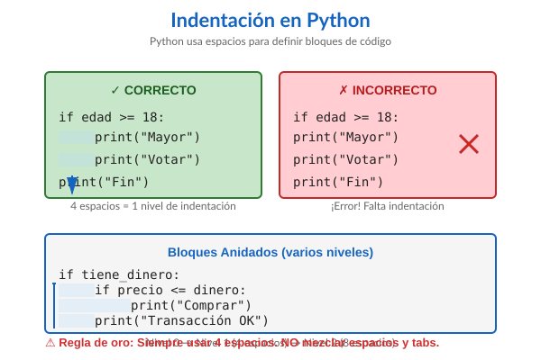

(control-flujo)=
# Control de Flujo

::::{tip} Mapa del Capítulo
:class: dropdown

Este capítulo te enseña a hacer que tus programas **piensen** y **repitan** acciones tomando decisiones. ¡Es donde tu código cobra vida!

```{mermaid}
graph TD
    A[Introducción] --> B[Condicionales if/elif/else]
    B --> C[Bucles while]
    C --> D[Bucles for]
    D --> E[Control de Bucles]
    E --> F[Patrones Comunes]
    
    style A fill:#e3f2fd
    style B fill:#fff9c4
    style C fill:#e1bee7
    style D fill:#e1bee7
    style E fill:#ffccbc
    style F fill:#c8e6c9
```

**⏱️ Tiempo estimado:** 5-7 horas

**Lo que vas a aprender:**
- Cómo hacer que tu programa tome decisiones (`if`, `elif`, `else`)
- Repetir acciones con `while` y `for`
- Controlar bucles con `break` y `continue`
- Patrones comunes de programación

**Al final podrás:**
- Crear programas que reaccionan a diferentes situaciones
- Evitar repetir código usando bucles
- Construir menús interactivos y validaciones
::::

## Introducción y Motivación

### ¿Qué es el Control de Flujo?

Hasta ahora, tus programas han sido como seguir una receta paso a paso: haces **una cosa tras otra**, siempre en el mismo orden. Pero los programas reales necesitan ser **inteligentes**:

:::::{grid} 1 1 2 2

::::{grid-item-card} Sin Control de Flujo
```python
# Programa "tonto"
print("Buenos días")
print("Buenas tardes")
print("Buenas noches")
# Siempre saluda igual...
```
::::

::::{grid-item-card} Con Control de Flujo
```python
# Programa "inteligente"
hora = 14
if hora < 12:
    print("Buenos días")
elif hora < 20:
    print("Buenas tardes")
else:
    print("Buenas noches")
# ¡Saluda según la hora! 
```
::::

:::::

### Analogía del Semáforo 🚦

Imaginate que sos un auto en una intersección:

```{mermaid}
graph LR
    A[Llego al semáforo] --> B{¿Qué color?}
    B -->|🟢 Verde| C[Paso]
    B -->|🟡 Amarillo| D[Freno con cuidado]
    B -->|🔴 Rojo| E[Me detengo]
    
    style A fill:#e3f2fd
    style B fill:#fff9c4
    style C fill:#c8e6c9
    style D fill:#fff3e0
    style E fill:#ffcdd2
```

Eso es **{term}`control de flujo`**: tu programa "mira" la situación y **decide** qué hacer, como vos decidís según el color del semáforo.

:::{important} ¿Por qué es tan importante?
El {term}`control de flujo` es lo que convierte una secuencia fija de instrucciones en un programa que puede:

- **Tomar decisiones** basadas en datos
- **Evitar repetir código** (no copies y pegues 100 veces)
- **Crear programas interactivos** que responden al usuario
- **Manejar diferentes escenarios** en el mismo programa
:::

### Ejemplos del Mundo Real

Todos estos usan {term}`control de flujo`:

:::::{grid} 1 1 2 2

::::{grid-item-card} 🏧 Cajero Automático
- **Decisión:** ¿El PIN es correcto?
- **Repetición:** Permitir 3 intentos
- **Menú:** Repetir hasta que elija "Salir"
::::

::::{grid-item-card} 🎮 Videojuego
- **Decisión:** ¿El jugador chocó?
- **Repetición:** Lazo principal del juego
- **Validación:** ¿Quedan vidas?
::::

::::{grid-item-card} 🌡️ Termostato
- **Decisión:** ¿Temperatura baja?
- **Repetición:** Revisar cada minuto
- **Acción:** Encender/apagar calefacción
::::

::::{grid-item-card} 📱 Aplicación de Mensajes
- **Decisión:** ¿Hay conexión?
- **Repetición:** Revisar nuevos mensajes
- **Validación:** ¿Mensaje válido?
::::

:::::

### ¿Qué Vas a Aprender?

```{mermaid}
mindmap
  root((Control<br/>de Flujo))
    Decisiones
      if simple
      if-else
      if-elif-else
    Repetición
      while
      for
      range
    Control
      break
      continue
      pass
    Patrones
      Validación
      Menús
      Banderas
```

¡Empecemos! 

---

(condicionales)=
## Estructuras Condicionales

### ¿Qué son las Condicionales? 

Las **condicionales** son como las bifurcaciones en un camino: según la situación, tu programa toma un camino u otro.

```{mermaid}
%%{init: {'theme':'base', 'themeVariables': { 'primaryColor':'#e3f2fd','primaryTextColor':'#1565c0','primaryBorderColor':'#1976d2','lineColor':'#1976d2','secondaryColor':'#fff3e0','tertiaryColor':'#f3e5f5','noteBkgColor':'#fff9c4','noteTextColor':'#333'}}}%%
flowchart TD
    inicio([Inicio])
    condicion{edad >= 18?}
    accion[print: Sos mayor de edad<br/>print: Podés votar]
    fin([Fin])
    
    inicio --> condicion
    condicion -->|Verdadero| accion
    condicion -->|Falso| fin
    accion ---> fin
    
    style inicio fill:#e3f2fd,stroke:#1976d2,stroke-width:2px
    style condicion fill:#fff3e0,stroke:#f57c00,stroke-width:2px
    style accion fill:#c8e6c9,stroke:#388e3c,stroke-width:2px
    style fin fill:#e3f2fd,stroke:#1976d2,stroke-width:2px
```

::::{tip} Analogía: El Guardia de Seguridad

Imaginate un guardia en la entrada de un boliche:

```python
edad = 17

if edad >= 18:
    print("¡Bienvenido! Pasá")  # Solo si cumple la condición
    
print("Que tengas buen día")  # Esto se ejecuta siempre
```

- **Si** tenés 18+ → te deja pasar Y te saluda
- **Si** tenés menos → solo te saluda

El guardia **decide** basándose en tu edad. ¡Eso es una condicional!
::::

---

### La Estructura `if` Simple

La forma más básica: "Si se cumple esto, hacé aquello"

```{code-cell} ipython3
edad = 18

if edad >= 18:
    print("Sos mayor de edad")
    print("Podés votar")
    
print("Este mensaje se muestra siempre")
```

#### Anatomía del `if`

:::::{grid} 1 1 2 2

::::{grid-item}
```python
if edad >= 18:
    print("Mayor")
    print("Votar")
print("Fin")
```
::::

::::{grid-item}
1. **`if`** → palabra clave
2. **`edad >= 18`** → condición (True/False)
3. **`:`** → dos puntos (obligatorio)
4. **Indentación** → define el bloque
5. **Sin indentar** → fuera del if
::::

:::::

:::{important} Indentación: ¡La Clave en Python!

Python es **especial**: usa **espacios** para definir {term}`bloques <Bloque>` de código (no llaves `{}` como otros lenguajes).

Esto significa que:

1. Si no hay indentación, hay un error de sintaxis.
2. Si hay indentación, pero no en todas las instrucciones que queremos agrupar, nos vamos a encontrar con algo que anda, ¡pero no como esperamos!



**Reglas:**
- ✅ Usá **4 espacios** por nivel
- ✅ Sé **consistente**(siempre 4)
- ✅ Revisá que las instrucciones que deben ir juntas en el bloque, _lo están_.
- ❌ NO mezcles espacios con tabuladores (esto no es un problema en el JupyterLab)
- ❌ NO olvidar los dos puntos `:`

```python
# ✓ CORRECTO
if edad >= 18:
    print("Mayor de edad")  # 4 espacios
    print("Podés votar")    # 4 espacios

# ✗ ERROR: Sin indentación
if edad >= 18:
print("Mayor de edad")  # IndentationError!

# ✗ ERROR: Inconsistente
if edad >= 18:
  print("Esto")    # 2 espacios
    print("Malo")  # 4 espacios - ¡No funciona!
```

> Aunque los editores de texto para programar tienen nos ayudan con este tema, es importante para que no nos encontremos con sorpresas al copiar y pegar, o si por alguna razón no tenemos acceso a un editor de textos apropiado.

:::

**Experimentá con `if`:**

```{code-cell} ipython3
# Probá cambiando los valores
temperatura = 25

if temperatura > 30:
    print("🔥 Hace mucho calor!")
    print("   Mejor quedarse adentro")

if temperatura < 10:
    print("🥶 Hace mucho frío!")
    print("   Abrigate bien")

if temperatura >= 10 and temperatura <= 30:
    print(" Temperatura agradable")
    print("   Buen día para salir")

print(f"Temperatura actual: {temperatura}°C")
```

### La Estructura `if-else`: Dos Caminos

A veces necesitás hacer **una cosa** si se cumple, y **otra cosa diferente** si no se cumple. Ahí usás `if-else`.

```{mermaid}
%%{init: {'theme':'base', 'themeVariables': { 'primaryColor':'#e3f2fd','primaryTextColor':'#1565c0','primaryBorderColor':'#1976d2','lineColor':'#1976d2','secondaryColor':'#fff3e0','tertiaryColor':'#f3e5f5','noteBkgColor':'#fff9c4','noteTextColor':'#333'}}}%%
flowchart TD
    inicio([Inicio])
    condicion{edad >= 18?}
    si[/print: Sos mayor de edad<br/>print: Podés votar/]
    no[/print: Sos menor de edad<br/>print: Todavía no podés votar/]
    fin([Fin])
    
    inicio --> condicion
    condicion -->|Verdadero| si
    condicion -->|Falso| no
    si ---> fin
    no ---> fin
    
    style inicio fill:#e3f2fd,stroke:#1976d2,stroke-width:2px
    style condicion fill:#fff3e0,stroke:#f57c00,stroke-width:2px
    style si fill:#c8e6c9,stroke:#388e3c,stroke-width:2px
    style no fill:#ffccbc,stroke:#e64a19,stroke-width:2px
    style fin fill:#e3f2fd,stroke:#1976d2,stroke-width:2px
```

::::{tip} Analogía: Moneda al Aire

Tirás una moneda:
- **Si** sale cara → ganás
- **Si** sale cruz (`else`) → perdés

```python
moneda = "cara"

if moneda == "cara":
    print("¡Ganaste!")
else:
    print("Perdiste")
```

**Siempre pasa UNA de las dos cosas**, nunca ambas.
::::

```{code-cell} ipython3
edad = 16

if edad >= 18:
    print("Sos mayor de edad")
    print("Podés votar")
else:
    print("Sos menor de edad")
    print("Todavía no podés votar")
    
print("Gracias por consultar")
```

:::{note} ¿Cuándo usar `if-else`?
Usá `if-else` cuando:
- Hay **exactamente 2 opciones** (blanco o negro, sí o no)
- **Siempre** querés hacer algo (una cosa u otra)
- Las opciones son **excluyentes** (no pueden pasar las dos)

**Ejemplos:**
- Aprobar/Reprobar un examen
- Día/Noche
- Par/Impar
- Usuario logueado / No logueado
:::

**Comparación visual:**

:::::{grid} 1 1 2 2

::::{grid-item-card} Solo `if`
```python
if soleado:
    print("¡Vamos al parque!")
# Si no es soleado, no pasa nada
```
**Problema:** ¿Y si llueve? 🤷
::::

::::{grid-item-card} Con `if-else`
```python
if soleado:
    print("¡Vamos al parque!")
else:
    print("Nos quedamos en casa")
# Siempre hacemos algo ✓
```
**Mejor:** Cubrimos ambos casos ✅
::::

:::::

### La Estructura `if-elif-else`: Múltiples Caminos 

Cuando tenés **más de 2 opciones** a elegir, usás `elif` (abreviación de "else if").

```{mermaid}
%%{init: {'theme':'base', 'themeVariables': { 'primaryColor':'#e3f2fd','primaryTextColor':'#1565c0','primaryBorderColor':'#1976d2','lineColor':'#1976d2','secondaryColor':'#fff3e0','tertiaryColor':'#f3e5f5','noteBkgColor':'#fff9c4','noteTextColor':'#333'}}}%%
flowchart TD
    inicio([Inicio])
    var[/input nota/]
    cond1{nota >= 90?}
    cond2{nota >= 70?}
    cond3{nota >= 60?}
    cond4{nota >= 40?}
    excelente[/print: Excelente - A/]
    muybueno[/print: Muy Bueno - B/]
    bueno[/print: Bueno - C/]
    regular[/print: Regular - D/]
    insuficiente[/print: Insuficiente - F/]
    fin([Fin])
    
    inicio --> var
    var --> cond1
    cond1 -->|Verdadero| excelente
    cond1 -->|Falso| cond2
    cond2 -->|Verdadero| muybueno
    cond2 -->|Falso| cond3
    cond3 -->|Verdadero| bueno
    cond3 -->|Falso| cond4
    cond4 -->|Verdadero| regular
    cond4 -->|Falso| insuficiente
    
    excelente ---> fin
    muybueno ---> fin
    bueno ---> fin
    regular ---> fin
    insuficiente ---> fin
    
    style inicio fill:#e3f2fd,stroke:#1976d2,stroke-width:2px
    style cond1 fill:#fff3e0,stroke:#f57c00,stroke-width:2px
    style cond2 fill:#fff3e0,stroke:#f57c00,stroke-width:2px
    style cond3 fill:#fff3e0,stroke:#f57c00,stroke-width:2px
    style cond4 fill:#fff3e0,stroke:#f57c00,stroke-width:2px
    style excelente fill:#c8e6c9,stroke:#388e3c,stroke-width:2px
    style muybueno fill:#c8e6c9,stroke:#388e3c,stroke-width:2px
    style bueno fill:#c8e6c9,stroke:#388e3c,stroke-width:2px
    style regular fill:#ffe0b2,stroke:#f57c00,stroke-width:2px
    style insuficiente fill:#ffccbc,stroke:#e64a19,stroke-width:2px
    style fin fill:#e3f2fd,stroke:#1976d2,stroke-width:2px
```

::::{tip} Analogía: El Semáforo de 4 Luces

Imaginate un semáforo especial con 4 luces que indica velocidades:

```python
velocidad = 80

if velocidad > 120:
    print("🔴 ¡Peligro! Muy rápido")
elif velocidad > 80:
    print("🟡 Cuidado, reducí velocidad")
elif velocidad > 40:
    print("🟢 Velocidad normal, bien")
else:
    print("🔵 Muy lento, podés acelerar")
```

Python revisa **en orden** hasta encontrar la primera que es verdadera. Una vez que encuentra una, **se detiene y no revisa las demás**.
::::

#### Ejemplo Completo: Sistema de Calificaciones

```{code-cell} ipython3
nota = 85

if nota >= 90:
    print("Excelente - Calificación: A")     # 1️⃣ 🟡
    print("   ¡Felicitaciones!")
elif nota >= 70:
    print("Muy Bueno - Calificación: B")     # 2️⃣ ✅
    print("   Buen trabajo")
elif nota >= 60:
    print("Bueno - Calificación: C")         # 3️⃣ 🔴
    print("   Aprobado")
elif nota >= 40:
    print("Regular - Calificación: D")       # 4️⃣ 🔴
    print("   Necesitás mejorar")
else:
    print("Insuficiente - Calificación: F")  # 5️⃣ 🔴
    print("   Reprobado")

print(f"\nTu nota fue: {nota}")
```

#### ¿Cómo Funciona?

**Flujo de evaluación para `nota = 85`**

- 1️⃣ ¿`nota >= 90`? → *No* (85 < 90)
   🟡 Pasa a la siguiente

- 2️⃣ ¿`nota >= 70`? → **¡Sí!** (85 >= 70)  
   ✅ Ejecuta este bloque  
   🛑 **Se detiene acá**, NO se evalúa el resto

- 3️⃣ ~~ ¿`nota >= 60`? ~~ → No se evalúa 🔴
- 4️⃣ ~~ ¿`nota >= 40`? ~~ → No se evalúa 🔴
- 5️⃣ ~~ `else` ~~ → No se ejecuta 🔴

::::

:::::

````{danger} Cuidado con el orden!
El **orden es fundamental**. Python evalúa de arriba hacia abajo y ejecuta **solo la primera** condición verdadera:

:::::{grid} 1 1 2 2

::::{grid-item-card} ✅ CORRECTO
```python
numero = 85

# Orden: más restrictivo → menos
if numero >= 90:
    print("A")
elif numero >= 80:
    print("B")  # ✓ Esta se ejecuta
elif numero >= 70:
    print("C")
else:
    print("F")
```

**Funciona bien:** 85 no pasa el primer filtro, pero sí el segundo.
::::

::::{grid-item-card} ❌ INCORRECTO
```python
numero = 85

# Con el orden invertido, obtenemos el resultado incorrecto
if numero >= 70:
    print("C+")  # ✗ ¡Siempre gana!
elif numero >= 80:
    print("B")   # Nunca se alcanza
elif numero >= 90:
    print("A")   # Nunca se alcanza
```

**Problema:** La primera condición "atrapa" todos los números >= 70, las siguientes nunca se ejecutan.
::::

:::::

````

**Regla de oro:** Siempre ordená de **más específico/restrictivo** a **menos específico**.

#### Comparación: `if` múltiple vs `if`-`elif`-`else`

:::::{grid} 1 1 2 2

::::{grid-item-card} Múltiples `if` separados
```python
edad = 25

if edad >= 18:
    print("Adulto")
if edad >= 13:
    print("Adolescente")
if edad >= 0:
    print("Persona")
```

**Resultado:**
```
Adulto
Adolescente
Persona
```

**Se ejecutan TODAS las que sean `True`**

Como son tres estructura{s} {term}`condicional{es} <Condicional>` separadas, obtenemos tres resultados diferentes.

::::

::::{grid-item-card} Con `if-elif-else`
```python
edad = 25

if edad >= 18:
    print("Adulto")
elif edad >= 13:
    print("Adolescente")
elif edad >= 0:
    print("Persona")
```

**Resultado:**
```
Adulto
```

**Se ejecuta SOLO LA PRIMERA `True`**

Como es una única estructura condicional, obtenemos un solo resultado, el primero que coincida.
::::

:::::

**Experimentá con diferentes valores:**

```{code-cell} ipython3
# Programa: Recomendación de actividad según la temperatura
temperatura = 25

if temperatura >= 35:
    print("🥵 ¡Mucho calor!")
    print("   Recomendación: Quedáte en casa con AC")
elif temperatura >= 25:
    print("☀️ Clima cálido")
    print("   Recomendación: Playa o pileta")
elif temperatura >= 15:
    print(" Clima agradable")
    print("   Recomendación: Caminar o hacer deporte")
elif temperatura >= 5:
    print("🧥 Hace frío")
    print("   Recomendación: Abrigate bien")
else:
    print("🥶 ¡Mucho frío!")
    print("   Recomendación: Quedáte adentro")

print(f"\nTemperatura actual: {temperatura}°C")
```

### Condiciones Anidadas: `if` dentro de `if`

A veces necesitás verificar **una cosa dentro de otra**, como muñecas rusas. Eso se llama **anidamiento**.

::::{tip} Analogía: Seguridad del Banco

Para entrar a la bóveda de un banco:
1. **Primero** verifican tu ID
2. **Si** tu ID es correcta, **entonces** verifican tu huella
3. **Si** ambas son correctas → Acceso permitido

```python
id_correcta = True
huella_correcta = True

if id_correcta:
    print("✓ ID verificada")
    if huella_correcta:
        print("✓ Huella verificada")
        print("   Acceso permitido a la bóveda")
    else:
        print("✗ Huella incorrecta - Acceso denegado")
else:
    print("✗ ID incorrecta - Acceso denegado")
```
::::

**Ejemplo clásico:**

```{code-cell} ipython3
edad = 20
tiene_licencia = True

if edad >= 18:
    print("✓ Tenés la edad mínima")
    if tiene_licencia:
        print("✓ Tenés licencia")
        print("¡Podés manejar!")
    else:
        print("✗ No tenés licencia")
        print(" Necesitás obtener la licencia primero")
else:
    print("✗ Sos menor de edad")
    print("Sos muy chico para manejar")
```

#### Simplificación con Operadores Lógicos

Es común que podamos **simplificar** usando `and` en lugar de anidar en aquellos casos en los que la cantidad de resultado sea reducida.

:::::{grid} 1 1 2 2

::::{grid-item-card} Anidado (más detallado)
```python
if edad >= 18:
    if tiene_licencia:
        print("Podés manejar")
else:
    print("No podes manejar")
```

Cuando solo necesitamos dos salidas, no es necesario utilizar un segundo `if`

::::

::::{grid-item-card} Con `and` (más simple)
```python
if edad >= 18 and tiene_licencia:
    print("Podés manejar")
else:
    print("No podes manejar")
```

Al unificar las dos condiciones, simplificamos el código a un único nivel de {term}`indentación`.

::::

:::::

:::{tip} ¿Cuándo anidar vs cuándo usar `and`?

**Usá anidamiento cuando:**
- Querés mostrar mensajes diferentes en ambas partes del condicional
- La lógica de cada nivel es independiente
- Necesitás hacer acciones diferentes en cada paso

**Usá `and` cuando:**
- Todas las condiciones deben ser `True` al mismo tiempo
- Solo necesitas dos caminos en una condición múltiple.
- Querés código más simple y legible

**Regla general:** Si podés usar `and`, mejor, hará que el código sea más simple, y esto es mejor.
:::

**Ejemplo combinado:**

```{code-cell} ipython3
# Sistema de acceso a un club
edad = 21
es_socio = True
tiene_invitacion = False

if edad >= 18:
    if es_socio:
        print("Bienvenido, socio!")
        print("   Entrada gratuita")
    elif tiene_invitacion:
        print("Entrada con invitación")
        print("   Acceso permitido")
    else:
        print("Entrada: $50000")
        print("   Podés pagar en la entrada")
else:
    print("Lo sentimos, solo mayores de 18")
    print("   No podés ingresar")
```

:::{note} Condicionales complejos

No lo hemos explorado en los ejemplos, pero los condicionales lógicos, ¡pueden ser realmente complicados!

Por ejemplo
```python
puede_acceder = (es_mayor or tiene_permiso) and tiene_dinero and en_bariloche
# Puede entrar si: 
#    - tiene la edad o está autorizado, 
#    - aparte de tambien:
#    - tiene que tener plata y 
#    - tiene que estar en Bariloche.
```

Y tan complicado como sea necesario, pero la clave acá está en que **el resultado final** es un sí puede o no acceder. Este condicional no nos indicaría *la razón* por la cual entró o no.

:::

### Valores "Truthy" y "Falsy"

En Python, ciertos valores se consideran "falsos" en un contexto booleano:
- `False`, `None`, `0`, `0.0`
- [Secuencias](./3_estructuras.md) vacías: `""`, `[]`, `{}`, `()`

Todos los demás valores se consideran "verdaderos". Sin embargo, según las buenas prácticas, es preferible ser **explícito**:

```{code-cell} ipython3
lista = []

# Menos claro (aunque funciona)
if lista:
    print("Tiene elementos")

# ✓ Más claro y explícito
if len(lista) > 0:
    print("Tiene elementos")

# O mejor aún
if lista:  # Aceptable para listas
    print("Tiene elementos")
# Pero documentalo si no es obvio
```

---

(ejemplos-condicionales)=
## Ejemplos Prácticos con Condicionales

A continuación, unos ejemplos de uso de condicionales `if-elif` para clasificación.

### Ejemplo 1: Calculadora de Descuento

```python
"""Programa que calcula descuento según el monto de compra."""

DESCUENTO_BASICO = 0.05      # 5%
DESCUENTO_INTERMEDIO = 0.10  # 10%
DESCUENTO_PREMIUM = 0.15     # 15%

monto = float(input("Ingrese el monto de compra: $"))

if monto >= 10000:
    descuento = monto * DESCUENTO_PREMIUM
    print(f"Descuento Premium: {DESCUENTO_PREMIUM * 100}%")
elif monto >= 5000:
    descuento = monto * DESCUENTO_INTERMEDIO
    print(f"Descuento Intermedio: {DESCUENTO_INTERMEDIO * 100}%")
elif monto >= 1000:
    descuento = monto * DESCUENTO_BASICO
    print(f"Descuento Básico: {DESCUENTO_BASICO * 100}%")
else:
    descuento = 0
    print("No hay descuento para este monto")

total = monto - descuento
print(f"Monto original: ${monto:.2f}")
print(f"Descuento: ${descuento:.2f}")
print(f"Total a pagar: ${total:.2f}")
```

### Ejemplo 2: Clasificación de Temperatura

Este es un ejemplo de clasificación tradicional en el que se muestra un mensaje diferente por rango de temperatura.

```python
"""Clasifica la temperatura y da recomendaciones."""

temperatura = float(input("Ingrese la temperatura en °C: "))

if temperatura >= 35:
    print("Extremadamente caluroso - Evitá la exposición al sol")
elif temperatura >= 25:
    print("Caluroso - Mantenete hidratado")
elif temperatura >= 15:
    print("Agradable - Clima óptimo")
elif temperatura >= 5:
    print("Fresco - Llevá una campera")
else:
    print("Frío - Abrigate bien")
```

### Ejemplo 3: Segmentación por Edad

En este ejemplo, también usamos condicionales compuestos con operadores lógicos, que nos ayudan a descartar los valores que sabemos que son imposibles primero.

```python
"""Valida si una persona puede acceder a cierto contenido."""

edad = int(input("Ingrese su edad: "))

if edad < 0 or edad > 120:
    print("Error: Edad inválida")
elif edad < 13:
    print("Contenido no disponible para menores de 13 años")
elif edad < 18:
    print("Acceso permitido con supervisión de un adulto")
else:
    print("Acceso completo permitido")
```

---

(while-lazos)=
## Lazos con `while`

Un **lazo**(bucle o lazo) permite ejecutar un bloque de código repetidamente. El lazo `while` continúa ejecutándose mientras una condición sea verdadera.

### Sintaxis Básica

```{code-cell} ipython3
while condicion:
    # Bloque de código que se repite
    # mientras la condición sea True
```

### Ejemplo Simple

```{code-cell} ipython3
contador = 1

while contador <= 5:
    print(f"Contador: {contador}")
    contador = contador + 1

print("Fin del lazo")
```

**Salida:**
```
Contador: 1
Contador: 2
Contador: 3
Contador: 4
Contador: 5
Fin del lazo
```

**Diagrama de flujo:**

```{mermaid}
flowchart TD
    inicio --> A
    A[contador = 1] --> B{contador <= 5?}
    B -->|True| C[print contador]
    C --> D[contador = contador + 1]
    D --> B
    B --->|False| E[Fin]
```

````{danger} 🚨 ¡Cuidado con los Lazos Infinitos!

Si la condición **nunca** se vuelve `False`, el bucle se ejecutará ** para siempre**:

:::::{grid} 1 1 2 2

::::{grid-item-card} Lazo Infinito (¡Ooops!)

```python
contador = 1
while contador <= 5:
    print(contador)
    # ¡Olvidamos incrementar!
```

**Problema:** `contador` siempre vale 1  
**Resultado:** Imprime "1" infinitamente 😱
**Solución:** Utiliza el botón para detener la celda en Jupyter
::::

::::{grid-item-card} ✅ Lazo Correcto
```python
contador = 1
while contador <= 5:
    print(contador)
    contador = contador + 1 # ✓ Incrementa
```

**Funciona:** `contador` cambia  
**Resultado:** Imprime 1, 2, 3, 4, 5 y termina ✓
::::

:::::

**Checklist anti-lazos-infinitos:**
- [ ] ¿La condición puede volverse `False`?
- [ ] ¿Modifico las variables de la condición dentro del bucle?
- [ ] ¿Hay una forma de salir del bucle?

**Tip:** Si tu programa "se colgó", probablemente tenés un lazo infinito. Presiona **Ctrl+C** para detenerlo.

````

### Patrones Comunes con `while`

Los patrones son fragmentos de código con formas comunes en las que se le dá uso a esta estructura. 

(while-acumulador)=
#### Patrón 1: Acumulador (Sumar números)

Este patrón utiliza una variable externa al lazo, denominada *acumulador*, cuya función es guardar el estado de una operación aritmética a completar de forma progresiva.

Para su uso, es necesaria una inicialización explícita, habitualmente en el elemento neutro (0 para sumas, 1 para multiplicaciones) y durante cada vuelta del lazo, se efectúa una asignación que va actualizando el valor del acumulador agregando el dato de la posición actual.

```{code-cell} ipython3
# Calcular la suma de los primeros 10 números
suma = 0  # Acumulador (empieza en 0)
contador = 1

while contador <= 10:
    suma = suma + contador  # Acumula el valor
    contador = contador + 1

print(f"La suma de 1 a 10 es: {suma}")
```

:::{tip} Patrón Acumulador
**Estructura:**
1. Inicializar {term}`acumulador` en 0
2. En cada vuelta, sumar al {term}`acumulador`
3. Al final, el {term}`acumulador` tiene el total

**Usos:** Sumar números, contar elementos, promedios
:::


(while-contador)=
#### Patrón 2: Contador clásico y reverso

Este patrón utiliza una variable de control, denominada contador, cuya finalidad es registrar la cantidad de ocurrencias o el número de vueltas del lazo ejecutadas.

Un lazo contador puede ser ascendente, con una condición que sea como tope, pero también puede ser descendente, que podemos utilizar cuando estamos buscando una cantidad de elementos y no nos interesa la posición en la que se encuentra.

```{code-cell} ipython3
print("Contandor ascendente:")
TOPE = 5
posicion = 1

while posicion < TOPE:
    faltantes = TOPE - posicion
    print(f" {posicion} / {faltantes}...")
    posicion = posicion + 1

print("Listo! ")
```

:::{note} Sobre `TOPE`

Aunque no es realmente necesario usar una variable en mayúsculas para el valor 'límite' a buscar, su uso facilita la lectura del código al evitar los llamados {term}`números mágicos`.

Aparte, si tenemos que cambiarlo, es mucho más fácil de esta forma y también podemos calcular 'cuantos faltan'.
:::


```{code-cell} ipython3
print("Cuenta regresiva para despegue:")
numero = 10

while numero > 0:
    print(f"   {numero}...")
    numero = numero - 1

print("   ¡DESPEGUE! ")
```

(while-compuesto)=
#### Patrón 3: Validación con Repetición (Condiciones compuestas)

Este patrón se asegura de que ejecutemos una acción mientras que una condición se cumpla, lo importante acá, es que esta no necesariamente trata sobre las veces en las que se recorre.

En este ejemplo, podemos ver como el lazo puede ser controlado por una expresión booleana arbitraria, que también es la base para [](#banderas-de-control). Este no es un ejemplo que podamos aplicar de forma directa, ya que el programa se quedará en un lazó con una condición demasiado específica para salir; la contraseña correcta.

```{code-cell} ipython3
# Pedir contraseña hasta que sea correcta
PASSWORD_CORRECTA = "python123"

contraseña = input("Ingrese la contraseña: ")

# Este lazo se lee:
# Mientras no des la contraseña correcta 
while contraseña != PASSWORD_CORRECTA:
    print(f"❌ Contraseña incorrecta.")
    contraseña = input("Ingrese la contraseña: ")

print("✅ ¡Acceso concedido!")
```

Para evitar el problema descrito más arriba, se agrega un 'termino' lógico a la condición, combinándolo con un lazo [](#while-contador), podemos limitar la cantidad de veces que se ejecuta el lazo.

```{code-cell} ipython3
# Pedir contraseña hasta que sea correcta
PASSWORD_CORRECTA = "python123"
intentos = 0
MAX_INTENTOS = 3

contraseña = input("Ingrese la contraseña: ")
intentos = intentos + 1

# Este lazo se lee:
# Mientras no des la contraseña correcta y te queden intentos:
while contraseña != PASSWORD_CORRECTA and intentos < MAX_INTENTOS:
    print(f"❌ Contraseña incorrecta. Te quedan {MAX_INTENTOS - intentos} intentos.")
    contraseña = input("Ingrese la contraseña: ")
    intentos = intentos + 1

if contraseña == PASSWORD_CORRECTA:
    print("✅ ¡Acceso concedido!")
else:
    print("Cuenta bloqueada por seguridad")
```

:::{note} Patrón Validación
Este patrón es **muy común** en programación:
- Sistemas de login
- Validación de datos
- Menús interactivos
- Juegos (seguir jugando mientras...)
:::

---

## Manipulación de lazos

TODO: explicar detalladamente que es `break` y `continue` de forma que vaya al tema siguiente de banderas de control. y tambien, mejorar la parte de lazos anidados (con referencias cruzadas desde aquí) para el comportamiento de estas instrucciones en esa situacion.


(banderas-control)=
## Banderas de Control

Según la {ref}`0x0006h`, en lugar de usar `break` y `continue` para lazos complejos, es preferible usar **banderas** (variables booleanas) para controlar el flujo.

### Patrón 4: Bandera Simple

```{code-cell} ipython3
"""Búsqueda con bandera de control."""

numeros = [10, 25, 30, 45, 50]
objetivo = 30
encontrado = False
i = 0

while i < len(numeros) and not encontrado:
    if numeros[i] == objetivo:
        encontrado = True
        print(f"Encontrado en posición {i}")
    i = i + 1

if not encontrado:
    print("No se encontró el número")
```

### Patrón 5: Múltiples Banderas

```python
"""Validación de entrada con múltiples condiciones."""

entrada_valida = False
intentos = 0
MAX_INTENTOS = 3

while not entrada_valida and intentos < MAX_INTENTOS:
    edad = int(input("Ingrese su edad (18-100): "))
    intentos = intentos + 1
    
    if edad >= 18 and edad <= 100:
        entrada_valida = True
        print("Edad válida registrada")
    else:
        print(f"Edad inválida. Intentos restantes: {MAX_INTENTOS - intentos}")

if not entrada_valida:
    print("Demasiados intentos inválidos")
```

### Ventajas de las Banderas

1. **Claridad:** El código es más fácil de entender
2. **Mantenibilidad:** Es fácil agregar condiciones adicionales
3. **Debugging:** Podés inspeccionar el estado de las banderas
4. **Testeo:** Las banderas facilitan las pruebas unitarias

:::{tip} Cuándo usar {term}`break`
Si bien preferimos banderas, `break` es aceptable en Python para casos simples de búsqueda:

```{code-cell} ipython3
# Aceptable para búsquedas simples
for elemento in lista:
    if elemento == objetivo:
        print("Encontrado")
        break
```

Para lógica más compleja, usá banderas.
:::

---

(for-lazos)=
## Lazos con `for`: Para Cada Elemento... 

Detalle importante, lo que está entre `[]` son **listas**, que veremos en profundidad en el próximo capítulo.
Por ahora, entendé que es simplemente un conjunto ordenado de valores.

### ¿Qué es un Bucle `for`?

El bucle `for` es para cuando querés hacer algo **con cada elemento** de una lista, palabra, o secuencia. Es como decir: "**Para cada** cosa en este grupo, hacé esto".

```{mermaid}
%%{init: {'theme':'base', 'themeVariables': { 'primaryColor':'#e3f2fd','primaryTextColor':'#1565c0','primaryBorderColor':'#1976d2','lineColor':'#1976d2','secondaryColor':'#fff3e0','tertiaryColor':'#f3e5f5','noteBkgColor':'#fff9c4','noteTextColor':'#333'}}}%%
flowchart TD
    inicio([Inicio])
    iniciar[lista = pan, leche, huevos, queso]
    bucle{¿Hay más<br/>elementos?}
    procesar[producto = siguiente elemento<br/>print: Comprar producto]
    fin([Fin])
    
    inicio --> iniciar
    iniciar --> bucle
    bucle -->|Sí| procesar
    bucle -->|No| fin
    procesar --> bucle
    
    style inicio fill:#e3f2fd,stroke:#1976d2,stroke-width:2px
    style iniciar fill:#f3e5f5,stroke:#7b1fa2,stroke-width:2px
    style bucle fill:#fff3e0,stroke:#f57c00,stroke-width:2px
    style procesar fill:#c8e6c9,stroke:#388e3c,stroke-width:2px
    style fin fill:#e3f2fd,stroke:#1976d2,stroke-width:2px
```

::::{tip} Analogía: Lista de Compras

Imaginate que tenés una lista de compras:

```python
lista_compras = ["pan", "leche", "huevos", "queso"]

for producto in lista_compras:
    print(f"✓ Comprar: {producto}")
```

**Salida:**
```
✓ Comprar: pan
✓ Comprar: leche
✓ Comprar: huevos
✓ Comprar: queso
```

Python **automáticamente** toma cada elemento de la lista, uno por uno, y ejecuta el código para cada uno. ¡No necesitás {term}`contador` ni incremento manual!
::::

---

### Diferencia: `while` vs `for`

:::::{grid} 1 1 2 2

::::{grid-item-card} {term}`while` (Mientras...)
```python
# Usar cuando NO sabés
# cuántas veces repetir

contraseña = ""
while contraseña != "abc123":
    contraseña = input("Contraseña: ")
```

**Cuándo usarlo:**
- Login (hasta que acierte)
- Menús (hasta que salga)
- Validaciones
::::

::::{grid-item-card} {term}`for` (Para cada...)
```python
# Usar cuando SÍ sabés
# cuántas veces repetir

frutas = ["🍎", "🍌", "🍊"]
for fruta in frutas:
    print(fruta)
```

**Cuándo usarlo:**
- Recorrer listas
- Repetir N veces
- Procesar colecciones
::::

:::::

---

### Iterando sobre un Rango

La función {term}`range()` genera una secuencia de números:

```{code-cell} ipython3
# Contar del 0 al 4
for i in range(5):
    print(f"Número: {i}")
```

**La función {term}`range()`:**

```{code-cell} ipython3
# range(stop) - desde 0 hasta stop-1
for i in range(5):
    print(i)  # 0, 1, 2, 3, 4

# range(start, stop) - desde start hasta stop-1
for i in range(2, 6):
    print(i)  # 2, 3, 4, 5

# range(start, stop, step) - con incremento personalizado
for i in range(0, 10, 2):
    print(i)  # 0, 2, 4, 6, 8

# Contando hacia atrás
for i in range(5, 0, -1):
    print(i)  # 5, 4, 3, 2, 1
```

### Iterando sobre Strings

```{code-cell} ipython3
mensaje = "Python"

for letra in mensaje:
    print(letra)

# Salida:
# P
# y
# t
# h
# o
# n
```

### Iterando sobre Listas

```{code-cell} ipython3
frutas = ["manzana", "banana", "naranja"]

for fruta in frutas:
    print(f"Me gusta la {fruta}")
```

:::{important} Estilo Pythonic
Según la {ref}`0x0007h`, en Python es preferible iterar directamente sobre elementos en lugar de usar índices:

```{code-cell} ipython3
nombres = ["Ana", "Bruno", "Carlos"]

# ❌ Menos Pythonico
for i in range(len(nombres)):
    print(nombres[i])

# ✓ Pythonico
for nombre in nombres:
    print(nombre)
```
:::

### Usando `enumerate()` cuando necesitás índices

Si necesitás tanto el índice como el elemento, usá `enumerate()`:

```{code-cell} ipython3
colores = ["rojo", "verde", "azul"]

for indice, color in enumerate(colores):
    print(f"Color {indice}: {color}")

# Salida:
# Color 0: rojo
# Color 1: verde
# Color 2: azul
```

**Empezar desde un índice diferente:**

```{code-cell} ipython3
colores = ["rojo", "verde", "azul"]

for indice, color in enumerate(colores, start=1):
    print(f"Color {indice}: {color}")

# Salida:
# Color 1: rojo
# Color 2: verde
# Color 3: azul
```

### Ejemplo: Tabla de Multiplicar

```python
"""Genera la tabla de multiplicar de un número."""

numero = int(input("Ingrese un número: "))

print(f"\nTabla de multiplicar del {numero}:")
print("-" * 30)

for i in range(1, 11):
    resultado = numero * i
    print(f"{numero} x {i:2d} = {resultado:3d}")
```

### Ejemplo: Suma de Lista

```{code-cell} ipython3
"""Calcula la suma de una lista de números."""

numeros = [10, 20, 30, 40, 50]
suma = 0

for numero in numeros:
    suma = suma + numero

print(f"La suma es: {suma}")

```

---

(while-vs-for)=
## `while` vs `for`: ¿Cuándo usar cada uno?

### Usar `while` cuando:

1. **No conocés de antemano cuántas iteraciones necesitás**
   ```python
   # Esperar entrada válida
   edad = -1
   while edad < 0 or edad > 120:
       edad = int(input("Edad (0-120): "))
   ```

2. **La condición de parada es compleja**
   ```{code-cell} ipython3
   intentos = 0
   exito = False
   MAX_INTENTOS = 5
   
   while intentos < MAX_INTENTOS and not exito:
       # ... lógica ...
   ```

3. **El lazo puede no ejecutarse ninguna vez**
   ```{code-cell} ipython3
   while hay_mas_datos():
       procesar_datos()
   ```

### Usar `for` cuando:

1. **Iterás sobre una secuencia conocida**
   ```{code-cell} ipython3
   for nombre in lista_nombres:
       print(nombre)
   ```

2. **Conocés exactamente cuántas iteraciones necesitás**
   ```{code-cell} ipython3
   for i in range(10):
       print(i)
   ```

3. **Necesitás procesar cada elemento de una colección**
   ```{code-cell} ipython3
   for estudiante in estudiantes:
       calcular_promedio(estudiante)
   ```

### Tabla Comparativa

| Aspecto | `while` | `for` |
|---------|---------|-------|
| **Iteraciones**| Número desconocido | Número conocido o secuencia |
| **Condición**| Puede ser compleja | Implícita (hasta terminar secuencia) |
| **Uso típico**| Validaciones, menús | Procesar colecciones, rangos |
| **Riesgo**| Lazo infinito si no hay cuidado | Menor riesgo |

---

(lazos-anidados)=
## Lazos Anidados

Podés colocar lazos dentro de otros lazos. Cada {term}`iteración` del lazo externo ejecuta completamente el lazo interno.

### Ejemplo: Tabla de Multiplicar Completa

```{code-cell} ipython3
"""Genera tablas de multiplicar del 1 al 5."""

for numero in range(1, 6):
    print(f"\nTabla del {numero}:")
    for multiplicador in range(1, 11):
        resultado = numero * multiplicador
        print(f"{numero} x {multiplicador:2d} = {resultado:3d}")
```

### Ejemplo: Patrón de Asteriscos

```{code-cell} ipython3
"""Imprime un triángulo de asteriscos."""

altura = 5

for fila in range(1, altura + 1):
    for columna in range(fila):
        print("*", end="")
    print()  # Nueva línea

# Salida:
# *
# **
# ***
# ****
# *****
```

### Ejemplo: Validación de Múltiples Credenciales

```{code-cell} ipython3
"""Verificar usuario y contraseña con múltiples intentos permitidos."""

# Credenciales correctas (en un caso real, esto estaría en una base de datos)
usuario_valido = "admin"
password_valida = "python123"

# Configuración
max_intentos_usuario = 3
max_intentos_password = 3
acceso_concedido = False

print("=== SISTEMA DE ACCESO ===")

# Lazo externo: intentos de usuario
for intento_usuario in range(1, max_intentos_usuario + 1):
    print(f"\n[Intento de usuario {intento_usuario}/{max_intentos_usuario}]")
    usuario = input("Usuario: ")
    
    if usuario == usuario_valido:
        print("✓ Usuario correcto")
        
        # Lazo interno: intentos de contraseña
        for intento_password in range(1, max_intentos_password + 1):
            print(f"[Intento de contraseña {intento_password}/{max_intentos_password}]")
            password = input("Contraseña: ")
            
            if password == password_valida:
                print("\n✓ ACCESO CONCEDIDO")
                acceso_concedido = True
                break  # Salir del lazo de contraseñas
            else:
                print("✗ Contraseña incorrecta")
        
        # Si encontró la contraseña, salir del lazo de usuarios también
        if acceso_concedido:
            break
        else:
            print("\n✗ Contraseña bloqueada")
            break
    else:
        print("✗ Usuario incorrecto")

if not acceso_concedido:
    print("\n✗ ACCESO DENEGADO - Cuenta bloqueada")
```

:::{warning} Cuidado con la complejidad
Lazos anidados pueden hacer que tu código sea lento. Un lazo dentro de otro multiplica las iteraciones:
- Lazo externo: 100 iteraciones
- Lazo interno: 100 iteraciones
- Total: 100 × 100 = 10,000 iteraciones

Usá lazos anidados solo cuando sea necesario.
:::

---

(patrones-comunes)=
## Patrones Comunes de Programación

### Patrón 1: Acumulador

Sumar o acumular valores:

```{code-cell} ipython3
# Suma de números del 1 al 100
suma = 0
for i in range(1, 101):
    suma = suma + i
print(f"Suma: {suma}")
```

### Patrón 2: Contador

Contar cuántas veces ocurre algo:

```{code-cell} ipython3
# Contar números pares en una lista
numeros = [1, 2, 3, 4, 5, 6, 7, 8, 9, 10]
contador_pares = 0

for numero in numeros:
    if numero % 2 == 0:
        contador_pares = contador_pares + 1

print(f"Hay {contador_pares} números pares")
```

### Patrón 3: Búsqueda

Encontrar un elemento:

```{code-cell} ipython3
# Buscar un nombre en una lista
nombres = ["Ana", "Bruno", "Carlos", "Diana"]
buscar = "Carlos"
encontrado = False

for nombre in nombres:
    if nombre == buscar:
        encontrado = True

if encontrado:
    print(f"{buscar} está en la lista")
else:
    print(f"{buscar} no está en la lista")
```

### Patrón 4: Máximo/Mínimo

Encontrar el valor máximo o mínimo:

```{code-cell} ipython3
# Encontrar el número mayor
numeros = [45, 23, 67, 12, 89, 34]
maximo = numeros[0]

for numero in numeros:
    if numero > maximo:
        maximo = numero

print(f"El máximo es: {maximo}")
```

### Patrón 5: Validación de Entrada

Repetir hasta obtener entrada válida:

```python
# Validar entrada numérica positiva
numero_valido = False

while not numero_valido:
    try:
        numero = float(input("Ingrese un número positivo: "))
        if numero > 0:
            numero_valido = True
            print(f"Número válido: {numero}")
        else:
            print("El número debe ser positivo")
    except ValueError:
        print("Debe ingresar un número")
```

### Patrón 6: Menú de Opciones

```python
"""Menú interactivo."""

continuar = True

while continuar:
    print("\n=== MENÚ ===")
    print("1. Opción A")
    print("2. Opción B")
    print("3. Opción C")
    print("4. Salir")
    
    opcion = input("Seleccione una opción (1-4): ")
    
    if opcion == "1":
        print("Ejecutando opción A...")
    elif opcion == "2":
        print("Ejecutando opción B...")
    elif opcion == "3":
        print("Ejecutando opción C...")
    elif opcion == "4":
        continuar = False
        print("¡Hasta luego!")
    else:
        print("Opción inválida")
```

---

(errores-comunes-control)=
## Errores Comunes

### 1. Olvidar la indentación

```python
# ❌ Error de sintaxis
if edad >= 18:
print("Mayor de edad")  # IndentationError

# ✓ Correcto
if edad >= 18:
    print("Mayor de edad")
```

### 2. Usar `=` en lugar de `==`

```python
# ❌ Asignación en lugar de comparación
if edad = 18:  # SyntaxError
    print("Tiene 18")

# ✓ Correcto
if edad == 18:
    print("Tiene 18")
```

### 3. Lazo infinito

```python
# ❌ Lazo infinito
contador = 0
while contador < 10:
    print(contador)
    # Olvidamos incrementar contador

# ✓ Correcto
contador = 0
while contador < 10:
    print(contador)
    contador = contador + 1
```

### 4. Condiciones incorrectas en rangos

```python
# ❌ Lógica incorrecta
nota = 85
if nota >= 60 and nota < 90:  # No captura 60-69
    print("Bueno")
elif nota >= 70 and nota < 90:  # Nunca se alcanza
    print("Muy Bueno")

# ✓ Correcto - orden de más específico a general
if nota >= 90:
    print("Excelente")
elif nota >= 70:
    print("Muy Bueno")
elif nota >= 60:
    print("Bueno")
```

### 5. Modificar lista mientras se itera

```{code-cell} ipython3
# ❌ Problemático
numeros = [1, 2, 3, 4, 5]
for numero in numeros:
    if numero % 2 == 0:
        numeros.remove(numero)  # Puede causar problemas

# ✓ Mejor - crear nueva lista
numeros = [1, 2, 3, 4, 5]
impares = []
for numero in numeros:
    if numero % 2 != 0:
        impares.append(numero)
```

---

(buenas-practicas-control)=
## Buenas Prácticas

### 1. Nombres Descriptivos para Banderas

```{code-cell} ipython3
# ❌ Poco claro
flag = True
x = False

# ✓ Descriptivo
usuario_autenticado = True
datos_validos = False
```

### 2. Condiciones Legibles

```{code-cell} ipython3
# ❌ Difícil de leer
if a > 18 and b == True and c != 0 and (d == "admin" or d == "superuser"):
    hacer_algo()

# ✓ Más claro
es_mayor_edad = a > 18
esta_activo = b == True
tiene_saldo = c != 0
es_administrador = d == "admin" or d == "superuser"

if es_mayor_edad and esta_activo and tiene_saldo and es_administrador:
    hacer_algo()
```

### 3. Evitar Anidación Excesiva

```{code-cell} ipython3
# ❌ Muy anidado
if condicion1:
    if condicion2:
        if condicion3:
            if condicion4:
                hacer_algo()

# ✓ Utilizá condiciones combinadas
if condicion1 and condicion2 and condicion3 and condicion4:
    hacer_algo()

# En particular cuando la acción a hacer es única.
# (No hay uso para los caminos 'else')    
```

### 4. Constantes para Valores Mágicos

```{code-cell} ipython3
# ❌ "Números mágicos"
if edad >= 18 and edad <= 65:
    calcular_descuento()

# ✓ Constantes descriptivas
EDAD_MINIMA = 18
EDAD_MAXIMA = 65

if edad >= EDAD_MINIMA and edad <= EDAD_MAXIMA:
    calcular_descuento()
```

### 5. Comentarios en Condiciones Complejas

```{code-cell} ipython3
# Verificar si el usuario puede acceder al sistema
# Debe ser mayor de edad, tener cuenta activa y no estar suspendido
if edad >= 18 and cuenta_activa and not suspendido:
    permitir_acceso()
```

---

(ejercicio-2-11)=
### Ejercicio 2.11: Validación de Contraseña

Escribí un programa que valide una contraseña según estos criterios:
- Longitud mínima: 8 caracteres
- Debe contener al menos una letra mayúscula
- Debe contener al menos una letra minúscula
- Debe contener al menos un dígito

**Entrada:**
- Contraseña (string)

**Salida:**
- Si la contraseña es válida o no
- Lista de criterios que no cumple

**Ejemplo:**
```
Ingrese una contraseña: hola123

Contraseña inválida. Problemas:
- Debe tener al menos 8 caracteres
- Debe contener al menos una mayúscula
```

:::{tip}
Usá los métodos de strings:
- `str.isupper()` - verifica si es mayúscula
- `str.islower()` - verifica si es minúscula
- `str.isdigit()` - verifica si es dígito
- `len(str)` - longitud del string
:::

---

(ejercicio-2-12)=
### Ejercicio 2.12: Cajero Automático (Menú)

Simulá un cajero automático con las siguientes opciones:
1. Consultar saldo
2. Depositar dinero
3. Retirar dinero
4. Salir

**Reglas:**
- Saldo inicial: $10,000
- No se puede retirar más del saldo disponible
- Los depósitos y retiros deben ser montos positivos

**Entrada:**
- Opción del menú
- Montos según la operación

**Salida:**
- Menú interactivo
- Confirmación de operaciones
- Saldo actualizado

**Ejemplo:**
```
=== CAJERO AUTOMÁTICO ===
1. Consultar Saldo
2. Depositar
3. Retirar
4. Salir

Opción: 1
Saldo actual: $10000.00

Opción: 2
Monto a depositar: $500
Depósito exitoso. Nuevo saldo: $10500.00

Opción: 3
Monto a retirar: $2000
Retiro exitoso. Nuevo saldo: $8500.00

Opción: 4
¡Gracias por usar nuestro cajero!
```


---

(uso-ia-control-flujo)=
## Uso Ético y Efectivo de la IA en Control de Flujo

:::{important} La IA: Tu Asistente de Aprendizaje, No Tu Reemplazo
Aprender {term}`control de flujo` es aprender a **pensar algorítmicamente**. La IA puede ayudarte a refinar tu lógica, pero no puede desarrollar esta habilidad por vos. **Vos debés ser quien diseñe la solución.**
:::

### Buenas Prácticas para Control de Flujo

#### Generar Ejercicios Adicionales

- *"Genera cinco ejercicios sobre condicionales `if-elif-else` que involucren validación de rangos de números"*
- *"Crea ejercicios de lazos `while` que requieran el uso de banderas de control"*
- *"Dame problemas de práctica sobre lazos `for` con {term}`range()`` de diferente complejidad"*

#### Obtener Pistas sobre Lógica

Si tu condición no funciona correctamente:

- *"Tengo un programa que debe verificar si un número está entre 10 y 20. Mi condición es `if numero > 10 and numero < 20:` pero falla con 10 y 20. ¿Por qué?"*
- *"Estoy escribiendo un lazo para pedir números hasta que el usuario ingrese 0, pero no sé cómo estructurarlo. ¿Cuál sería el esqueleto básico?"*
- *"¿Cómo puedo salir de un lazo `while` cuando se cumpla cierta condición sin usar `break`?"*

#### Refactorizar Condiciones Complejas

- *"Esta condición es muy larga y difícil de leer: `if (edad >= 18 and tiene_dni and (es_estudiante or es_empleado)) or es_admin:`. ¿Cómo puedo mejorarla?"*
- *"Tengo cuatro `if` anidados. ¿Hay una forma más clara de escribir esto?"*

#### Debugging de Lógica

- *"Mi lazo infinito no se detiene. Aquí está mi código: [código]. ¿Qué estoy haciendo mal?"*
- *"Mi condición siempre evalúa `True` incluso cuando debería ser `False`. ¿Cuál podría ser el problema?"*

#### Explorar Alternativas

- *"Resolví este problema con un `while`. ¿Podrías mostrarme cómo se vería con un `for`?"*
- *"¿Cuál es la diferencia práctica entre usar un `for` con {term}`range()` y un `while` con contador manual?"*

### Ejemplos Específicos de este Módulo

**Situación 1**: Validación de entrada

❌ **Incorrecto**:
```
Prompt: "Dame el código para validar que un número esté entre 1 y 100"
```

✅ **Correcto**:
```
Prompt: "Estoy validando un número entre 1 y 100. Escribí esto:
if numero > 1 and numero < 100:
¿Está correcto o debería usar >= y <=?"
```

**Situación 2**: Lazo con {term}`acumulador`

❌ **Incorrecto**:
```
Prompt: "Escribe un programa que sume números hasta que el usuario ingrese 0"
```

✅ **Correcto**:
```
Prompt: "Estoy sumando números en un lazo while. Inicialicé suma = 0 
y tengo el lazo, pero no sé dónde hacer la suma. ¿Dentro o fuera del lazo?"
```

### Errores Comunes en este Módulo

:::{warning} No pidas que la IA diseñe tu algoritmo
El diseño del algoritmo (decidir qué condiciones usar, cómo estructurar el lazo, cuándo terminar) es **la habilidad que estás aprendiendo**. Si la IA lo hace por vos, no estás aprendiendo nada.

**Desarrollá tu algoritmo primero**, luego pedí ayuda para refinarlo.
:::

### Ejercicio de Reflexión

Antes de pedir ayuda a la IA sobre un ejercicio de {term}`control de flujo`, preguntate:

1. ¿Cuál es la condición que quiero verificar?
2. ¿Qué debe pasar si es verdadera? ¿Y si es falsa?
3. ¿Necesito repetir algo? ¿Cuántas veces? ¿Hasta cuándo?
4. ¿Qué variables necesito para controlar el flujo?

Si podés responder estas preguntas, **ya sabés cómo resolver el ejercicio**. La IA solo debería ayudarte con detalles de sintaxis o refinamiento.

---


---

## Resumen Visual del Capítulo 

### Mapa Mental Completo

```{mermaid}
mindmap
  root((Control de<br/>Flujo))
    Condicionales
      if simple
        Una decisión
        Puede no ejecutarse
      if-else
        Dos caminos
        Siempre uno se ejecuta
      if-elif-else
        Múltiples opciones
        Solo una se ejecuta
      Anidadas
        if dentro de if
        Simplificar con and/or
    Bucles
      while
        Mientras condición True
        Puede nunca ejecutarse
        Usar para validaciones
      for
        Para cada elemento
        Sobre listas strings range
        Más seguro que while
      Anidados
        Lazo dentro de lazo
        Cuidado con complejidad
    Control
      break
        Sale del bucle
        Para búsquedas
      continue
        Salta esta vuelta
        Para filtrar
      pass
        Placeholder
        Para código futuro
    Patrones
      Acumulador
        Sumar valores
      Contador
        Contar elementos
      Validación
        Repetir hasta correcto
      Menú
        Lazo hasta salir
```

---

### Checklist de Dominio ✓

Antes de avanzar al **Capítulo 3: Listas**, asegurate de poder hacer todo esto **sin ayuda**:

::::{tip} Condicionales - Decisiones

**Sintaxis básica:**
- [ ] Escribir un `if` simple correctamente (con `:` y {term}`indentación`)
- [ ] Usar `if-else` para dos alternativas
- [ ] Usar `if-elif-else` para múltiples opciones
- [ ] Anidar condicionales cuando sea necesario

**Operadores:**
- [ ] Usar correctamente `==`, `!=`, `<`, `>`, `<=`, `>=`
- [ ] Combinar condiciones con `and`, `or`, `not`
- [ ] Entender precedencia de operadores lógicos

**Aplicación:**
- [ ] Validar entrada del usuario
- [ ] Clasificar valores en rangos
- [ ] Tomar decisiones basadas en múltiples condiciones
::::

::::{tip} Bucles {term}`while` - Repetición con condición

**Sintaxis y control:**
- [ ] Escribir un `while` que termine correctamente
- [ ] Inicializar variables antes del bucle
- [ ] Actualizar la variable de control dentro del bucle
- [ ] Evitar lazos infinitos

**Patrones comunes:**
- [ ] Implementar un {term}`contador` (incrementar/decrementar)
- [ ] Implementar un {term}`acumulador` (sumar valores)
- [ ] Validar entrada hasta que sea correcta
- [ ] Crear un menú que se repita hasta "salir"

**Con banderas:**
- [ ] Usar variables booleanas para controlar el flujo
- [ ] Salir del bucle cuando se cumple una condición
::::

::::{tip} Bucles {term}`for` - Iteración sobre secuencias

**Con {term}`range()`:**
- [ ] Usar `range(n)` para iterar de 0 a n-1
- [ ] Usar `range(inicio, fin)` para rangos específicos
- [ ] Usar `range(inicio, fin, paso)` con incrementos personalizados
- [ ] Entender que el fin NO se incluye

**Con strings:**
- [ ] Iterar sobre cada carácter de un string
- [ ] Contar caracteres específicos
- [ ] Buscar un carácter en un string

**Aplicación:**
- [ ] Sumar números en un rango
- [ ] Generar tablas de multiplicar
- [ ] Contar elementos que cumplen una condición
::::

::::{tip} Control de bucles - {term}`break` y continue

**{term}`break`:**
- [ ] Salir de un bucle antes de que termine naturalmente
- [ ] Usar con banderas para búsquedas
- [ ] Entender que solo sale del bucle más interno

**{term}`continue`:**
- [ ] Saltar a la siguiente {term}`iteración`
- [ ] Filtrar elementos sin procesar

**Aplicación:**
- [ ] Buscar el primer elemento que cumple una condición
- [ ] Procesar solo algunos elementos de una secuencia
- [ ] Implementar validación con reintentos
::::

::::{tip} Bucles anidados

**Estructura:**
- [ ] Escribir un bucle dentro de otro correctamente
- [ ] Entender que el interno se ejecuta completamente por cada {term}`iteración` del externo
- [ ] Usar variables de control con nombres claros (`fila`, `columna`, etc.)

**Aplicación:**
- [ ] Generar patrones con caracteres (triángulos, rectángulos)
- [ ] Crear tablas de multiplicar múltiples
- [ ] Implementar validaciones de múltiples niveles
::::

::::{tip} Buenas prácticas

**Código limpio:**
- [ ] Indentar con 4 espacios consistentemente
- [ ] Usar nombres descriptivos para variables y banderas
- [ ] Evitar condicionales demasiado anidadas
- [ ] Simplificar condiciones complejas

**Errores comunes a evitar:**
- [ ] No confundir `=` (asignación) con `==` (comparación)
- [ ] Siempre actualizar variables de control en while
- [ ] No modificar la variable de control dentro de for
- [ ] Inicializar acumuladores y contadores antes del bucle
::::

:::{important} ¿Cuándo estás listo?
Cuando puedas marcar **TODAS** estas casillas sin mirar el apunte ni buscar ayuda.

**Test final:** Intentá resolver estos problemas sin ayuda:
1. Sistema de menú con validación
2. Buscar un número primo en un rango
3. Calcular factorial de un número
4. Dibujar un triángulo de asteriscos

Si podés resolverlos, ¡estás listo para el Capítulo 3: Listas! 🚀
:::

---

### Tabla de Referencia Rápida

| Concepto | Cuándo Usarlo | Ejemplo | Salida |
|----------|---------------|---------|---------|
| **if**| Una decisión | `if x > 0: print("+")`  | Puede no mostrar nada |
| **if-else**| Dos caminos | `if par: ... else: ...` | Siempre ejecuta uno |
| **if-elif-else**| 3+ opciones | Notas A/B/C/D | Solo ejecuta uno |
| **while**| No sabés cuántas veces | Login, menú | Hasta que condición cambie |
| **for**| Sabés la secuencia | Procesar lista | Una vez por elemento |
| **{term}`break`**| Salir ya | Encontraste algo | Sale del bucle |
| **{term}`continue`**| Saltar esta vez | Ignorar elemento | Pasa al siguiente |

---

### Lo Más Importante 

:::{important} Los 3 Conceptos Clave
1. **Condicionales**→ Tu programa **decide** qué hacer
2. **Bucles**→ Tu programa **repite** sin copiar código
3. **Control**→ Tu programa **responde** a situaciones diferentes

```{mermaid}
graph LR
    A[Programa<br/>Secuencial] -->|+ Control| B[Programa<br/>Inteligente]
    
    B --> C[✓ Toma decisiones]
    B --> D[✓ Repite tareas]
    B --> E[✓ Valida datos]
    B --> F[✓ Responde al usuario]
    
    style A fill:#ffcdd2
    style B fill:#c8e6c9
    style C fill:#e3f2fd
    style D fill:#e3f2fd
    style E fill:#e3f2fd
    style F fill:#e3f2fd
```
:::

---

### Próximos Pasos 

**¡Felicitaciones! Ya podés:**
- ✅ Crear programas que toman decisiones
- ✅ Repetir acciones eficientemente
- ✅ Validar entrada del usuario
- ✅ Crear menús interactivos
- ✅ Resolver problemas más complejos

**En el Capítulo 3: Listas aprenderás:**
- 📋 Crear y manipular listas de datos
- 🔍 Acceder y modificar elementos
- ➕ Agregar y eliminar elementos
- 🔄 Iterar sobre listas con `for`
- 🎯 Combinar listas con {term}`control de flujo` para resolver problemas reales

:::{tip} 💪 La Práctica Hace al Maestro
El {term}`control de flujo` **se domina practicando**. 

**Tu plan de acción:**
1. ✍️ Hacé todos los ejercicios del capítulo
2. Repasá los ejemplos y modificalos
3. 🎮 Creá tus propios programas pequeños
4.  Debuggeá errores (aprendés mucho así)
5. Combiná condicionales y bucles creativamente

**Recordá:**Cada programador empezó donde estás vos ahora. ¡Seguí adelante!
:::


---

(glosario-control-flujo)=
## Glosario 

```{glossary}
Control de flujo
: Capacidad de un programa para tomar decisiones y repetir acciones según condiciones. Permite que el código no solo ejecute instrucciones secuencialmente, sino que "piense" y se adapte.

Condicional
: Instrucción que ejecuta código diferente según si una condición es verdadera o falsa. Las principales son {term}`if`, {term}`if-else` y {term}`if-elif-else`.

if
: Estructura {term}`condicional` básica que ejecuta un bloque de código solo si una condición es `True`. Sintaxis: `if condicion:`. Si la condición es `False`, el bloque se salta.

if-else
: Estructura {term}`condicional` con dos caminos: uno si la condición es `True` (bloque `if`) y otro si es `False` (bloque `else`). Siempre ejecuta exactamente uno de los dos bloques.

if-elif-else
: Estructura {term}`condicional` con múltiples opciones. Evalúa condiciones en orden y ejecuta el bloque del primer `True` encontrado. El `else` final es opcional y captura todos los casos no contemplados.

Condición anidada
: Estructura {term}`condicional` dentro de otra. Se usa para verificar múltiples condiciones en secuencia. Puede simplificarse usando {term}`operadores lógicos <operador lógico>`.

Bloque
: Conjunto de instrucciones agrupadas por indentación (4 espacios). En Python, la indentación define qué código pertenece a una estructura de control.

Indentación
: Espacios al inicio de una línea que definen la estructura del código. Python requiere indentación consistente (4 espacios es el estándar). Errores de indentación causan `IndentationError`.

Lazo
: Estructura que repite un bloque de código múltiples veces. Los dos tipos principales son **while** y **for**. También conocido como **loop** o **bucle**.

while
: Tipo de {term}`lazo` que repite código mientras una condición sea `True`. Se evalúa la condición antes de cada iteración. Si la condición nunca se vuelve `False`, resulta en un {term}`lazo infinito`.

for
: Tipo de {term}`lazo` que itera sobre una secuencia (lista, string, {term}`range()`, etc.). Ejecuta el bloque una vez por cada elemento. No necesita contador manual como {term}`while`.

range()
: Función que genera una secuencia de números. Formas: `range(n)` (0 a n-1), `range(inicio, fin)` (inicio a fin-1), `range(inicio, fin, paso)` (con incremento personalizado).

Iteración
: Una ejecución del bloque de código dentro de un {term}`lazo`. "Primera iteración" es la primera vez, "segunda iteración" es la segunda, etc.

Variable de control
: Variable que controla cuándo termina un . En `while`, se actualiza manualmente. En `for`, se actualiza automáticamente con cada elemento de la secuencia.

Lazo infinito
: {term}`Lazo<lazo>` que nunca termina porque su condición siempre es `True`. Error común al olvidar actualizar la {term}`variable de control` en un {term}`while`.

break
: Palabra clave que **sale inmediatamente** de un bucle, sin importar la condición. Útil para terminar un bucle cuando se encuentra lo que se busca.

continue
: Palabra clave que **salta** el resto de la iteración actual y pasa a la siguiente. No sale del bucle, solo ignora el código restante de esa iteración.

pass
: Palabra clave que no hace nada. Se usa como marcador de posición en bloques vacíos que serán completados después. Sintaxis válida que Python acepta sin error.

Bandera
: Variable booleana usada para controlar el flujo de un programa. Se inicializa (ej: `encontrado = False`) y se cambia cuando ocurre un evento (ej: `encontrado = True`). Se puede utilizar para substituir {term}`break` y {term}`continue`.

Bucle anidado
: {term}`Lazo` dentro de otro bucle. El bucle interno se ejecuta completamente por cada iteración del bucle externo. Útil para procesar estructuras bidimensionales.

Acumulador
: Patrón donde una variable suma valores en cada {term}`iteración` de un bucle. Se inicializa en 0 antes del bucle: `suma = 0`, luego se actualiza: `suma = suma + valor`.

Contador
: Patrón donde una variable cuenta cuántas veces ocurre algo en un bucle. Se inicializa en 0: `contador = 0`, luego se incrementa: `contador = contador + 1` o `contador += 1`.

Operador lógico
: Operador que combina o modifica expresiones booleanas. Los tres principales son `and` (ambos True), `or` (al menos uno True), `not` (invierte el valor).

Cortocircuito
: Optimización donde Python deja de evaluar una expresión con {term}`operadores lógicos <operador lógico>` cuando ya conoce el resultado. En `and`, si el primero es `False`, no evalúa el segundo. (Conocido en inglés como "Short-circuit")

else en lazos
: Cláusula opcional en {term}`lazos<lazo>` que se ejecuta solo si el bucle termina **normalmente** (sin {term}`break`). Si se usa `break`, el `else` no se ejecuta.
```