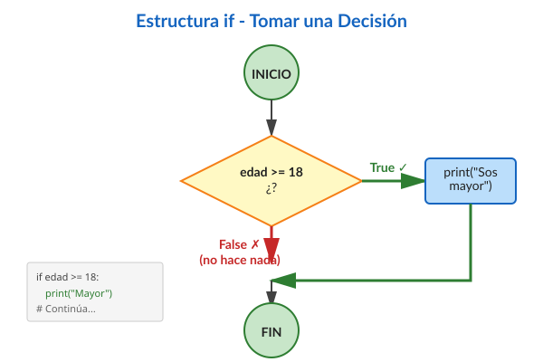
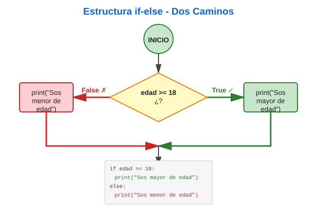
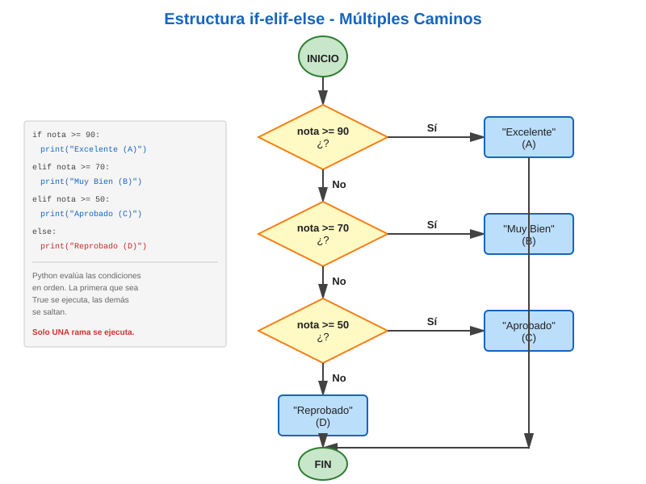

(control-flujo)=
# Control de Flujo

::::{admonition} Mapa del Capítulo
:class: tip dropdown

Este capítulo te enseña a hacer que tus programas **piensen** y **repitan** acciones. ¡Es donde tu código cobra vida!

```{mermaid}
graph TD
    A[Introducción] --> B[Condicionales if/elif/else]
    B --> C[Bucles while]
    C --> D[Bucles for]
    D --> E[Control de Bucles]
    E --> F[Patrones Comunes]
    
    style A fill:#e3f2fd
    style B fill:#fff9c4
    style C fill:#e1bee7
    style D fill:#e1bee7
    style E fill:#ffccbc
    style F fill:#c8e6c9
```

**⏱️ Tiempo estimado:** 5-7 horas

**Lo que vas a aprender:**
- Cómo hacer que tu programa tome decisiones (`if`, `elif`, `else`)
- Repetir acciones con `while` y `for`
- Controlar bucles con `break` y `continue`
- Patrones comunes de programación

**Al final podrás:**
- Crear programas que reaccionan a diferentes situaciones
- Evitar repetir código usando bucles
- Construir menús interactivos y validaciones
::::

## Introducción y Motivación

### ¿Qué es el Control de Flujo? 🚦

Hasta ahora, tus programas han sido como seguir una receta paso a paso: haces **una cosa tras otra**, siempre en el mismo orden. Pero los programas reales necesitan ser **inteligentes**:

:::::{grid} 1 1 2 2
:gutter: 3

::::{grid-item-card} Sin Control de Flujo
```python
# Programa "tonto"
print("Buenos días")
print("Buenas tardes")
print("Buenas noches")
# Siempre saluda igual...
```
::::

::::{grid-item-card} Con Control de Flujo
```python
# Programa "inteligente"
hora = 14
if hora < 12:
    print("Buenos días")
elif hora < 20:
    print("Buenas tardes")
else:
    print("Buenas noches")
# ¡Saluda según la hora! 
```
::::

:::::

### Analogía del Semáforo 🚦

Imaginate que sos un auto en una intersección:

```{mermaid}
graph LR
    A[Llego al semáforo] --> B{¿Qué color?}
    B -->|🟢 Verde| C[Paso]
    B -->|🟡 Amarillo| D[Freno con cuidado]
    B -->|🔴 Rojo| E[Me detengo]
    
    style A fill:#e3f2fd
    style B fill:#fff9c4
    style C fill:#c8e6c9
    style D fill:#fff3e0
    style E fill:#ffcdd2
```

Eso es **control de flujo**: tu programa "mira" la situación y **decide** qué hacer, como vos decidís según el color del semáforo.

:::{important} ¿Por qué es tan importante?
El control de flujo es lo que convierte una secuencia fija de instrucciones en un programa que puede:

- **Tomar decisiones** basadas en datos
- **Evitar repetir código** (no copies y pegues 100 veces)
- **Crear programas interactivos** que responden al usuario
- **Manejar diferentes escenarios** en el mismo programa
:::

### Ejemplos del Mundo Real

Todos estos usan control de flujo:

:::::{grid} 1 1 2 2
:gutter: 2

::::{grid-item-card} 🏧 Cajero Automático
- **Decisión:** ¿El PIN es correcto?
- **Repetición:** Permitir 3 intentos
- **Menú:** Repetir hasta que elija "Salir"
::::

::::{grid-item-card} 🎮 Videojuego
- **Decisión:** ¿El jugador chocó?
- **Repetición:** Loop principal del juego
- **Validación:** ¿Quedan vidas?
::::

::::{grid-item-card} 🌡️ Termostato
- **Decisión:** ¿Temperatura baja?
- **Repetición:** Revisar cada minuto
- **Acción:** Encender/apagar calefacción
::::

::::{grid-item-card} 📱 Aplicación de Mensajes
- **Decisión:** ¿Hay conexión?
- **Repetición:** Revisar nuevos mensajes
- **Validación:** ¿Mensaje válido?
::::

:::::

### ¿Qué Vas a Aprender?

```{mermaid}
mindmap
  root((Control<br/>de Flujo))
    Decisiones
      if simple
      if-else
      if-elif-else
    Repetición
      while
      for
      range
    Control
      break
      continue
      pass
    Patrones
      Validación
      Menús
      Banderas
```

¡Empecemos! 

---

(condicionales)=
## Estructuras Condicionales

### ¿Qué son las Condicionales? 

Las **condicionales** son como las bifurcaciones en un camino: según la situación, tu programa toma un camino u otro.



::::{admonition} Analogía: El Guardia de Seguridad
:class: tip

Imaginate un guardia en la entrada de un boliche:

```python
edad = 17

if edad >= 18:
    print("¡Bienvenido! Pasá")  # Solo si cumple la condición
    
print("Que tengas buen día")  # Esto se ejecuta siempre
```

- **Si** tenés 18+ → te deja pasar Y te saluda
- **Si** tenés menos → solo te saluda

El guardia **decide** basándose en tu edad. ¡Eso es una condicional!
::::

---

### La Estructura `if` Simple

La forma más básica: "Si se cumple esto, hacé aquello"

```{code-cell} ipython3
edad = 18

if edad >= 18:
    print("Sos mayor de edad")
    print("Podés votar")
    
print("Este mensaje se muestra siempre")
```

#### Anatomía del `if`

:::::{grid} 1 1 2 2
:gutter: 3

::::{grid-item}
```python
if edad >= 18:
    print("Mayor")
    print("Votar")
print("Fin")
```
::::

::::{grid-item}
1. **`if`** → palabra clave
2. **`edad >= 18`** → condición (True/False)
3. **`:`** → dos puntos (obligatorio)
4. **Indentación** → define el bloque
5. **Sin indentar** → fuera del if
::::

:::::

:::{important} Indentación: ¡La Clave en Python!

Python es **especial**: usa **espacios** para definir bloques de código (no llaves `{}` como otros lenguajes).


**Reglas de oro:**
- ✅ Usá **4 espacios** por nivel
- ✅ Sé **consistente**(siempre 4)
- ❌ NO mezcles espacios con tabuladores (esto no es un problema en el JupyterLab)
- ❌ NO olvidar los dos puntos `:`

```python
# ✓ CORRECTO
if edad >= 18:
    print("Mayor de edad")  # 4 espacios
    print("Podés votar")    # 4 espacios

# ✗ ERROR: Sin indentación
if edad >= 18:
print("Mayor de edad")  # IndentationError!

# ✗ ERROR: Inconsistente
if edad >= 18:
  print("Esto")    # 2 espacios
    print("Malo")  # 4 espacios - ¡No funciona!
```
:::

**Experimentá con `if`:**

```{code-cell} ipython3
# Probá cambiando los valores
temperatura = 25

if temperatura > 30:
    print("🔥 Hace mucho calor!")
    print("   Mejor quedarse adentro")

if temperatura < 10:
    print("🥶 Hace mucho frío!")
    print("   Abrigate bien")

if temperatura >= 10 and temperatura <= 30:
    print(" Temperatura agradable")
    print("   Buen día para salir")

print(f"Temperatura actual: {temperatura}°C")
```

### La Estructura `if-else`: Dos Caminos 🛤️

A veces necesitás hacer **una cosa** si se cumple, y **otra cosa diferente** si no se cumple. Ahí usás `if-else`.



::::{admonition} Analogía: Moneda al Aire
:class: tip

Tirás una moneda:
- **Si** sale cara → ganás
- **Si** sale cruz (else) → perdés

```python
moneda = "cara"

if moneda == "cara":
    print("¡Ganaste! ")
else:
    print("Perdiste 😔")
```

**Siempre pasa UNA de las dos cosas**, nunca ambas.
::::

```{code-cell} ipython3
edad = 16

if edad >= 18:
    print("Sos mayor de edad")
    print("Podés votar")
else:
    print("Sos menor de edad")
    print("Todavía no podés votar")
    
print("Gracias por consultar")
```

:::{note} ¿Cuándo usar `if-else`?
Usá `if-else` cuando:
- Hay **exactamente 2 opciones** (blanco o negro, sí o no)
- **Siempre** querés hacer algo (una cosa u otra)
- Las opciones son **excluyentes** (no pueden pasar las dos)

**Ejemplos:**
- Aprobar/Reprobar un examen
- Día/Noche
- Par/Impar
- Usuario logueado / No logueado
:::

**Comparación visual:**

:::::{grid} 1 1 2 2
:gutter: 3

::::{grid-item-card} Solo `if`
```python
if soleado:
    print("¡Vamos al parque!")
# Si no es soleado, no pasa nada
```
**Problema:** ¿Y si llueve? 🤷
::::

::::{grid-item-card} Con `if-else`
```python
if soleado:
    print("¡Vamos al parque!")
else:
    print("Nos quedamos en casa")
# Siempre hacemos algo ✓
```
**Mejor:** Cubrimos ambos casos ✅
::::

:::::

### La Estructura `if-elif-else`: Múltiples Caminos 

Cuando tenés **más de 2 opciones** a elegir, usás `elif` (abreviación de "else if").



::::{admonition} Analogía: El Semáforo de 4 Luces
:class: tip

Imaginate un semáforo especial con 4 luces que indica velocidades:

```python
velocidad = 80

if velocidad > 120:
    print("🔴 ¡Peligro! Muy rápido")
elif velocidad > 80:
    print("🟡 Cuidado, reducí velocidad")
elif velocidad > 40:
    print("🟢 Velocidad normal, bien")
else:
    print("🔵 Muy lento, podés acelerar")
```

Python revisa **en orden** hasta encontrar la primera que es verdadera. Una vez que encuentra una, **se detiene y no revisa las demás**.
::::

#### Ejemplo Completo: Sistema de Calificaciones

```{code-cell} ipython3
nota = 85

if nota >= 90:
    print("📗 Excelente - Calificación: A")
    print("   ¡Felicitaciones!")
elif nota >= 70:
    print("📘 Muy Bueno - Calificación: B")
    print("   Buen trabajo")
elif nota >= 60:
    print("📙 Bueno - Calificación: C")
    print("   Aprobado")
elif nota >= 40:
    print("📕 Regular - Calificación: D")
    print("   Necesitás mejorar")
else:
    print("❌ Insuficiente - Calificación: F")
    print("   Reprobado")

print(f"\nTu nota fue: {nota}")
```

#### ¿Cómo Funciona?

:::::{grid} 1 1 2 2
:gutter: 3

::::{grid-item}
**Flujo de evaluación:**

1️⃣ ¿`nota >= 90`? → No (85 < 90)  
   Pasa a la siguiente

2️⃣ ¿`nota >= 70`? → **¡Sí!** (85 >= 70)  
   ✅ Ejecuta este bloque  
   🛑 **Se detiene, NO evalúa el resto**

3️⃣ ~~ ¿`nota >= 60`? ~~ → No se evalúa  
4️⃣ ~~ ¿`nota >= 40`? ~~ → No se evalúa  
5️⃣ ~~ `else` ~~ → No se ejecuta
::::

::::{grid-item}
```{mermaid}
graph TD
    A[nota = 85] --> B{≥ 90?}
    B -->|No| C{≥ 70?}
    C -->|Sí| D[Muy Bueno B]
    C -->|No| E{≥ 60?}
    E -->|No| F{≥ 40?}
    F -->|No| G[Reprobado]
    
    style D fill:#c8e6c9
    style G fill:#ffcdd2
```
::::

:::::

````{danger} Cuidado con el orden!
El **orden importa muchísimo**. Python evalúa de arriba hacia abajo y ejecuta **solo la primera** condición verdadera:


:::::{grid} 1 1 2 2
:gutter: 3

::::{grid-item-card} ✅ CORRECTO
```python
numero = 85

# Orden: más restrictivo → menos
if numero >= 90:
    print("A")
elif numero >= 80:
    print("B")  # ✓ Esta se ejecuta
elif numero >= 70:
    print("C")
else:
    print("F")
```

**Funciona bien:** 85 no pasa el primer filtro, pero sí el segundo.
::::

::::{grid-item-card} ❌ INCORRECTO
```python
numero = 85

# Con el orden invertido, obtenemos el resultado incorrecto
if numero >= 70:
    print("C+")  # ✗ ¡Siempre gana!
elif numero >= 80:
    print("B")   # Nunca se alcanza
elif numero >= 90:
    print("A")   # Nunca se alcanza
```

**Problema:** La primera condición "atrapa" todos los números >= 70, las siguientes nunca se ejecutan.
::::

:::::

````


**Regla de oro:** Siempre ordená de **más específico/restrictivo** a **menos específico**.


#### Comparación: `if` múltiple vs `if`-`elif`-`else`

:::::{grid} 1 1 2 2
:gutter: 3

::::{grid-item-card} Múltiples `if` separados
```python
edad = 25

if edad >= 18:
    print("Adulto")
if edad >= 13:
    print("Adolescente")
if edad >= 0:
    print("Persona")
```

**Resultado:**
```
Adulto
Adolescente
Persona
```

**Se ejecutan TODAS las que sean `True`**

Como son tres estructuras condicionales separadas, obtenemos tres resultados diferentes.

::::

::::{grid-item-card} Con `if-elif-else`
```python
edad = 25

if edad >= 18:
    print("Adulto")
elif edad >= 13:
    print("Adolescente")
elif edad >= 0:
    print("Persona")
```

**Resultado:**
```
Adulto
```

**Se ejecuta SOLO LA PRIMERA `True`**

Como es una única estructura condicional, obtenemos un solo resultado, el primero que coincida.
::::

:::::

**Experimentá con diferentes valores:**

```{code-cell} ipython3
# Programa: Recomendación de actividad según la temperatura
temperatura = 25

if temperatura >= 35:
    print("🥵 ¡Mucho calor!")
    print("   Recomendación: Quedáte en casa con AC")
elif temperatura >= 25:
    print("☀️ Clima cálido")
    print("   Recomendación: Playa o pileta")
elif temperatura >= 15:
    print(" Clima agradable")
    print("   Recomendación: Caminar o hacer deporte")
elif temperatura >= 5:
    print("🧥 Hace frío")
    print("   Recomendación: Abrigate bien")
else:
    print("🥶 ¡Mucho frío!")
    print("   Recomendación: Quedáte adentro")

print(f"\nTemperatura actual: {temperatura}°C")
```

### Condiciones Anidadas: `if` dentro de `if` 🪆

A veces necesitás verificar **una cosa dentro de otra**, como muñecas rusas. Eso se llama **anidamiento**.

::::{admonition} Analogía: Seguridad del Banco
:class: tip

Para entrar a la bóveda de un banco:
1. **Primero** verifican tu ID
2. **Si** tu ID es correcta, **entonces** verifican tu huella
3. **Si** ambas son correctas → Acceso permitido

```python
id_correcta = True
huella_correcta = True

if id_correcta:
    print("✓ ID verificada")
    if huella_correcta:
        print("✓ Huella verificada")
        print("   Acceso permitido a la bóveda")
    else:
        print("✗ Huella incorrecta - Acceso denegado")
else:
    print("✗ ID incorrecta - Acceso denegado")
```
::::

**Ejemplo clásico:**

```{code-cell} ipython3
edad = 20
tiene_licencia = True

if edad >= 18:
    print("✓ Tenés la edad mínima")
    if tiene_licencia:
        print("✓ Tenés licencia")
        print("🚗 ¡Podés manejar!")
    else:
        print("✗ No tenés licencia")
        print(" Necesitás obtener la licencia primero")
else:
    print("✗ Sos menor de edad")
    print("⏳ Sos muy pequeño para manejar")
```

#### Simplificación con Operadores Lógicos

Muchas veces podés **simplificar** usando `and` en lugar de anidar:

:::::{grid} 1 1 2 2
:gutter: 3

::::{grid-item-card} ❌ Anidado (más complejo)
```python
if edad >= 18:
    if tiene_licencia:
        print("Podés conducir")
    else:
        print("Necesitás licencia")
else:
    print("Muy joven")
```

**Con dos niveles de indentación, es más difícil de leer.**
::::

::::{grid-item-card} ✅ Con `and` (más simple)
```python
if edad >= 18 and tiene_licencia:
    print("Podés conducir")
elif edad >= 18:
    print("Necesitás licencia")
else:
    print("Muy joven")
```

**Pero con solo un nivel de indentación, es más directo**
::::

:::::

:::{tip} ¿Cuándo anidar vs cuándo usar `and`?

**Usá anidamiento cuando:**
- Querés mostrar mensajes diferentes en cada nivel
- La lógica de cada nivel es independiente
- Necesitás hacer acciones diferentes en cada paso

**Usá `and` cuando:**
- Todas las condiciones deben ser `True` al mismo tiempo
- No necesitás mensajes intermedios
- Querés código más simple y legible

**Regla de oro:** Si podés usar `and`, usá `and`. El código más simple es mejor.
:::

**Ejemplo combinado:**

```{code-cell} ipython3
# Sistema de acceso a un club
edad = 21
es_socio = True
tiene_invitacion = False

if edad >= 18:
    if es_socio:
        print("🎫 Bienvenido, socio!")
        print("   Entrada gratuita")
    elif tiene_invitacion:
        print("📨 Entrada con invitación")
        print("   Acceso permitido")
    else:
        print("Entrada: $500")
        print("   Podés pagar en la entrada")
else:
    print("⛔ Lo sentimos, solo mayores de 18")
    print("   No podés ingresar")
```

### Expresiones Booleanas en Condiciones

Recordá que las condiciones deben evaluar a `True` o `False`:

```{code-cell} ipython3
# Comparaciones
if temperatura > 30:
    print("Hace calor")

# Variables booleanas
if esta_lloviendo:
    print("Llevá paraguas")

# Operadores lógicos
if edad >= 18 and tiene_dni:
    print("Podés votar")

# Negación
if not esta_ocupado:
    print("Disponible")
```

### Valores "Truthy" y "Falsy"

En Python, ciertos valores se consideran "falsos" en un contexto booleano:
- `False`, `None`, `0`, `0.0`
- Secuencias vacías: `""`, `[]`, `{}`, `()`

Todos los demás valores se consideran "verdaderos". Sin embargo, según las buenas prácticas, es preferible ser **explícito**:

```{code-cell} ipython3
lista = []

# ❌ Menos claro (aunque funciona)
if lista:
    print("Tiene elementos")

# ✓ Más claro y explícito
if len(lista) > 0:
    print("Tiene elementos")

# O mejor aún
if lista:  # Aceptable para listas
    print("Tiene elementos")
# Pero documentalo si no es obvio
```

---

(ejemplos-condicionales)=
## Ejemplos Prácticos con Condicionales

### Ejemplo 1: Calculadora de Descuento

```python
"""Programa que calcula descuento según el monto de compra."""

DESCUENTO_BASICO = 0.05      # 5%
DESCUENTO_INTERMEDIO = 0.10  # 10%
DESCUENTO_PREMIUM = 0.15     # 15%

monto = float(input("Ingrese el monto de compra: $"))

if monto >= 10000:
    descuento = monto * DESCUENTO_PREMIUM
    print(f"Descuento Premium: {DESCUENTO_PREMIUM * 100}%")
elif monto >= 5000:
    descuento = monto * DESCUENTO_INTERMEDIO
    print(f"Descuento Intermedio: {DESCUENTO_INTERMEDIO * 100}%")
elif monto >= 1000:
    descuento = monto * DESCUENTO_BASICO
    print(f"Descuento Básico: {DESCUENTO_BASICO * 100}%")
else:
    descuento = 0
    print("No hay descuento para este monto")

total = monto - descuento
print(f"Monto original: ${monto:.2f}")
print(f"Descuento: ${descuento:.2f}")
print(f"Total a pagar: ${total:.2f}")
```

### Ejemplo 2: Clasificación de Temperatura

```python
"""Clasifica la temperatura y da recomendaciones."""

temperatura = float(input("Ingrese la temperatura en °C: "))

if temperatura >= 35:
    print("Extremadamente caluroso - Evitá la exposición al sol")
elif temperatura >= 25:
    print("Caluroso - Mantenete hidratado")
elif temperatura >= 15:
    print("Agradable - Clima ideal")
elif temperatura >= 5:
    print("Fresco - Llevá una campera")
else:
    print("Frío - Abrigate bien")
```

### Ejemplo 3: Validación de Edad

```python
"""Valida si una persona puede acceder a cierto contenido."""

edad = int(input("Ingrese su edad: "))

if edad < 0 or edad > 120:
    print("Error: Edad inválida")
elif edad < 13:
    print("Contenido no disponible para menores de 13 años")
elif edad < 18:
    print("Acceso permitido con supervisión de un adulto")
else:
    print("Acceso completo permitido")
```

---

(while-loops)=
## Loops con `while`

Un **loop**(bucle o lazo) permite ejecutar un bloque de código repetidamente. El loop `while` continúa ejecutándose mientras una condición sea verdadera.

### Sintaxis Básica

```{code-cell} ipython3
while condicion:
    # Bloque de código que se repite
    # mientras la condición sea True
```

### Ejemplo Simple

```{code-cell} ipython3
contador = 1

while contador <= 5:
    print(f"Contador: {contador}")
    contador = contador + 1

print("Fin del loop")
```

**Salida:**
```
Contador: 1
Contador: 2
Contador: 3
Contador: 4
Contador: 5
Fin del loop
```

**Diagrama de flujo:**

```{mermaid}
flowchart TD
    A[contador = 1] --> B{contador <= 5?}
    B -->|True| C[print contador]
    C --> D[contador = contador + 1]
    D --> B
    B -->|False| E[Fin del loop]
```

````{danger} 🚨 ¡Cuidado con los Loops Infinitos!

Si la condición **nunca** se vuelve `False`, el bucle se ejecutará ** para siempre**:

:::::{grid} 1 1 2 2
:gutter: 3

::::{grid-item-card} Loop Infinito (¡Ooops!)
```python
contador = 1
while contador <= 5:
    print(contador)
    # ¡Olvidamos incrementar!
```

**Problema:** `contador` siempre vale 1  
**Resultado:** Imprime "1" infinitamente 😱
**Solución:** Utiliza el botón para detener la celda en Jupyter
::::

::::{grid-item-card} ✅ Loop Correcto
```python
contador = 1
while contador <= 5:
    print(contador)
    contador = contador + 1 # ✓ Incrementa
```

**Funciona:** `contador` cambia  
**Resultado:** Imprime 1, 2, 3, 4, 5 y termina ✓
::::

:::::

**Checklist anti-loops-infinitos:**
- [ ] ¿La condición puede volverse `False`?
- [ ] ¿Modifico las variables de la condición dentro del bucle?
- [ ] ¿Hay una forma de salir del bucle?

**Tip:** Si tu programa "se colgó", probablemente tenés un loop infinito. Presiona **Ctrl+C** para detenerlo.

````

### Patrones Comunes con `while`

#### Patrón 1: Acumulador (Sumar números)

```{code-cell} ipython3
# Calcular la suma de los primeros 10 números
suma = 0  # Acumulador (empieza en 0)
contador = 1

while contador <= 10:
    suma = suma + contador  # Acumula el valor
    contador = contador + 1

print(f"La suma de 1 a 10 es: {suma}")
```

:::{tip} Patrón Acumulador
**Estructura:**
1. Inicializar acumulador en 0
2. En cada vuelta, sumar al acumulador
3. Al final, el acumulador tiene el total

**Usos:**Sumar números, contar elementos, promedios
:::

#### Patrón 2: Contador Regresivo

```{code-cell} ipython3
print("Cuenta regresiva para despegue:")
numero = 10

while numero > 0:
    print(f"   {numero}...")
    numero = numero - 1

print("   ¡DESPEGUE! ")
```

#### Patrón 3: Validación con Repetición

```{code-cell} ipython3
# Pedir contraseña hasta que sea correcta
PASSWORD_CORRECTA = "python123"
intentos = 0
MAX_INTENTOS = 3

contraseña = input("Ingrese la contraseña: ")
intentos = intentos + 1

while contraseña != PASSWORD_CORRECTA and intentos < MAX_INTENTOS:
    print(f"❌ Contraseña incorrecta. Te quedan {MAX_INTENTOS - intentos} intentos.")
    contraseña = input("Ingrese la contraseña: ")
    intentos = intentos + 1

if contraseña == PASSWORD_CORRECTA:
    print("✅ ¡Acceso concedido!")
else:
    print("Cuenta bloqueada por seguridad")
```

:::{note} Patrón Validación
Este patrón es **muy común** en programación:
- Sistemas de login
- Validación de datos
- Menús interactivos
- Juegos (seguir jugando mientras...)
:::

#### Patrón 4: Menú Interactivo

```{code-cell} ipython3
print("=== CALCULADORA SIMPLE ===")
continuar = "s"

while continuar.lower() == "s":
    a = float(input("\nPrimer número: "))
    operacion = input("Operación (+, -, *, /): ")
    b = float(input("Segundo número: "))
    
    if operacion == "+":
        print(f"Resultado: {a + b}")
    elif operacion == "-":
        print(f"Resultado: {a - b}")
    elif operacion == "*":
        print(f"Resultado: {a * b}")
    elif operacion == "/" and b != 0:
        print(f"Resultado: {a / b}")
    else:
        print("Operación inválida")
    
    continuar = input("\n¿Otra operación? (s/n): ")

print("¡Hasta luego! 👋")
```

### Loops con Condiciones Complejas

Podés usar operadores lógicos en la condición:

```python
"""Juego de adivinanza con límite de intentos."""

NUMERO_SECRETO = 42
MAX_INTENTOS = 5

intentos = 0
adivinado = False

while intentos < MAX_INTENTOS and not adivinado:
    intento = int(input("Adiviná el número (1-100): "))
    intentos = intentos + 1
    
    if intento == NUMERO_SECRETO:
        adivinado = True
        print(f"¡Correcto! Lo adivinaste en {intentos} intentos")
    elif intento < NUMERO_SECRETO:
        print("Muy bajo. Intentá de nuevo.")
    else:
        print("Muy alto. Intentá de nuevo.")

if not adivinado:
    print(f"Se acabaron los intentos. El número era {NUMERO_SECRETO}")
```

---

(banderas-control)=
## Banderas de Control

Según la {ref}`0x0006h`, en lugar de usar `break` y `continue` para loops complejos, es preferible usar **banderas** (variables booleanas) para controlar el flujo.

### Patrón de Bandera Simple

```{code-cell} ipython3
"""Búsqueda con bandera de control."""

numeros = [10, 25, 30, 45, 50]
objetivo = 30
encontrado = False
i = 0

while i < len(numeros) and not encontrado:
    if numeros[i] == objetivo:
        encontrado = True
        print(f"Encontrado en posición {i}")
    i = i + 1

if not encontrado:
    print("No se encontró el número")
```

### Múltiples Banderas

```python
"""Validación de entrada con múltiples condiciones."""

entrada_valida = False
intentos = 0
MAX_INTENTOS = 3

while not entrada_valida and intentos < MAX_INTENTOS:
    edad = int(input("Ingrese su edad (18-100): "))
    intentos = intentos + 1
    
    if edad >= 18 and edad <= 100:
        entrada_valida = True
        print("Edad válida registrada")
    else:
        print(f"Edad inválida. Intentos restantes: {MAX_INTENTOS - intentos}")

if not entrada_valida:
    print("Demasiados intentos inválidos")
```

### Ventajas de las Banderas

1. **Claridad:** El código es más fácil de entender
2. **Mantenibilidad:** Es fácil agregar condiciones adicionales
3. **Debugging:** Podés inspeccionar el estado de las banderas
4. **Testeo:** Las banderas facilitan las pruebas unitarias

:::{tip} Cuándo usar break
Si bien preferimos banderas, `break` es aceptable en Python para casos simples de búsqueda:

```{code-cell} ipython3
# Aceptable para búsquedas simples
for elemento in lista:
    if elemento == objetivo:
        print("Encontrado")
        break
```

Para lógica más compleja, usá banderas.
:::

---

(for-loops)=
## Loops con `for`: Para Cada Elemento... 

Detalle importante, lo que está entre `[]` son **listas**, que veremos en profundidad en el próximo capítulo.
Por ahora, entendé que es simplemente un conjunto ordenado de valores.

### ¿Qué es un Bucle `for`?

El bucle `for` es para cuando querés hacer algo **con cada elemento** de una lista, palabra, o secuencia. Es como decir: "**Para cada** cosa en este grupo, hacé esto".


::::{admonition} Analogía: Lista de Compras
:class: tip

Imaginate que tenés una lista de compras:

```python
lista_compras = ["pan", "leche", "huevos", "queso"]

for producto in lista_compras:
    print(f"✓ Comprar: {producto}")
```

**Salida:**
```
✓ Comprar: pan
✓ Comprar: leche
✓ Comprar: huevos
✓ Comprar: queso
```

Python **automáticamente** toma cada elemento de la lista, uno por uno, y ejecuta el código para cada uno. ¡No necesitás contador ni incremento manual!
::::

---

### Diferencia: `while` vs `for`

:::::{grid} 1 1 2 2
:gutter: 3

::::{grid-item-card} while (Mientras...)
```python
# Usar cuando NO sabés
# cuántas veces repetir

contraseña = ""
while contraseña != "abc123":
    contraseña = input("Contraseña: ")
```

**Cuándo usarlo:**
- Login (hasta que acierte)
- Menús (hasta que salga)
- Validaciones
::::

::::{grid-item-card} for (Para cada...)
```python
# Usar cuando SÍ sabés
# cuántas veces repetir

frutas = ["🍎", "🍌", "🍊"]
for fruta in frutas:
    print(fruta)
```

**Cuándo usarlo:**
- Recorrer listas
- Repetir N veces
- Procesar colecciones
::::

:::::

---

### Iterando sobre un Rango

La función `range()` genera una secuencia de números:

```{code-cell} ipython3
# Contar del 0 al 4
for i in range(5):
    print(f"Número: {i}")
```

**La función `range()`:**

```{code-cell} ipython3
# range(stop) - desde 0 hasta stop-1
for i in range(5):
    print(i)  # 0, 1, 2, 3, 4

# range(start, stop) - desde start hasta stop-1
for i in range(2, 6):
    print(i)  # 2, 3, 4, 5

# range(start, stop, step) - con incremento personalizado
for i in range(0, 10, 2):
    print(i)  # 0, 2, 4, 6, 8

# Contando hacia atrás
for i in range(5, 0, -1):
    print(i)  # 5, 4, 3, 2, 1
```

### Iterando sobre Strings

```{code-cell} ipython3
mensaje = "Python"

for letra in mensaje:
    print(letra)

# Salida:
# P
# y
# t
# h
# o
# n
```

### Iterando sobre Listas

```{code-cell} ipython3
frutas = ["manzana", "banana", "naranja"]

for fruta in frutas:
    print(f"Me gusta la {fruta}")
```

:::{important} Estilo Pythonic
Según la {ref}`0x0007h`, en Python es preferible iterar directamente sobre elementos en lugar de usar índices:

```{code-cell} ipython3
nombres = ["Ana", "Bruno", "Carlos"]

# ❌ Menos Pythonico
for i in range(len(nombres)):
    print(nombres[i])

# ✓ Pythonico
for nombre in nombres:
    print(nombre)
```
:::

### Usando `enumerate()` cuando necesitás índices

Si necesitás tanto el índice como el elemento, usá `enumerate()`:

```{code-cell} ipython3
colores = ["rojo", "verde", "azul"]

for indice, color in enumerate(colores):
    print(f"Color {indice}: {color}")

# Salida:
# Color 0: rojo
# Color 1: verde
# Color 2: azul
```

**Empezar desde un índice diferente:**

```{code-cell} ipython3
colores = ["rojo", "verde", "azul"]

for indice, color in enumerate(colores, start=1):
    print(f"Color {indice}: {color}")

# Salida:
# Color 1: rojo
# Color 2: verde
# Color 3: azul
```

### Ejemplo: Tabla de Multiplicar

```python
"""Genera la tabla de multiplicar de un número."""

numero = int(input("Ingrese un número: "))

print(f"\nTabla de multiplicar del {numero}:")
print("-" * 30)

for i in range(1, 11):
    resultado = numero * i
    print(f"{numero} x {i:2d} = {resultado:3d}")
```

### Ejemplo: Suma de Lista

```{code-cell} ipython3
"""Calcula la suma de una lista de números."""

numeros = [10, 20, 30, 40, 50]
suma = 0

for numero in numeros:
    suma = suma + numero

print(f"La suma es: {suma}")

```

---

(while-vs-for)=
## `while` vs `for`: ¿Cuándo usar cada uno?

### Usar `while` cuando:

1. **No conocés de antemano cuántas iteraciones necesitás**
   ```python
   # Esperar entrada válida
   edad = -1
   while edad < 0 or edad > 120:
       edad = int(input("Edad (0-120): "))
   ```

2. **La condición de parada es compleja**
   ```{code-cell} ipython3
   intentos = 0
   exito = False
   MAX_INTENTOS = 5
   
   while intentos < MAX_INTENTOS and not exito:
       # ... lógica ...
   ```

3. **El loop puede no ejecutarse ninguna vez**
   ```{code-cell} ipython3
   while hay_mas_datos():
       procesar_datos()
   ```

### Usar `for` cuando:

1. **Iterás sobre una secuencia conocida**
   ```{code-cell} ipython3
   for nombre in lista_nombres:
       print(nombre)
   ```

2. **Conocés exactamente cuántas iteraciones necesitás**
   ```{code-cell} ipython3
   for i in range(10):
       print(i)
   ```

3. **Necesitás procesar cada elemento de una colección**
   ```{code-cell} ipython3
   for estudiante in estudiantes:
       calcular_promedio(estudiante)
   ```

### Tabla Comparativa

| Aspecto | `while` | `for` |
|---------|---------|-------|
| **Iteraciones**| Número desconocido | Número conocido o secuencia |
| **Condición**| Puede ser compleja | Implícita (hasta terminar secuencia) |
| **Uso típico**| Validaciones, menús | Procesar colecciones, rangos |
| **Riesgo**| Loop infinito si no hay cuidado | Menor riesgo |

---

(loops-anidados)=
## Loops Anidados

Podés colocar loops dentro de otros loops. Cada iteración del loop externo ejecuta completamente el loop interno.

### Ejemplo: Tabla de Multiplicar Completa

```{code-cell} ipython3
"""Genera tablas de multiplicar del 1 al 5."""

for numero in range(1, 6):
    print(f"\nTabla del {numero}:")
    for multiplicador in range(1, 11):
        resultado = numero * multiplicador
        print(f"{numero} x {multiplicador:2d} = {resultado:3d}")
```

### Ejemplo: Patrón de Asteriscos

```{code-cell} ipython3
"""Imprime un triángulo de asteriscos."""

altura = 5

for fila in range(1, altura + 1):
    for columna in range(fila):
        print("*", end="")
    print()  # Nueva línea

# Salida:
# *
# **
# ***
# ****
# *****
```

### Ejemplo: Validación de Múltiples Credenciales

```{code-cell} ipython3
"""Verificar usuario y contraseña con múltiples intentos permitidos."""

# Credenciales correctas (en un caso real, esto estaría en una base de datos)
usuario_valido = "admin"
password_valida = "python123"

# Configuración
max_intentos_usuario = 3
max_intentos_password = 3
acceso_concedido = False

print("=== SISTEMA DE ACCESO ===")

# Loop externo: intentos de usuario
for intento_usuario in range(1, max_intentos_usuario + 1):
    print(f"\n[Intento de usuario {intento_usuario}/{max_intentos_usuario}]")
    usuario = input("Usuario: ")
    
    if usuario == usuario_valido:
        print("✓ Usuario correcto")
        
        # Loop interno: intentos de contraseña
        for intento_password in range(1, max_intentos_password + 1):
            print(f"[Intento de contraseña {intento_password}/{max_intentos_password}]")
            password = input("Contraseña: ")
            
            if password == password_valida:
                print("\n✓ ACCESO CONCEDIDO")
                acceso_concedido = True
                break  # Salir del loop de contraseñas
            else:
                print("✗ Contraseña incorrecta")
        
        # Si encontró la contraseña, salir del loop de usuarios también
        if acceso_concedido:
            break
        else:
            print("\n✗ Contraseña bloqueada")
            break
    else:
        print("✗ Usuario incorrecto")

if not acceso_concedido:
    print("\n✗ ACCESO DENEGADO - Cuenta bloqueada")
```

:::{warning} Cuidado con la complejidad
Loops anidados pueden hacer que tu código sea lento. Un loop dentro de otro multiplica las iteraciones:
- Loop externo: 100 iteraciones
- Loop interno: 100 iteraciones
- Total: 100 × 100 = 10,000 iteraciones

Usá loops anidados solo cuando sea necesario.
:::

---

(patrones-comunes)=
## Patrones Comunes de Programación

### Patrón 1: Acumulador

Sumar o acumular valores:

```{code-cell} ipython3
# Suma de números del 1 al 100
suma = 0
for i in range(1, 101):
    suma = suma + i
print(f"Suma: {suma}")
```

### Patrón 2: Contador

Contar cuántas veces ocurre algo:

```{code-cell} ipython3
# Contar números pares en una lista
numeros = [1, 2, 3, 4, 5, 6, 7, 8, 9, 10]
contador_pares = 0

for numero in numeros:
    if numero % 2 == 0:
        contador_pares = contador_pares + 1

print(f"Hay {contador_pares} números pares")
```

### Patrón 3: Búsqueda

Encontrar un elemento:

```{code-cell} ipython3
# Buscar un nombre en una lista
nombres = ["Ana", "Bruno", "Carlos", "Diana"]
buscar = "Carlos"
encontrado = False

for nombre in nombres:
    if nombre == buscar:
        encontrado = True

if encontrado:
    print(f"{buscar} está en la lista")
else:
    print(f"{buscar} no está en la lista")
```

### Patrón 4: Máximo/Mínimo

Encontrar el valor máximo o mínimo:

```{code-cell} ipython3
# Encontrar el número mayor
numeros = [45, 23, 67, 12, 89, 34]
maximo = numeros[0]

for numero in numeros:
    if numero > maximo:
        maximo = numero

print(f"El máximo es: {maximo}")
```

### Patrón 5: Validación de Entrada

Repetir hasta obtener entrada válida:

```python
# Validar entrada numérica positiva
numero_valido = False

while not numero_valido:
    try:
        numero = float(input("Ingrese un número positivo: "))
        if numero > 0:
            numero_valido = True
            print(f"Número válido: {numero}")
        else:
            print("El número debe ser positivo")
    except ValueError:
        print("Debe ingresar un número")
```

### Patrón 6: Menú de Opciones

```python
"""Menú interactivo."""

continuar = True

while continuar:
    print("\n=== MENÚ ===")
    print("1. Opción A")
    print("2. Opción B")
    print("3. Opción C")
    print("4. Salir")
    
    opcion = input("Seleccione una opción (1-4): ")
    
    if opcion == "1":
        print("Ejecutando opción A...")
    elif opcion == "2":
        print("Ejecutando opción B...")
    elif opcion == "3":
        print("Ejecutando opción C...")
    elif opcion == "4":
        continuar = False
        print("¡Hasta luego!")
    else:
        print("Opción inválida")
```

---

(errores-comunes-control)=
## Errores Comunes

### 1. Olvidar la indentación

```python
# ❌ Error de sintaxis
if edad >= 18:
print("Mayor de edad")  # IndentationError

# ✓ Correcto
if edad >= 18:
    print("Mayor de edad")
```

### 2. Usar `=` en lugar de `==`

```python
# ❌ Asignación en lugar de comparación
if edad = 18:  # SyntaxError
    print("Tiene 18")

# ✓ Correcto
if edad == 18:
    print("Tiene 18")
```

### 3. Loop infinito

```python
# ❌ Loop infinito
contador = 0
while contador < 10:
    print(contador)
    # Olvidamos incrementar contador

# ✓ Correcto
contador = 0
while contador < 10:
    print(contador)
    contador = contador + 1
```

### 4. Condiciones incorrectas en rangos

```python
# ❌ Lógica incorrecta
nota = 85
if nota >= 60 and nota < 90:  # No captura 60-69
    print("Bueno")
elif nota >= 70 and nota < 90:  # Nunca se alcanza
    print("Muy Bueno")

# ✓ Correcto - orden de más específico a general
if nota >= 90:
    print("Excelente")
elif nota >= 70:
    print("Muy Bueno")
elif nota >= 60:
    print("Bueno")
```

### 5. Modificar lista mientras se itera

```{code-cell} ipython3
# ❌ Problemático
numeros = [1, 2, 3, 4, 5]
for numero in numeros:
    if numero % 2 == 0:
        numeros.remove(numero)  # Puede causar problemas

# ✓ Mejor - crear nueva lista
numeros = [1, 2, 3, 4, 5]
impares = []
for numero in numeros:
    if numero % 2 != 0:
        impares.append(numero)
```

---

(buenas-practicas-control)=
## Buenas Prácticas

### 1. Nombres Descriptivos para Banderas

```{code-cell} ipython3
# ❌ Poco claro
flag = True
x = False

# ✓ Descriptivo
usuario_autenticado = True
datos_validos = False
```

### 2. Condiciones Legibles

```{code-cell} ipython3
# ❌ Difícil de leer
if a > 18 and b == True and c != 0 and (d == "admin" or d == "superuser"):
    hacer_algo()

# ✓ Más claro
es_mayor_edad = a > 18
esta_activo = b == True
tiene_saldo = c != 0
es_administrador = d == "admin" or d == "superuser"

if es_mayor_edad and esta_activo and tiene_saldo and es_administrador:
    hacer_algo()
```

### 3. Evitar Anidación Excesiva

```{code-cell} ipython3
# ❌ Muy anidado
if condicion1:
    if condicion2:
        if condicion3:
            if condicion4:
                hacer_algo()

# ✓ Utilizá condiciones combinadas
if condicion1 and condicion2 and condicion3 and condicion4:
    hacer_algo()

# En particular cuando la acción a hacer es única.
# (No hay uso para los caminos 'else')    
```

### 4. Constantes para Valores Mágicos

```{code-cell} ipython3
# ❌ "Números mágicos"
if edad >= 18 and edad <= 65:
    calcular_descuento()

# ✓ Constantes descriptivas
EDAD_MINIMA = 18
EDAD_MAXIMA = 65

if edad >= EDAD_MINIMA and edad <= EDAD_MAXIMA:
    calcular_descuento()
```

### 5. Comentarios en Condiciones Complejas

```{code-cell} ipython3
# Verificar si el usuario puede acceder al sistema
# Debe ser mayor de edad, tener cuenta activa y no estar suspendido
if edad >= 18 and cuenta_activa and not suspendido:
    permitir_acceso()
```

---

(ejercicios-control-flujo)=
## Ejercicios

(ejercicio-2-1)=
### Ejercicio 2.1: Calculadora de IMC con Clasificación

Calculá el IMC y clasificalo según la tabla de la OMS:

| IMC | Clasificación |
|-----|---------------|
| < 18.5 | Bajo peso |
| 18.5 - 24.9 | Peso normal |
| 25.0 - 29.9 | Sobrepeso |
| ≥ 30.0 | Obesidad |

**Entrada:**
- Peso en kg (float)
- Altura en metros (float)

**Salida:**
- IMC calculado
- Clasificación según la tabla

**Ejemplo:**
```
Ingrese su peso en kg: 70
Ingrese su altura en metros: 1.75

Su IMC es: 22.86
Clasificación: Peso normal
```

---

(ejercicio-2-2)=
### Ejercicio 2.2: Año Bisiesto

Un año es bisiesto si:
- Es divisible por 4, PERO
- Si es divisible por 100, también debe ser divisible por 400

Escribí un programa que determine si un año es bisiesto.

**Entrada:**
- Año (int)

**Salida:**
- Si es bisiesto o no

**Ejemplo:**
```
Ingrese un año: 2024
2024 es un año bisiesto

Ingrese un año: 1900
1900 NO es un año bisiesto

Ingrese un año: 2000
2000 es un año bisiesto
```

:::{tip}
Usá el operador módulo `%` para verificar divisibilidad.
Un número es divisible por otro si el resto es 0.
:::

---

(ejercicio-2-3)=
### Ejercicio 2.3: Calculadora de Notas

Escribí un programa que calcule el promedio de un estudiante y determine si aprobó.

**Reglas:**
- Se ingresan 3 notas (0-10)
- El promedio debe ser ≥ 6 para aprobar
- Si alguna nota es < 4, desaprueba automáticamente (aplazo)

**Entrada:**
- Tres notas (float)

**Salida:**
- Promedio
- Estado (Aprobado/Desaprobado/Aplazado)

**Ejemplo:**
```
Ingrese nota 1: 7
Ingrese nota 2: 8
Ingrese nota 3: 6

Promedio: 7.00
Estado: Aprobado
```

---

(ejercicio-2-4)=
### Ejercicio 2.4: Contador de Dígitos

Escribí un programa que cuente cuántos dígitos tiene un número entero positivo.

**Entrada:**
- Número entero positivo

**Salida:**
- Cantidad de dígitos

**Ejemplo:**
```
Ingrese un número: 12345
El número tiene 5 dígitos
```

:::{tip}
Podés dividir el número por 10 repetidamente hasta que llegue a 0, contando las veces que dividiste.
:::

---

(ejercicio-2-5)=
### Ejercicio 2.5: Suma de Pares

Escribí un programa que sume todos los números pares entre 1 y un número N ingresado por el usuario.

**Entrada:**
- Número N (int)

**Salida:**
- Suma de todos los pares entre 1 y N

**Ejemplo:**
```
Ingrese un número: 10
La suma de los pares entre 1 y 10 es: 30
(2 + 4 + 6 + 8 + 10 = 30)
```

---

(ejercicio-2-6)=
### Ejercicio 2.6: Factorial

El factorial de un número n (escrito n!) es el producto de todos los enteros positivos desde 1 hasta n:

$$
n! = 1 \times 2 \times 3 \times ... \times n
$$

Por ejemplo: $5! = 1 \times 2 \times 3 \times 4 \times 5 = 120$

Escribí un programa que calcule el factorial de un número.

**Entrada:**
- Número entero positivo

**Salida:**
- Factorial del número

**Ejemplo:**
```
Ingrese un número: 5
5! = 120
```

---

(ejercicio-2-7)=
### Ejercicio 2.7: Números Primos

Un número primo es aquel que solo es divisible por 1 y por sí mismo. Escribí un programa que determine si un número es primo.

**Entrada:**
- Número entero mayor que 1

**Salida:**
- Si el número es primo o no

**Ejemplo:**
```
Ingrese un número: 17
17 es un número primo

Ingrese un número: 12
12 NO es un número primo
```

:::{tip}
Para verificar si n es primo, probá dividirlo por todos los números desde 2 hasta n-1. Si alguno lo divide exactamente (resto 0), no es primo.
:::

---

(ejercicio-2-8)=
### Ejercicio 2.8: Secuencia de Fibonacci

La secuencia de Fibonacci comienza con 0 y 1, y cada número siguiente es la suma de los dos anteriores:

$$
0, 1, 1, 2, 3, 5, 8, 13, 21, 34, ...
$$

Escribí un programa que muestre los primeros N números de la secuencia de Fibonacci.

**Entrada:**
- Cantidad de números a mostrar (int)

**Salida:**
- Los primeros N números de Fibonacci

**Ejemplo:**
```
¿Cuántos números de Fibonacci desea ver? 8
0, 1, 1, 2, 3, 5, 8, 13
```

---

(ejercicio-2-9)=
### Ejercicio 2.9: Pirámide de Números

Escribí un programa que imprima una pirámide de números de altura N.

**Entrada:**
- Altura de la pirámide (int)

**Salida:**
- Pirámide de números

**Ejemplo:**
```
Ingrese la altura: 5

    1
   121
  12321
 1234321
123454321
```

:::{tip}
Para cada fila i:
1. Imprimí (N - i) espacios
2. Imprimí números ascendentes de 1 a i
3. Imprimí números descendentes de i-1 a 1
:::

---

(ejercicio-2-10)=
### Ejercicio 2.10: Juego de Adivinanza

Implementá un juego donde la computadora "piensa" un número aleatorio entre 1 y 100, y el usuario debe adivinarlo. El programa debe dar pistas ("muy alto" o "muy bajo") y contar los intentos.

**Entrada:**
- Intentos del usuario (int)

**Salida:**
- Pistas hasta que adivine
- Cantidad de intentos necesarios

**Ejemplo:**
```
¡Adivina el número entre 1 y 100!

Intento 1: 50
Muy alto

Intento 2: 25
Muy bajo

Intento 3: 37
Muy bajo

Intento 4: 43
¡Correcto! Adivinaste en 4 intentos.
```

:::{tip}
Para generar un número aleatorio:
```{code-cell} ipython3
import random
numero_secreto = random.randint(1, 100)
```
:::

---

(ejercicio-2-11)=
### Ejercicio 2.11: Validación de Contraseña

Escribí un programa que valide una contraseña según estos criterios:
- Longitud mínima: 8 caracteres
- Debe contener al menos una letra mayúscula
- Debe contener al menos una letra minúscula
- Debe contener al menos un dígito

**Entrada:**
- Contraseña (string)

**Salida:**
- Si la contraseña es válida o no
- Lista de criterios que no cumple

**Ejemplo:**
```
Ingrese una contraseña: hola123

Contraseña inválida. Problemas:
- Debe tener al menos 8 caracteres
- Debe contener al menos una mayúscula
```

:::{tip}
Usá los métodos de strings:
- `str.isupper()` - verifica si es mayúscula
- `str.islower()` - verifica si es minúscula
- `str.isdigit()` - verifica si es dígito
- `len(str)` - longitud del string
:::

---

(ejercicio-2-12)=
### Ejercicio 2.12: Cajero Automático (Menú)

Simulá un cajero automático con las siguientes opciones:
1. Consultar saldo
2. Depositar dinero
3. Retirar dinero
4. Salir

**Reglas:**
- Saldo inicial: $10,000
- No se puede retirar más del saldo disponible
- Los depósitos y retiros deben ser montos positivos

**Entrada:**
- Opción del menú
- Montos según la operación

**Salida:**
- Menú interactivo
- Confirmación de operaciones
- Saldo actualizado

**Ejemplo:**
```
=== CAJERO AUTOMÁTICO ===
1. Consultar Saldo
2. Depositar
3. Retirar
4. Salir

Opción: 1
Saldo actual: $10000.00

Opción: 2
Monto a depositar: $500
Depósito exitoso. Nuevo saldo: $10500.00

Opción: 3
Monto a retirar: $2000
Retiro exitoso. Nuevo saldo: $8500.00

Opción: 4
¡Gracias por usar nuestro cajero!
```


---

(uso-ia-control-flujo)=
## Uso Ético y Efectivo de la IA en Control de Flujo

:::{important} La IA: Tu Asistente de Aprendizaje, No Tu Reemplazo
Aprender control de flujo es aprender a **pensar algorítmicamente**. La IA puede ayudarte a refinar tu lógica, pero no puede desarrollar esta habilidad por vos. **Vos debés ser quien diseñe la solución.**
:::

### Buenas Prácticas para Control de Flujo

#### Generar Ejercicios Adicionales

- *"Genera cinco ejercicios sobre condicionales `if-elif-else` que involucren validación de rangos de números"*
- *"Crea ejercicios de loops `while` que requieran el uso de banderas de control"*
- *"Dame problemas de práctica sobre loops `for` con `range()` de diferente complejidad"*

#### Obtener Pistas sobre Lógica

Si tu condición no funciona correctamente:

- *"Tengo un programa que debe verificar si un número está entre 10 y 20. Mi condición es `if numero > 10 and numero < 20:` pero falla con 10 y 20. ¿Por qué?"*
- *"Estoy escribiendo un loop para pedir números hasta que el usuario ingrese 0, pero no sé cómo estructurarlo. ¿Cuál sería el esqueleto básico?"*
- *"¿Cómo puedo salir de un loop `while` cuando se cumpla cierta condición sin usar `break`?"*

#### Refactorizar Condiciones Complejas

- *"Esta condición es muy larga y difícil de leer: `if (edad >= 18 and tiene_dni and (es_estudiante or es_empleado)) or es_admin:`. ¿Cómo puedo mejorarla?"*
- *"Tengo cuatro `if` anidados. ¿Hay una forma más clara de escribir esto?"*

#### Debugging de Lógica

- *"Mi loop infinito no se detiene. Aquí está mi código: [código]. ¿Qué estoy haciendo mal?"*
- *"Mi condición siempre evalúa `True` incluso cuando debería ser `False`. ¿Cuál podría ser el problema?"*

#### Explorar Alternativas

- *"Resolví este problema con un `while`. ¿Podrías mostrarme cómo se vería con un `for`?"*
- *"¿Cuál es la diferencia práctica entre usar un `for` con `range()` y un `while` con contador manual?"*

### Ejemplos Específicos de este Módulo

**Situación 1**: Validación de entrada

❌ **Incorrecto**:
```
Prompt: "Dame el código para validar que un número esté entre 1 y 100"
```

✅ **Correcto**:
```
Prompt: "Estoy validando un número entre 1 y 100. Escribí esto:
if numero > 1 and numero < 100:
¿Está correcto o debería usar >= y <=?"
```

**Situación 2**: Loop con acumulador

❌ **Incorrecto**:
```
Prompt: "Escribe un programa que sume números hasta que el usuario ingrese 0"
```

✅ **Correcto**:
```
Prompt: "Estoy sumando números en un loop while. Inicialicé suma = 0 
y tengo el loop, pero no sé dónde hacer la suma. ¿Dentro o fuera del loop?"
```

### Errores Comunes en este Módulo

:::{warning} No pidas que la IA diseñe tu algoritmo
El diseño del algoritmo (decidir qué condiciones usar, cómo estructurar el loop, cuándo terminar) es **la habilidad que estás aprendiendo**. Si la IA lo hace por vos, no estás aprendiendo nada.

**Desarrollá tu algoritmo primero**, luego pedí ayuda para refinarlo.
:::

### Ejercicio de Reflexión

Antes de pedir ayuda a la IA sobre un ejercicio de control de flujo, preguntate:

1. ¿Cuál es la condición que quiero verificar?
2. ¿Qué debe pasar si es verdadera? ¿Y si es falsa?
3. ¿Necesito repetir algo? ¿Cuántas veces? ¿Hasta cuándo?
4. ¿Qué variables necesito para controlar el flujo?

Si podés responder estas preguntas, **ya sabés cómo resolver el ejercicio**. La IA solo debería ayudarte con detalles de sintaxis o refinamiento.

---


---

## Resumen Visual del Capítulo 

### Mapa Mental Completo

```{mermaid}
mindmap
  root((Control de<br/>Flujo))
    Condicionales
      if simple
        Una decisión
        Puede no ejecutarse
      if-else
        Dos caminos
        Siempre uno se ejecuta
      if-elif-else
        Múltiples opciones
        Solo una se ejecuta
      Anidadas
        if dentro de if
        Simplificar con and/or
    Bucles
      while
        Mientras condición True
        Puede nunca ejecutarse
        Usar para validaciones
      for
        Para cada elemento
        Sobre listas strings range
        Más seguro que while
      Anidados
        Loop dentro de loop
        Cuidado con complejidad
    Control
      break
        Sale del bucle
        Para búsquedas
      continue
        Salta esta vuelta
        Para filtrar
      pass
        Placeholder
        Para código futuro
    Patrones
      Acumulador
        Sumar valores
      Contador
        Contar elementos
      Validación
        Repetir hasta correcto
      Menú
        Loop hasta salir
```

---

### Checklist de Dominio ✓

Antes de avanzar al **Capítulo 3: Listas**, asegurate de poder hacer todo esto **sin ayuda**:

::::{admonition} Condicionales - Decisiones
:class: tip

**Sintaxis básica:**
- [ ] Escribir un `if` simple correctamente (con `:` y indentación)
- [ ] Usar `if-else` para dos alternativas
- [ ] Usar `if-elif-else` para múltiples opciones
- [ ] Anidar condicionales cuando sea necesario

**Operadores:**
- [ ] Usar correctamente `==`, `!=`, `<`, `>`, `<=`, `>=`
- [ ] Combinar condiciones con `and`, `or`, `not`
- [ ] Entender precedencia de operadores lógicos

**Aplicación:**
- [ ] Validar entrada del usuario
- [ ] Clasificar valores en rangos
- [ ] Tomar decisiones basadas en múltiples condiciones
::::

::::{admonition} Bucles while - Repetición con condición
:class: tip

**Sintaxis y control:**
- [ ] Escribir un `while` que termine correctamente
- [ ] Inicializar variables antes del bucle
- [ ] Actualizar la variable de control dentro del bucle
- [ ] Evitar loops infinitos

**Patrones comunes:**
- [ ] Implementar un contador (incrementar/decrementar)
- [ ] Implementar un acumulador (sumar valores)
- [ ] Validar entrada hasta que sea correcta
- [ ] Crear un menú que se repita hasta "salir"

**Con banderas:**
- [ ] Usar variables booleanas para controlar el flujo
- [ ] Salir del bucle cuando se cumple una condición
::::

::::{admonition} Bucles for - Iteración sobre secuencias
:class: tip

**Con range():**
- [ ] Usar `range(n)` para iterar de 0 a n-1
- [ ] Usar `range(inicio, fin)` para rangos específicos
- [ ] Usar `range(inicio, fin, paso)` con incrementos personalizados
- [ ] Entender que el fin NO se incluye

**Con strings:**
- [ ] Iterar sobre cada carácter de un string
- [ ] Contar caracteres específicos
- [ ] Buscar un carácter en un string

**Aplicación:**
- [ ] Sumar números en un rango
- [ ] Generar tablas de multiplicar
- [ ] Contar elementos que cumplen una condición
::::

::::{admonition} Control de bucles - break y continue
:class: tip

**break:**
- [ ] Salir de un bucle antes de que termine naturalmente
- [ ] Usar con banderas para búsquedas
- [ ] Entender que solo sale del bucle más interno

**continue:**
- [ ] Saltar a la siguiente iteración
- [ ] Filtrar elementos sin procesar

**Aplicación:**
- [ ] Buscar el primer elemento que cumple una condición
- [ ] Procesar solo algunos elementos de una secuencia
- [ ] Implementar validación con reintentos
::::

::::{admonition} Bucles anidados
:class: tip

**Estructura:**
- [ ] Escribir un bucle dentro de otro correctamente
- [ ] Entender que el interno se ejecuta completamente por cada iteración del externo
- [ ] Usar variables de control con nombres claros (`fila`, `columna`, etc.)

**Aplicación:**
- [ ] Generar patrones con caracteres (triángulos, rectángulos)
- [ ] Crear tablas de multiplicar múltiples
- [ ] Implementar validaciones de múltiples niveles
::::

::::{admonition} Buenas prácticas
:class: tip

**Código limpio:**
- [ ] Indentar con 4 espacios consistentemente
- [ ] Usar nombres descriptivos para variables y banderas
- [ ] Evitar condicionales demasiado anidadas
- [ ] Simplificar condiciones complejas

**Errores comunes a evitar:**
- [ ] No confundir `=` (asignación) con `==` (comparación)
- [ ] Siempre actualizar variables de control en while
- [ ] No modificar la variable de control dentro de for
- [ ] Inicializar acumuladores y contadores antes del bucle
::::

:::{important} ¿Cuándo estás listo?
Cuando puedas marcar **TODAS** estas casillas sin mirar el apunte ni buscar ayuda.

**Test final:** Intentá resolver estos problemas sin ayuda:
1. Sistema de menú con validación
2. Buscar un número primo en un rango
3. Calcular factorial de un número
4. Dibujar un triángulo de asteriscos

Si podés resolverlos, ¡estás listo para el Capítulo 3: Listas! 🚀
:::

---

### Tabla de Referencia Rápida

| Concepto | Cuándo Usarlo | Ejemplo | Salida |
|----------|---------------|---------|---------|
| **if**| Una decisión | `if x > 0: print("+")`  | Puede no mostrar nada |
| **if-else**| Dos caminos | `if par: ... else: ...` | Siempre ejecuta uno |
| **if-elif-else**| 3+ opciones | Notas A/B/C/D | Solo ejecuta uno |
| **while**| No sabés cuántas veces | Login, menú | Hasta que condición cambie |
| **for**| Sabés la secuencia | Procesar lista | Una vez por elemento |
| **break**| Salir ya | Encontraste algo | Sale del bucle |
| **continue**| Saltar esta vez | Ignorar elemento | Pasa al siguiente |

---

### Lo Más Importante 

:::{important} Los 3 Conceptos Clave
1. **Condicionales**→ Tu programa **decide** qué hacer
2. **Bucles**→ Tu programa **repite** sin copiar código
3. **Control**→ Tu programa **responde** a situaciones diferentes

```{mermaid}
graph LR
    A[Programa<br/>Secuencial] -->|+ Control| B[Programa<br/>Inteligente]
    
    B --> C[✓ Toma decisiones]
    B --> D[✓ Repite tareas]
    B --> E[✓ Valida datos]
    B --> F[✓ Responde al usuario]
    
    style A fill:#ffcdd2
    style B fill:#c8e6c9
    style C fill:#e3f2fd
    style D fill:#e3f2fd
    style E fill:#e3f2fd
    style F fill:#e3f2fd
```
:::

---

### Próximos Pasos 

**¡Felicitaciones! Ya podés:**
- ✅ Crear programas que toman decisiones
- ✅ Repetir acciones eficientemente
- ✅ Validar entrada del usuario
- ✅ Crear menús interactivos
- ✅ Resolver problemas más complejos

**En el Capítulo 3: Listas aprenderás:**
- 📋 Crear y manipular listas de datos
- 🔍 Acceder y modificar elementos
- ➕ Agregar y eliminar elementos
- 🔄 Iterar sobre listas con `for`
- 🎯 Combinar listas con control de flujo para resolver problemas reales

:::{tip} 💪 La Práctica Hace al Maestro
El control de flujo **se domina practicando**. 

**Tu plan de acción:**
1. ✍️ Hacé todos los ejercicios del capítulo
2. Repasá los ejemplos y modificalos
3. 🎮 Creá tus propios programas pequeños
4.  Debuggeá errores (aprendés mucho así)
5. Combiná condicionales y bucles creativamente

**Recordá:**Cada programador empezó donde estás vos ahora. ¡Seguí adelante!
:::
