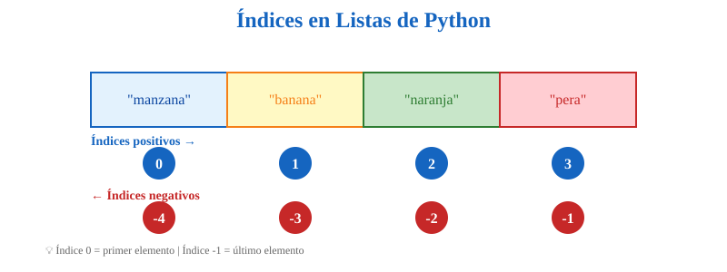
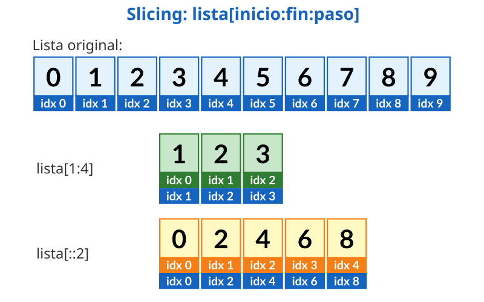

--- 
title: Estructuras de Datos - Listas y Sets
short_title: 3 - Listas y Sets
subtitle: Colecciones fundamentales en Python - Listas ordenadas y conjuntos únicos
---

(estructuras-datos)=
# Estructuras de Datos: Listas y Sets

## Introducción: Del Dato Individual a las Colecciones 

### ¿Por qué Necesitamos Estructuras de Datos?

Hasta ahora trabajaste con **una cosa a la vez**: un número, un texto, un booleano. Pero en la vida real, los datos raramente vienen solos; vienen en grupos, listas o conjuntos. Imaginate tener que manejar la información de cientos de usuarios. Sin estructuras de datos, tendrías que crear cientos de variables individuales, lo cual sería inmanejable. Las estructuras de datos nos permiten organizar y manipular estos conjuntos de información de manera eficiente.

::::{tip} Problema Real

**Sin estructuras de datos:**
```python
estudiante1 = "Ana"
estudiante2 = "Bruno"
estudiante3 = "Carlos"
estudiante4 = "Diana"
# ... ¿y si tenés 1000 estudiantes? 😱
```

**Con estructuras de datos:**
```python
estudiantes = ["Ana", "Bruno", "Carlos", "Diana"]  # ¡Y podés agregar más!
```

¿Ves la diferencia? En lugar de 1000 variables sueltas, tenés **1 lista** ordenada que las contiene a todas.
::::

---

### Mapa del Capítulo

Este diagrama mental muestra las dos estructuras fundamentales que aprenderás en este capítulo: **listas** y **sets (conjuntos)**. Ambas son colecciones mutables, pero con características muy diferentes que las hacen ideales para distintos casos de uso.

```{mermaid}
mindmap
  root((Estructuras<br/>de Datos))
    **Listas**
      Creación y acceso
      Slicing avanzado
      Métodos principales
      Listas anidadas
      Iteración
    **Sets (Conjuntos)**
      Unicidad de elementos
      Operaciones de conjuntos
      Métodos de sets
      Frozen sets
      Comparaciones
```

::::{grid} 1 1 2 2

:::{card} Objetivos de Aprendizaje

**Al finalizar este capítulo podrás:**

✅ Crear y manipular listas eficientemente
✅ Aplicar slicing y comprensiones de listas
✅ Usar sets para elementos únicos
✅ Realizar operaciones de conjuntos (unión, intersección, diferencia)
✅ Elegir entre lista o set según el problema
:::

:::{card} Comparación Rápida

| Estructura | Mutable | Ordenada | Indexable | Única |
|------------|---------|----------|-----------|-------|
| **Lista**  | ✅      | ✅       | ✅        | ❌    |
| **Set**    | ✅      | ❌       | ❌        | ✅    |

**Lista**: Secuencia ordenada que permite duplicados  
**Set**: Colección desordenada de elementos únicos
:::

::::


```{mermaid}
graph TD
    A[Estructuras<br/>de Datos] --> B[LISTAS]
    A --> E[SETS]
    
    B --> B1[Mutables<br/>Ordenadas<br/>Indexables]
    E --> E1[Únicos<br/>No ordenadas<br/>Rápidas]
    
    style A fill:#e3f2fd
    style B fill:#c8e6c9
    style E fill:#ffccbc
```

---

### Analogía del Mundo Real 

Para entender mejor cómo funcionan las estructuras de datos, pensemos en cómo organizamos objetos físicos. La diferencia entre tener datos sueltos y tenerlos estructurados es como la diferencia entre llevar objetos en la mano o usar una mochila organizada.

:::::{grid} 1 1 2 2

::::{grid-item-card} Sin Estructuras
**Guardar cosas sueltas:**

Imaginate que tenés que llevar 50 cosas a la escuela. Sin una mochila, llevás:
- 1 cosa en la mano derecha.
- 1 cosa en la mano izquierda.
- 1 cosa en el bolsillo.
- ¿Y las otras 47? 😰

**Código:**
```python
item1 = "lapiz"
item2 = "cuaderno"
item3 = "goma"
# ... imposible de manejar
```
::::

::::{grid-item-card} Con Estructuras
**Guardar cosas organizadas:**

Con una mochila (estructura), llevás:
- 50 cosas en **un solo lugar**.
- Organizadas y fáciles de encontrar.
- Podés agregar o sacar cosas.

**Código:**
```python
mochila = ["lapiz", "cuaderno", "goma", ...]
# ¡Fácil de manejar!
```
::::

:::::

---

### ¿Qué Aprenderás?

:::{important} Objetivos del Capítulo

Al finalizar este capítulo, podrás usar:

1. **Listas** → Guardar cosas que cambian (lista de compras).
2. **Tuplas** → Guardar cosas fijas (coordenadas GPS).
3. **Diccionarios** → Guardar info con etiquetas (perfil de usuario).
4. **Sets** → Guardar elementos únicos ({term}`unicidad`) (sin repetidos).
5. **Strings avanzados** → Manipular texto como un profesional.
:::

---

### Comparación Visual: ¿Cuál Elegir?

Elegir la estructura correcta es clave para escribir código eficiente. Esta regla simplificada te ayuda a decidir entre lista y set.

:::{tip} Regla de Oro
- **¿Necesitás orden?** → Lista
- **¿Solo únicos?** → Set
- **¿Vas a buscar con `in` frecuentemente?** → Set (mucho más rápido)
- **¿Necesitás acceso por índice?** → Lista
:::

---

### Ejemplos del Mundo Real

:::::{grid} 1 1 2 2

::::{grid-item-card} Lista
**Lista de reproducción de Spotify**
```python
canciones = [
    "Bohemian Rhapsody",
    "Imagine",
    "Stairway to Heaven"
]
# Orden importa, puede haber duplicados
```
::::

::::{grid-item-card} Set
**Etiquetas únicas de un blog**
```python
tags = {"python", "tutorial", "datos"}
# No puede haber "python" dos veces
# Orden no importa
```
::::

:::::

**Más ejemplos prácticos:**

- **Lista**: Historial de navegación, pasos de un algoritmo, resultados de una búsqueda
- **Set**: Visitantes únicos de un sitio, palabras clave sin duplicados, elementos comunes entre grupos

¡Empecemos! 

---

(listas)= 
## Listas: Tu Colección Ordenada 

### ¿Qué es una Lista?

Una **lista** es la estructura de datos más versátil y utilizada en Python. Pensala como una **fila de cajitas** numeradas donde podés guardar cualquier tipo de objeto. Lo más importante de las listas es que son **ordenadas** (mantienen el orden en que ponés las cosas) y **mutables** (podés cambiarlas después de crearlas).

Características principales:
- **Ordenada:** Cada cosa tiene su posición (0, 1, 2…).
- **{term}`mutable`:** Podés cambiar, agregar o quitar elementos.
- **Versátil:** Puede contener cualquier tipo de dato.
- **Duplicados:** Puede tener elementos repetidos.

::::{tip} Analogía: Lista de Compras

Una lista de Python es como tu lista del supermercado:

```python
compras = ["pan", "leche", "huevos", "queso"]
```

- ✅ Está **ordenada** (pan es primero, queso último).
- ✅ Podés **tachar** cosas (eliminar elementos).
- ✅ Podés **agregar** más cosas (`append`).
- ✅ Podés tener “pan” dos veces si querés.

**En la vida real:** Escribís en papel.  
**En Python:** Usás corchetes `[]`.
::::

---

### Crear Listas: Tres Formas

Existen varias formas de crear listas en Python, cada una apropiada para diferentes situaciones. Podés crear listas vacías que llenarás después, listas con elementos iniciales, o incluso listas que contengan diferentes tipos de datos mezclados. La sintaxis básica usa corchetes `[]` para definir los elementos de la lista.

```{code-cell} ipython3
# 1️⃣ Lista vacía (para ir agregando después)
mi_lista = []
otra_vacia = list()  # Alternativa

# 2️⃣ Lista con elementos (lo más común)
numeros = [1, 2, 3, 4, 5]
frutas = ["manzana", "banana", "naranja"]
precios = [10.5, 20.0, 15.75]

# 3️⃣ Lista mixta (diferentes tipos)
mixta = [1, "dos", 3.0, True, ["lista", "dentro"]]
print(f"Una lista puede tener {len(mixta)} tipos diferentes!")
```

:::{note} Listas con Diferentes Tipos
Python es **flexible**. Una lista puede contener números, strings, booleanos, e incluso otras listas (listas anidadas).

**Tip:** En la práctica, generalmente usás un solo tipo por lista para que sea más fácil de procesar.
:::

**Lista en múltiples líneas (más legible):**

```{code-cell} ipython3
# Cuando la lista es larga, formato multi-línea
colores_arcoiris = [
    "rojo",      # 🔴
    "naranja",   # 🟠
    "amarillo",  # 🟡
    "verde",     # 🟢
    "azul",      # 🔵
    "añil",      # 🔵
    "violeta",   # 🟣
]  # ← Nota: coma final permitida (buena práctica)

print(f"El arcoíris tiene {len(colores_arcoiris)} colores")
```

### Acceso a Elementos: Los Índices 

Para trabajar con los elementos de una lista, necesitamos una forma de referirnos a cada uno de ellos. Python utiliza **índices**, que son números enteros que representan la posición de cada elemento.

#### La Regla del Índice 0

:::{danger} ¡IMPORTANTE!
En Python, **¡contamos desde 0!** No desde 1.

El **primer** elemento está en la posición **0**.
:::

::::{tip} Analogía: Los Pisos del Edificio

En algunos países, los edificios se numeran así:
- Planta Baja = Piso 0
- Primer Piso = Piso 1
- Segundo Piso = Piso 2

Python funciona igual:
```python
pisos = ["Lobby", "Oficinas", "Restaurant", "Gimnasio"]
#        índice 0    índice 1    índice 2      índice 3
```

Para llegar al Lobby (planta baja), pedís `pisos[0]`.
::::

---

#### Índices Positivos y Negativos

Además de contar desde el principio (`0`, `1`, `2`…), Python tiene una característica muy útil: permite contar desde el final hacia atrás usando números negativos. El `-1` es el último elemento, el `-2` el penúltimo, y así sucesivamente.



```{code-cell} ipython3
frutas = ["🍎", "🍌", "🍊", "🍐"]

# Índices POSITIVOS (de izquierda a derecha)
print(f"Primera fruta: {frutas[0]}")   # 🍎 manzana
print(f"Segunda fruta: {frutas[1]}")   # 🍌 banana
print(f"Tercera fruta: {frutas[2]}")   # 🍊 naranja
print(f"Cuarta fruta: {frutas[3]}")    # 🍐 pera

print("\n" + "="*50 + "\n")

# Índices NEGATIVOS (de derecha a izquierda)
print(f"Última fruta: {frutas[-1]}")     # 🍐 pera
print(f"Penúltima: {frutas[-2]}")        # 🍊 naranja
print(f"Antepenúltima: {frutas[-3]}")    # 🍌 banana
print(f"Primera (con -4): {frutas[-4]}") # 🍎 manzana
```

:::{tip} ¿Cuándo usar índices negativos?
**Índices positivos:** Cuando sabés la posición exacta desde el inicio.  
**Índices negativos:** Cuando querés el último, penúltimo, etc. sin saber el tamaño de la lista.
:::

---

#### Comparación Visual

:::::{grid} 1 1 2 2

::::{grid-item-card} ✅ Índice Válido
```python
letras = ['A', 'B', 'C', 'D']
print(letras[0])  # 'A' ✓
print(letras[3])  # 'D' ✓
print(letras[-1]) # 'D' ✓
```

**Resultado:** ✅ Funciona perfecto
::::

::::{grid-item-card} ❌ Índice Fuera de Rango
```python
letras = ['A', 'B', 'C', 'D']
print(letras[4])   # ❌ Error
print(letras[100]) # ❌ Error
print(letras[-5])  # ❌ Error
```

**Resultado:** `IndexError: list index out of range`
::::

:::::

:::{danger} 🚨 Error Común: Índice Fuera de Rango

Intentar acceder a un índice que no existe (por ejemplo, índice 5 en una lista de 2 elementos) causará un error `IndexError`. Siempre verificá el tamaño de la lista si no estás seguro.

```{code-cell} ipython3
# Ejemplo de error
frutas = ["🍎", "🍌"]

# ❌ Esto da error (solo hay 2 elementos: índices 0 y 1)
try:
    print(frutas[5])
except IndexError as e:
    print(f"ERROR: {e}")
    print(f"La lista solo tiene {len(frutas)} elementos")
    print(f"   Índices válidos: 0 a {len(frutas)-1}")
```
:::

### Slicing: Cortar Rebanadas de la Lista 🍰

#### ¿Qué es Slicing?

A veces no querés un solo elemento, sino un grupo de ellos (un subconjunto). **Slicing** (rebanado) es la técnica para obtener una parte de la lista especificando dónde empezar y dónde terminar.

::::{tip} Analogía: Torta con 10 Rebanadas

Imaginate una torta con 10 rebanadas numeradas del 0 al 9:

```python
torta = [0, 1, 2, 3, 4, 5, 6, 7, 8, 9]
```

**Slicing te permite decir:**
- “Dame las rebanadas 2 a 5” → `torta[2:5]` = `[2, 3, 4]`
- “Dame las primeras 3” → `torta[:3]` = `[0, 1, 2]`
- “Dame las últimas 2” → `torta[-2:]` = `[8, 9]`
- “Dame de 2 en 2” → `torta[::2]` = `[0, 2, 4, 6, 8]`
::::

El slicing crea una lista nueva con los elementos de la lista original en las posiciones que le indiquemos.

---

#### Sintaxis: `lista[inicio:fin:paso]`

La sintaxis completa de slicing tiene tres partes separadas por dos puntos: inicio, fin y paso. Todas son opcionales y tienen valores por defecto si se omiten.



```{code-cell} ipython3
numeros = [0, 1, 2, 3, 4, 5, 6, 7, 8, 9]

# 1️⃣ [inicio:fin] - desde inicio hasta fin-1 (¡el fin NO se incluye!)
print("Elementos [2:5]:", numeros[2:5])    # [2, 3, 4] (NO incluye el 5)

# 2️⃣ [inicio:] - desde inicio hasta el final
print("Elementos [5:]:", numeros[5:])      # [5, 6, 7, 8, 9]

# 3️⃣ [:fin] - desde el inicio hasta fin-1
print("Elementos [:4]:", numeros[:4])      # [0, 1, 2, 3]

# 4️⃣ [:] - copia toda la lista
print("Copia [:]:", numeros[:])            # [0, 1, 2, 3, 4, 5, 6, 7, 8, 9]

# 5️⃣ [inicio:fin:paso] - con incremento (saltos)
print("Cada 2 [::2]:", numeros[::2])       # [0, 2, 4, 6, 8]
print("Cada 3 [::3]:", numeros[::3])       # [0, 3, 6, 9]

# 6️⃣ Paso negativo - invertir
print("Invertido [::-1]:", numeros[::-1])  # [9, 8, 7, 6, 5, 4, 3, 2, 1, 0]
```

:::{tip} Regla del Fin No Incluido
El {term}`índice` final **NO se incluye** en el slice. Esto es deliberado y matemático: `fin - inicio` te da exactamente la cantidad de elementos.

```python
lista[2:5]  # Tamaño = 5 - 2 = 3 elementos ✓ (índices 2, 3, 4)
```
:::

---

#### Ejemplos Prácticos de Slicing

Veamos cómo usar slicing en situaciones reales comunes, como obtener los primeros elementos, filtrar pares, o invertir una lista.

:::::{grid} 1 1 2 2

::::{grid-item-card} Primeros y Últimos
```python
numeros = [0, 1, 2, 3, 4, 5, 6, 7, 8, 9]

# Primeros 3
primeros = numeros[:3]
# [0, 1, 2]

# Últimos 3
ultimos = numeros[-3:]
# [7, 8, 9]

# Todos excepto primero y último
medio = numeros[1:-1]
# [1, 2, 3, 4, 5, 6, 7, 8]
```
::::

::::{grid-item-card} Pares e Impares
```python
numeros = [0, 1, 2, 3, 4, 5, 6, 7, 8, 9]

# Solo pares (empieza en 0, salta de 2)
pares = numeros[::2]
# [0, 2, 4, 6, 8]

# Solo impares (empieza en 1, salta de 2)
impares = numeros[1::2]
# [1, 3, 5, 7, 9]
```
::::

::::{grid-item-card} Invertir
```python
palabra = ['P', 'Y', 'T', 'H', 'O', 'N']

# Invertir con paso negativo
invertida = palabra[::-1]
# ['N', 'O', 'H', 'T', 'Y', 'P']

# Cada 2, pero al revés
salteada = palabra[::-2]
# ['N', 'H', 'Y']
```
::::

::::{grid-item-card} Copiar Lista
```python
original = [1, 2, 3, 4, 5]

# Copia superficial
copia = original[:]

copia[0] = 999
print(original)  # [1, 2, 3, 4, 5] ✓
print(copia)     # [999, 2, 3, 4, 5]
```
::::

:::::

---

#### Slicing con Índices Negativos

Podés combinar slicing con índices negativos para obtener partes relativas al final de la lista. Esto es muy útil cuando no sabés el largo exacto de la lista.

```{code-cell} ipython3
letras = ['A', 'B', 'C', 'D', 'E', 'F']
#         0    1    2    3    4    5     ← Índices positivos
#        -6   -5   -4   -3   -2   -1     ← Índices negativos

# Desde penúltimo hasta el final
print("[-2:]:", letras[-2:])      # ['E', 'F']

# Desde inicio hasta antepenúltimo
print("[:-2]:", letras[:-2])      # ['A', 'B', 'C', 'D']

# Desde antepenúltimo hasta penúltimo (sin incluir)
print("[-3:-1]:", letras[-3:-1])  # ['D', 'E']

# Últimos 4, cada 2
print("[-4::2]:", letras[-4::2])  # ['C', 'E']
```

:::{danger} 🚨 Error Común: Orden Invertido

Si usás un inicio mayor que el fin con un paso positivo, obtendrás una lista vacía porque Python intenta ir hacia adelante y “se pasa” antes de empezar.

```{code-cell} ipython3
numeros = [0, 1, 2, 3, 4, 5]

# ❌ Esto da lista vacía (inicio > fin con paso positivo)
print("Mal [5:2]:", numeros[5:2])  # [] vacío

# ✓ Para ir hacia atrás, usá paso negativo
print("Bien [5:2:-1]:", numeros[5:2:-1])  # [5, 4, 3]
```

**Regla:** Si inicio > fin, necesitás paso negativo.
:::

---

#### Tabla de Referencia Rápida

| Sintaxis | Descripción | Ejemplo | Resultado |
|----------|-------------|---------|-----------|
| `[n]` | Elemento en posición n | `lst[2]` | Un elemento |
| `[n:m]` | Desde n hasta m-1 | `lst[1:4]` | `[lst[1], lst[2], lst[3]]` |
| `[n:]` | Desde n hasta el final | `lst[3:]` | Todo desde 3 |
| `[:m]` | Desde inicio hasta m-1 | `lst[:5]` | Primeros 5 |
| `[:]` | Copia completa | `lst[:]` | Toda la lista |
| `[::s]` | Cada s elementos | `lst[::2]` | Cada 2 |
| `[::-1]` | Invertida | `lst[::-1]` | Al revés |
| `[-n:]` | Últimos n | `lst[-3:]` | Últimos 3 |
| `[:-n]` | Todos menos últimos n | `lst[:-2]` | Sin últimos 2 |

---

### Modificar Listas: El Poder de lo Mutable 

#### ¿Qué Significa Mutable?

La **mutabilidad** es la capacidad de un objeto de cambiar su estado o contenido después de haber sido creado. Las listas son mutables, lo que significa que podés alterar sus elementos sin crear una lista nueva.

::::{tip} Analogía: Lista de Papel vs Piedra

**Lista Python = Lista de papel:**
- Podés **tachar** cosas (eliminar).
- Podés **agregar** más cosas (`append`).
- Podés **cambiar** una cosa por otra (modificar).
- Es **flexible** y **editable**.

**Tupla Python = Texto en piedra:**
- Una vez escrito, **NO podés cambiar**.
- Es **{term}`inmutable`** (lo veremos más adelante).

```python
# Mutable (lista) - ✓ Podés cambiar
compras = ["pan", "leche"]
compras[0] = "facturas"  # ✓ Funciona

# Inmutable (tupla) - ✗ NO podés cambiar
coordenadas = (10, 20)
coordenadas[0] = 15  # ✗ ERROR: no se puede
```
::::

---

#### Formas de Modificar

Podés modificar elementos individuales accediendo por su índice, o modificar múltiples elementos a la vez usando slicing.

```{code-cell} ipython3
frutas = ["manzana", "banana", "naranja"]

print("Original:", frutas)

# 1️⃣ Modificar UN elemento por índice
frutas[1] = "pera"
print("Después de [1]='pera':", frutas)

# 2️⃣ Modificar VARIOS elementos con slice
frutas[0:2] = ["kiwi", "uva"]
print("Después de [0:2]=['kiwi','uva']:", frutas)

# 3️⃣ Reemplazar con diferente cantidad
colores = ["rojo", "verde", "azul"]
colores[1:2] = ["amarillo", "naranja", "violeta"]  # 1 por 3
print("Reemplazo de diferente tamaño:", colores)
```

:::{warning} Diferencia Importante
**Asignación directa vs Slice:**

```python
lista = [1, 2, 3, 4, 5]

# Asignación directa - REEMPLAZA un elemento
lista[2] = 99
# [1, 2, 99, 4, 5]

# Asignación con slice - REEMPLAZA un rango (puede cambiar el tamaño)
lista[2:4] = [88, 77, 66]
# [1, 2, 88, 77, 66, 5]
```
:::

---

#### Modificar con Índices Negativos

También podés usar índices negativos para modificar elementos contando desde el final.

```{code-cell} ipython3
numeros = [10, 20, 30, 40, 50]

# Modificar el último
numeros[-1] = 999
print("Último modificado:", numeros)  # [10, 20, 30, 40, 999]

# Modificar los últimos 2
numeros[-2:] = [888, 777]
print("Últimos 2 modificados:", numeros)  # [10, 20, 30, 888, 777]
```

---

#### Insertar en el Medio con Slice

Un truco avanzado del slicing es usar un rango vacío para insertar elementos en cualquier posición sin borrar nada.

```{code-cell} ipython3
# Truco: slice vacío para insertar sin eliminar
letras = ['A', 'B', 'E', 'F']
print("Original:", letras)

# Insertar en posición 2 (sin eliminar nada)
letras[2:2] = ['C', 'D']
print("Con C,D insertadas:", letras)  # ['A', 'B', 'C', 'D', 'E', 'F']
```

:::{tip} Slice Vacío para Insertar
`lista[n:n] = [valores]` inserta **antes** de la posición `n` **sin eliminar nada**.

```python
nums = [1, 2, 5, 6]
nums[2:2] = [3, 4]  # Inserta en posición 2
# Resultado: [1, 2, 3, 4, 5, 6]
```
:::

---

#### Eliminar con Slice

Del mismo modo, asignar una lista vacía a un slice elimina esos elementos.

```{code-cell} ipython3
numeros = [0, 1, 2, 3, 4, 5, 6, 7, 8, 9]

# Eliminar elementos con slice vacío
numeros[3:6] = []  # Elimina posiciones 3, 4, 5
print("Después de eliminar [3:6]:", numeros)  # [0, 1, 2, 6, 7, 8, 9]
```

---

### Métodos de Listas: Tu Caja de Herramientas

Las listas tienen **métodos** (funciones integradas) que facilitan operaciones comunes como agregar, quitar y ordenar.

---

#### Agregar Elementos

Para añadir elementos a una lista, Python ofrece tres métodos principales dependiendo de lo que necesites: `append` para uno solo, `insert` para una posición específica, y `extend` para agregar varios a la vez.

::::{tip} Analogía: Agregar a una Fila

Imaginate una fila de personas esperando:

**`append()`** = Una persona se suma **al final** de la fila.
**`insert()`** = Una persona se **mete en el medio** (posición específica).
**`extend()`** = Llega un **grupo** y se suma al final.
::::

```{code-cell} ipython3
# Lista inicial
frutas = ["manzana", "banana"]
print("Inicial:", frutas)

# 1️⃣ append(elemento) - agrega UN elemento al final
frutas.append("naranja")
print("Después de append:", frutas)

# 2️⃣ insert(índice, elemento) - inserta en posición específica
frutas.insert(1, "pera")  # Inserta en posición 1
print("Después de insert(1):", frutas)

# 3️⃣ extend(iterable) - agrega VARIOS elementos al final
frutas.extend(["kiwi", "uva"])
print("Después de extend:", frutas)
```

---

##### `append()` vs `extend()` vs `+` : ¿Cuál usar?

Es común confundirse entre estas opciones. La diferencia clave está en si agregan el elemento como un todo (`append`) o si agregan sus partes (`extend`), y si modifican la lista original o crean una nueva (`+`).

:::::{grid} 1 1 3 3

::::{grid-item-card} `append()`
**Agrega 1 elemento**

```python
lista = [1, 2, 3]
lista.append(4)
# [1, 2, 3, 4]

lista.append([5, 6])
# [1, 2, 3, 4, [5, 6]]
#              ↑ lista dentro
```

**Usa cuando:** Agregás 1 cosa.
::::

::::{grid-item-card} `extend()`
**Agrega varios elementos**

```python
lista = [1, 2, 3]
lista.extend([4, 5, 6])
# [1, 2, 3, 4, 5, 6]

lista.extend("abc")
# [1, 2, 3, 4, 5, 6, 'a', 'b', 'c']
```

**Usa cuando:** Agregás varios.
::::

::::{grid-item-card} Operador `+`
**Crea lista nueva**

```python
lista1 = [1, 2, 3]
lista2 = [4, 5, 6]
lista3 = lista1 + lista2
# [1, 2, 3, 4, 5, 6]

# lista1 NO cambia
print(lista1)
# [1, 2, 3]
```

**Usa cuando:** No querés modificar original.
::::

:::::

```{code-cell} ipython3
# Comparación práctica
a = [1, 2, 3]
b = [1, 2, 3]
c = [1, 2, 3]

# append - agrega el objeto completo
a.append([4, 5])
print("append([4,5]):", a)  # [1, 2, 3, [4, 5]]

# extend - agrega cada elemento
b.extend([4, 5])
print("extend([4,5]):", b)  # [1, 2, 3, 4, 5]

# + - crea nueva lista
c = c + [4, 5]
print("c + [4,5]:", c)      # [1, 2, 3, 4, 5]
```

:::{tip} Regla Rápida
- `append(x)` → Agrega `x` **como está** (1 elemento, puede ser lista).
- `extend(iterable)` → Agrega **cada elemento** del iterable.
- `lista + otra` → Crea **nueva lista** (no modifica original).
:::

---

##### `insert()`: Insertar en Cualquier Posición

`insert()` te permite colocar un elemento exactamente donde querés, desplazando los demás a la derecha.

```{code-cell} ipython3
numeros = [10, 20, 40, 50]
print("Original:", numeros)

# Insertar en posición 2 (antes del 40)
numeros.insert(2, 30)
print("insert(2, 30):", numeros)  # [10, 20, 30, 40, 50]

# Insertar al principio
numeros.insert(0, 5)
print("insert(0, 5):", numeros)   # [5, 10, 20, 30, 40, 50]

# Insertar al final (equivalente a append)
numeros.insert(len(numeros), 60)
print("insert(len, 60):", numeros)  # [5, 10, 20, 30, 40, 50, 60]

# Índice mayor al tamaño - inserta al final
numeros.insert(1000, 70)
print("insert(1000, 70):", numeros)  # Se agrega al final
```

:::{note} Comportamiento de insert()
- **insert(0, x)** → Inserta al **principio**.
- **insert(n, x)** → Inserta **antes** de la posición `n`.
- **insert(len(lista), x)** → Inserta al **final** (= append).
- **insert(999, x)** → Si {term}`índice` > tamaño, inserta al final.
:::

---

#### Eliminar Elementos

Al igual que para agregar, existen múltiples formas de eliminar elementos según si conocés el valor, la posición, o si querés vaciar todo.

::::{tip} Analogía: Sacar de la Fila

Hay 4 formas de sacar a alguien de la fila:

1. **`remove("nombre")`** → Buscás por nombre y lo sacás (primera coincidencia).
2. **`pop()`** → Sacás el último de la fila.
3. **`pop(n)`** → Sacás al que está en posición `n`.
4. **`del lista[n]`** → Eliminás sin recibir el {term}`elemento`.
5. **`clear()`** → Echás a TODOS (vacías la fila).
::::

---

##### `remove()`: Eliminar por Valor

Usá `remove()` cuando sabés **qué** querés eliminar pero no dónde está.

```{code-cell} ipython3
frutas = ["🍎 manzana", "🍌 banana", "🍊 naranja", "🍐 pera", "🍌 banana"]
print("Original:", frutas)

# remove(valor) - elimina la PRIMERA ocurrencia
frutas.remove("🍌 banana")
print("Después de remove:", frutas)  # Solo elimina la primera banana
```

:::{danger} 🚨 Error si el {term}`valor<Value>` no existe

Si intentás remover algo que no está, Python lanza un error.

```{code-cell} ipython3
# ❌ Si el valor no existe, da error
frutas = ["🍎 manzana", "🍊 naranja"]

try:
    frutas.remove("🍌 banana")  # No existe
except ValueError as e:
    print(f"❌ ERROR: {e}")

# ✓ Verificar antes de eliminar
if "🍌 banana" in frutas:
    frutas.remove("🍌 banana")
else:
    print("Banana no está en la lista")
```
:::

---

##### `pop()`: Eliminar y Obtener el Elemento

Usá `pop()` cuando querés sacar un elemento (generalmente el último) y **usarlo**.

```{code-cell} ipython3
pila_libros = ["libro1", "libro2", "libro3", "libro4"]
print("Pila inicial:", pila_libros)

# 1️⃣ pop() sin argumentos - elimina y retorna el ÚLTIMO
ultimo = pila_libros.pop()
print(f"Sacaste: {ultimo}")
print(f"Quedan: {pila_libros}")

# 2️⃣ pop(índice) - elimina y retorna elemento en posición específica
segundo = pila_libros.pop(1)
print(f"Sacaste el segundo: {segundo}")
print(f"Quedan: {pila_libros}")

# 3️⃣ pop(0) - saca el primero (uso común en colas)
primero = pila_libros.pop(0)
print(f"Sacaste el primero: {primero}")
print(f"Quedan: {pila_libros}")
```

:::{tip} pop() vs remove()

| Método | Elimina por | Retorna el elemento | Error si vacía |
|--------|-------------|---------------------|----------------|
| `remove(valor)` | Valor | ❌ No (`None`) | `ValueError` si no existe |
| `pop()` | Posición (último) | ✅ Sí | `IndexError` si vacía |
| `pop(n)` | Posición n | ✅ Sí | `IndexError` si índice inválido |

**Usa `pop()`** cuando necesitás el {term}`elemento` eliminado (ej: pila, cola).  
**Usa `remove()`** cuando solo querés eliminar algo específico.
:::

---

##### del: Eliminar sin Retornar

La sentencia `del` es una instrucción de Python (no un método de lista) que elimina objetos o partes de ellos. Es útil para eliminar rangos completos.

```{code-cell} ipython3
numeros = [0, 1, 2, 3, 4, 5, 6, 7, 8, 9]
print("Original:", numeros)

# 1️⃣ del lista[índice] - elimina un elemento
del numeros[5]
print("Después de del [5]:", numeros)

# 2️⃣ del lista[inicio:fin] - elimina un rango
del numeros[2:5]
print("Después de del [2:5]:", numeros)

# 3️⃣ del lista[::paso] - elimina con patrón
numeros = [0, 1, 2, 3, 4, 5, 6, 7, 8, 9]
del numeros[::2]  # Elimina elementos en posiciones pares
print("Después de del [::2]:", numeros)  # [1, 3, 5, 7, 9]
```

:::{note} `del` vs `pop()`
**`del`:**
- No retorna el {term}`elemento`.
- Puede eliminar slices completos.
- Es una **declaración** (statement), no un método.

**`pop()`:**
- Retorna el {term}`elemento` eliminado.
- Solo elimina un {term}`elemento` a la vez.
- Es un **método** de lista.
:::

---

##### `clear()`: Vaciar Completamente

Cuando querés dejar la lista en blanco (como nueva) pero manteniendo la misma variable.

```{code-cell} ipython3
tareas = ["tarea1", "tarea2", "tarea3"]
print("Antes de clear:", tareas)

# clear() - elimina TODOS los elementos
tareas.clear()
print("Después de clear:", tareas)  # []
print(f"¿Está vacía? {len(tareas) == 0}")
```

:::::{grid} 1 1 2 2

::::{grid-item-card} `clear()`
```python
lista = [1, 2, 3]
lista.clear()
print(lista)  # []
```
**Ventaja:** Claro y legible.
**Efecto:** Vacía la lista.
::::

::::{grid-item-card} Alternativas
```python
# Opción 2: Asignar slice vacío
lista[:] = []

# Opción 3: Crear nueva (NO es lo mismo)
lista = []  # Crea nueva referencia
```
**Diferencia:** `clear()` modifica la lista existente.
::::

:::::

---

#### Comparación Visual: Métodos de Eliminación

```{mermaid}
graph TD
    A[¿Cómo eliminar?] --> B{¿Conocés el valor?}
    B -->|Sí| C[remove valor]
    B -->|No| D{¿Qué posición?}
    
    D -->|Último| E[pop ]
    D -->|Específica| F[pop índice]
    D -->|Rango| G[del lista inicio:fin]
    
    A --> H{¿Vaciar todo?}
    H -->|Sí| I[clear ]
    
    style C fill:#c8e6c9
    style E fill:#fff9c4
    style F fill:#fff9c4
    style G fill:#ffccbc
    style I fill:#e1bee7
```

---

#### Búsqueda y Conteo

Para encontrar elementos dentro de una lista o saber cuántas veces aparecen, usamos `index`, `count` y el operador `in`.

::::{tip} Analogía: Buscar en la Biblioteca

**`count()`** = ¿Cuántos libros de Harry Potter tenés?
**`index()`** = ¿En qué estante está Harry Potter?
**`in`** = ¿Tenés Harry Potter? (Sí/No).
::::

---

##### `count()`: Contar Ocurrencias

```{code-cell} ipython3
numeros = [1, 3, 5, 3, 7, 3, 9, 3]
print("Lista:", numeros)

# Contar cuántas veces aparece el 3
veces = numeros.count(3)
print(f"El 3 aparece {veces} veces")

# Contar algo que no existe
veces_10 = numeros.count(10)
print(f"El 10 aparece {veces_10} veces")  # 0 (no da error)
```

**Ejemplo práctico:**

```{code-cell} ipython3
# Contar votos
votos = ["🍎 manzana", "🍌 banana", "🍎 manzana", "🍊 naranja", "🍎 manzana"]

print(f"Votos por manzana: {votos.count('🍎 manzana')}")
print(f"Votos por banana: {votos.count('🍌 banana')}")
print(f"Votos por naranja: {votos.count('🍊 naranja')}")
```

---

##### `index()`: Encontrar la Primera Posición

Retorna el índice donde se encuentra el elemento por primera vez.

```{code-cell} ipython3
frutas = ["🍎 manzana", "🍌 banana", "🍊 naranja", "🍐 pera", "🍌 banana"]
print("Lista:", frutas)

# Encontrar la primera posición de banana
posicion = frutas.index("🍌 banana")
print(f"Primera banana está en posición: {posicion}")  # 1

# index() con rango de búsqueda
# Buscar banana después de la posición 2
segunda_banana = frutas.index("🍌 banana", 2)  # Busca desde índice 2
print(f"Segunda banana está en posición: {segunda_banana}")  # 4
```

:::{danger} 🚨 Error si no existe

Si el elemento no está en la lista, `index()` falla con un error.

```{code-cell} ipython3
# ❌ Si el elemento no existe, da error
frutas = ["🍎 manzana", "🍌 banana"]

try:
    pos = frutas.index("🍇 uva")
except ValueError as e:
    print(f"❌ ERROR: {e}")

# ✓ Verificar antes de buscar
if "🍇 uva" in frutas:
    pos = frutas.index("🍇 uva")
    print(f"Posición: {pos}")
else:
    print("Uva no está en la lista")
```
:::

**`index()` con inicio y fin:**

```{code-cell} ipython3
numeros = [10, 20, 30, 40, 30, 50, 30]
#          0   1   2   3   4   5   6

# Buscar 30 en toda la lista
print("Primer 30:", numeros.index(30))  # 2

# Buscar 30 desde posición 3
print("30 desde pos 3:", numeros.index(30, 3))  # 4

# Buscar 30 entre posiciones 5 y 7
print("30 entre [5:7]:", numeros.index(30, 5, 7))  # 6
```

:::{tip} Sintaxis de `index()`
```python
lista.index(valor)              # Busca en toda la lista
lista.index(valor, inicio)      # Busca desde inicio hasta el final
lista.index(valor, inicio, fin) # Busca en rango [inicio:fin)
```
:::

---

##### `in` / `not in`: Verificar Pertenencia

La forma más Pythonic de chequear si algo está en una lista es usar `in`. Retorna `True` o `False`.

```{code-cell} ipython3
colores = ["rojo", "verde", "azul"]

# Operador 'in' - retorna True/False
print("¿Está rojo?", "rojo" in colores)      # True
print("¿Está amarillo?", "amarillo" in colores)  # False

# Operador 'not in'
print("¿No está amarillo?", "amarillo" not in colores)  # True
```

**Uso práctico con `if`:**

```{code-cell} ipython3
lista_compras = ["pan", "leche", "huevos"]

# Agregar solo si no existe
nueva_compra = "pan"
if nueva_compra not in lista_compras:
    lista_compras.append(nueva_compra)
    print(f"✓ Agregado: {nueva_compra}")
else:
    print(f"Ya estaba: {nueva_compra}")

# Eliminar solo si existe
item_a_borrar = "leche"
if item_a_borrar in lista_compras:
    lista_compras.remove(item_a_borrar)
    print(f"✓ Eliminado: {item_a_borrar}")
```

---

##### Comparación: `count()` vs `index()` vs `in`

| Método | Retorna | Si no existe | Velocidad | Uso |
|--------|---------|--------------|-----------|-----|
| `count(x)` | Número (`int`) | 0 | O(n) | Contar repeticiones |
| `index(x)` | Posición (`int`) | `ValueError` | O(n) | Encontrar ubicación |
| `x in lista` | `Bool` | False | O(n) | Verificar existencia |

```{code-cell} ipython3
# Comparación práctica
lista = [1, 2, 3, 2, 4, 2, 5]

print(f"count(2): {lista.count(2)}")        # 3
print(f"index(2): {lista.index(2)}")        # 1 (primera posición)
print(f"2 in lista: {2 in lista}")          # True
print(f"10 in lista: {10 in lista}")        # False
```

---

#### Ordenamiento y Reversión

Python te permite ordenar listas de manera muy eficiente. Es importante distinguir entre métodos que ordenan la lista original y funciones que crean una nueva lista ordenada.

::::{tip} Analogía: Ordenar Cartas

**`sort()`** = Reordenar tu mano de cartas (modifica tu mano).  
**`sorted()`** = Copiar las cartas y ordenar la copia (tu mano original no cambia).  
**`reverse()`** = Dar vuelta la mano (del final al principio).
::::

---

##### `sort()`: Ordenar In-Place

Ordena la lista original. ¡Cuidado! Los datos originales cambian de posición.

```{code-cell} ipython3
# Lista desordenada
numeros = [5, 2, 8, 1, 9, 3, 7, 4, 6]
print("Original:", numeros)

# 1️⃣ sort() - ordena de menor a mayor (modifica la lista)
numeros.sort()
print("Después de sort():", numeros)

# 2️⃣ sort(reverse=True) - orden descendente
numeros.sort(reverse=True)
print("Descendente:", numeros)
```

**Con strings:**

```{code-cell} ipython3
frutas = ["🍊 naranja", "🍎 manzana", "🍐 pera", "🍌 banana"]
print("Original:", frutas)

# Orden alfabético
frutas.sort()
print("Alfabético:", frutas)

# Orden alfabético inverso
frutas.sort(reverse=True)
print("Inverso:", frutas)
```

**Ordenamiento con clave personalizada:**

```{code-cell} ipython3
# Ordenar por longitud (cantidad de caracteres)
palabras = ["sol", "mariposa", "pan", "elefante", "aro"]
print("Original:", palabras)

palabras.sort(key=len)  # key=función que extrae el criterio
print("Por longitud:", palabras)

# Ordenar ignorando mayúsculas/minúsculas
nombres = ["ana", "Bruno", "carlos", "Diana"]
nombres.sort(key=str.lower)  # Convierte a minúsculas para comparar
print("Orden alfabético (case-insensitive):", nombres)
```

:::{note} `sort()` modifica la lista
**sort():**
- Modifica la lista **in-place** (en el lugar).
- Retorna `None` (no retorna la lista).
- Es un **método** de lista.

```python
numeros = [3, 1, 2]
resultado = numeros.sort()
print(resultado)  # None
print(numeros)    # [1, 2, 3] ← La lista cambió
```
:::

---

##### `sorted()`: Crear Lista Ordenada Nueva

Si querés una versión ordenada pero necesitás mantener la original intacta, usá `sorted()`.

```{code-cell} ipython3
# Lista original
original = [5, 2, 8, 1, 9, 3]
print("Original:", original)

# sorted() crea una NUEVA lista ordenada
ordenada = sorted(original)
print("Ordenada (nueva):", ordenada)
print("Original (sin cambios):", original)  # ← ¡No cambió!

# sorted() también funciona con reverse
desc = sorted(original, reverse=True)
print("Descendente (nueva):", desc)
```

:::::{grid} 1 1 2 2

::::{grid-item-card} `sort()`
**Método de lista**

```python
lista = [3, 1, 2]
lista.sort()
print(lista)  # [1, 2, 3]

# ❌ No funciona con otros tipos
# tupla.sort()  # ERROR
```

**Modifica** la lista original.
**Retorna** `None`.
**Solo** para listas.
::::

::::{grid-item-card} `sorted()`
**Función built-in**

```python
lista = [3, 1, 2]
nueva = sorted(lista)
print(nueva)  # [1, 2, 3]
print(lista)  # [3, 1, 2]

# ✓ Funciona con cualquier iterable
sorted((3,1,2))  # [1, 2, 3]
sorted("cab")    # ['a', 'b', 'c']
```

**No modifica** el original.
**Retorna** nueva lista.
**Funciona** con cualquier iterable.
::::

:::::

---

##### `reverse()`: Invertir el Orden

Invierte el orden de los elementos tal cual están (el último pasa a ser el primero). No ordena, solo invierte.

```{code-cell} ipython3
# Invertir lista
numeros = [1, 2, 3, 4, 5]
print("Original:", numeros)

numeros.reverse()  # Invierte in-place
print("Después de reverse():", numeros)

# También se puede con slicing [::-1]
letras = ['A', 'B', 'C', 'D']
invertida = letras[::-1]  # Crea nueva lista
print("Con [::-1]:", invertida)
print("Original sin cambios:", letras)
```

:::::{grid} 1 1 2 2

::::{grid-item-card} `reverse()`
**Método**

```python
lista = [1, 2, 3]
lista.reverse()
print(lista)  # [3, 2, 1]
```

**Modifica** la lista.
**Retorna** `None`.
**Más rápido**.
::::

::::{grid-item-card} `[::-1]`
**Slicing**

```python
lista = [1, 2, 3]
nueva = lista[::-1]
print(nueva)  # [3, 2, 1]
print(lista)  # [1, 2, 3]
```

**Crea** nueva lista.
**No modifica** original.
**Más flexible**.
::::

:::::

:::{tip} ¿Cuándo usar cada uno?

**`sort()`** → Cuando querés modificar la lista existente.
**`sorted()`** → Cuando necesitás conservar el original.
**`reverse()`** → Para invertir in-place.
**`[::-1]`** → Para obtener copia invertida.
:::

---

##### `copy()`: Copiar una Lista

Crear una copia de una lista no es tan simple como `lista2 = lista1`. Eso solo crea una referencia. Para duplicar los datos, necesitamos copiar explícitamente.

```{code-cell} ipython3
# Problema: asignación simple NO copia
original = [1, 2, 3]
referencia = original  # ¡NO es una copia!

referencia[0] = 999
print("Original:", original)      # [999, 2, 3] ← ¡Cambió!
print("Referencia:", referencia)  # [999, 2, 3]

print("\n" + "="*50 + "\n")

# Solución 1: método copy()
lista1 = [1, 2, 3]
lista2 = lista1.copy()  # Copia superficial

lista2[0] = 777
print("Lista1:", lista1)  # [1, 2, 3] ← No cambió ✓
print("Lista2:", lista2)  # [777, 2, 3]

print("\n" + "="*50 + "\n")

# Solución 2: slicing [:]
lista3 = [1, 2, 3]
lista4 = lista3[:]

lista4[0] = 555
print("Lista3:", lista3)  # [1, 2, 3] ← No cambió ✓
print("Lista4:", lista4)  # [555, 2, 3]
```

:::{danger} 🚨 Copia Superficial vs Profunda

`copy()` hace una copia “superficial”. Si la lista contiene otras listas dentro, esas sub-listas seguirán siendo compartidas. Para una copia total, se usa `deepcopy`.

```{code-cell} ipython3
# Problema con listas anidadas
original = [[1, 2], [3, 4]]
copia = original.copy()  # Copia superficial

# Modificar la sub-lista
copia[0][0] = 999

print("Original:", original)  # [[999, 2], [3, 4]] ← ¡Se modificó!
print("Copia:", copia)        # [[999, 2], [3, 4]]

# Para listas anidadas, usar deepcopy
import copy
original2 = [[1, 2], [3, 4]]
copia_profunda = copy.deepcopy(original2)

copia_profunda[0][0] = 777
print("\nOriginal2:", original2)           # [[1, 2], [3, 4]] ← No cambió ✓
print("Copia profunda:", copia_profunda)   # [[777, 2], [3, 4]]
```

**Resumen:**
- `copy()` o `[:]` → Copia superficial (OK para listas simples).
- `copy.deepcopy()` → Copia profunda (necesaria para listas anidadas).
:::

---

### Longitud y Operaciones Básicas

Python proporciona funciones integradas (built-in) que trabajan con cualquier tipo de colección, incluyendo listas. Estas funciones te permiten obtener información básica sobre la lista (como su longitud), realizar cálculos matemáticos (suma, mínimo, máximo), o verificar condiciones sobre todos los elementos.

```{code-cell} ipython3
frutas = ["🍎 manzana", "🍌 banana", "🍊 naranja"]

# len() - cantidad de elementos
print(f"Cantidad: {len(frutas)}")  # 3

# min() y max() - mínimo y máximo
numeros = [5, 2, 8, 1, 9]
print(f"Mínimo: {min(numeros)}")   # 1
print(f"Máximo: {max(numeros)}")   # 9

# sum() - suma de elementos
print(f"Suma: {sum(numeros)}")     # 25

# any() - ¿alguno es True?
booleanos = [False, False, True, False]
print(f"¿Alguno True? {any(booleanos)}")  # True

# all() - ¿todos son True?
print(f"¿Todos True? {all(booleanos)}")   # False
```

---

### Iterar sobre Listas: Las 3 Formas

Recorrer una lista es una de las tareas más comunes. Python ofrece varias formas, pero algunas son más recomendables que otras (“Pythonic”).

::::{tip} Analogía: Recorrer una Fila

Imaginate que tenés que saludar a cada persona en una fila:

**Forma 1:** “Hola `[nombre]`” → No te importa la posición.
**Forma 2:** “Sos el número `[N]`, `[nombre]`” → Necesitás la posición.
**Forma 3:** “Hola persona en posición `[N]`” → Estilo antiguo (no recomendado).
::::

---

#### Forma 1: Iterar sobre elementos (Pythonic 🐍)

Esta es la forma directa y preferida cuando no necesitás el índice.

```{code-cell} ipython3
frutas = ["🍎 manzana", "🍌 banana", "🍊 naranja"]

# La forma más común y legible
for fruta in frutas:
    print(f"Me gusta: {fruta}")
```

**Ventajas:**
- ✅ Más legible.
- ✅ Menos propenso a errores.
- ✅ Más eficiente.
- ✅ **Estilo Pythonic**.

---

#### Forma 2: Iterar con índice y elemento (`enumerate`)

Usá `enumerate` cuando necesitás tanto el valor como su posición.

```{code-cell} ipython3
frutas = ["🍎 manzana", "🍌 banana", "🍊 naranja"]

# enumerate() te da (índice, elemento)
for i, fruta in enumerate(frutas):
    print(f"{i+1}. {fruta}")  # Numeración desde 1

# enumerate() con inicio personalizado
for i, fruta in enumerate(frutas, start=1):
    print(f"{i}. {fruta}")  # Más directo
```

**Cuándo usar:**
- Necesitás saber la posición.
- Querés numerar elementos.
- Necesitás el {term}`índice` para algo más.

---

#### Forma 3: Iterar con Índices (Estilo C/Java)

Esta forma manual es común en otros lenguajes, pero se considera poco elegante en Python.

```{code-cell} ipython3
frutas = ["🍎 manzana", "🍌 banana", "🍊 naranja"]

# Forma "antigua" (menos Pythonic)
for i in range(len(frutas)):
    print(f"{i}: {frutas[i]}")
```

:::{warning} Esta forma es menos Pythonic
**Evitala** a menos que tengas una razón específica:
- Necesitás modificar índices específicos en múltiples listas.
- Estás trabajando con índices de forma compleja.

**Es mejor usar `enumerate()`** en su lugar cuando necesites índices.
:::

---

#### Comparación: Las 3 Formas

:::::{grid} 1 1 3 3

::::{grid-item-card} Solo Elementos
```python
for item in lista:
    print(item)
```

**Uso:** 90% de los casos.  
**Legibilidad:** Alta.
**Pythonic:** ✅
::::

::::{grid-item-card} Con Índice
```python
for i, item in enumerate(lista):
    print(i, item)
```

**Uso:** Cuando necesitás posición.  
**Legibilidad:** Media.
**Pythonic:** ✅
::::

::::{grid-item-card} Solo Índices
```python
for i in range(len(lista)):
    print(i, lista[i])
```

**Uso:** Casos específicos.  
**Legibilidad:** Baja.
**Pythonic:** ❌
::::

:::::

---

#### Ejemplos Prácticos

```{code-cell} ipython3
# Ejemplo 1: Procesar elementos
precios = [100, 200, 150, 300]
total = 0
for precio in precios:
    total += precio
print(f"Total: ${total}")

# Ejemplo 2: Filtrar y procesar
numeros = [1, 2, 3, 4, 5, 6, 7, 8, 9, 10]
for num in numeros:
    if num % 2 == 0:
        print(f"{num} es par")

# Ejemplo 3: Enumerar con formato
tareas = ["Estudiar", "💻 Programar", "🏃 Ejercicio"]
print("MI LISTA DE TAREAS:")
for i, tarea in enumerate(tareas, start=1):
    print(f"  {i}. {tarea}")
```

---


### Tabla Resumen Completa: Métodos de Listas

Esta tabla consolida todos los métodos esenciales de las listas en Python, organizados por su comportamiento. Los métodos que modifican la lista cambian la estructura original (mutación in-place), mientras que los métodos de consulta solo leen información sin alterarla. Esta distinción es crucial para evitar errores: si necesitás preservar la lista original, recordá hacer una copia antes de usar métodos modificadores.

#### Métodos que Modifican la Lista

| Método | Descripción | Modifica | Retorna | Ejemplo |
|--------|-------------|----------|---------|---------|
| `append(x)` | Agrega `x` al final | ✅ | `None` | `lista.append(5)` |
| `insert(i, x)` | Inserta `x` en posición i | ✅ | `None` | `lista.insert(0, 5)` |
| `extend(iterable)` | Agrega elementos de iterable | ✅ | `None` | `lista.extend([1,2,3])` |
| `remove(x)` | Elimina primera ocurrencia de `x` | ✅ | `None` | `lista.remove(5)` |
| `pop([i])` | Elimina y retorna elemento en i (último si no se especifica) | ✅ | Elemento | `x = lista.pop()` |
| `clear()` | Vacía la lista completamente | ✅ | `None` | `lista.clear()` |
| `sort(key, reverse)` | Ordena la lista in-place | ✅ | `None` | `lista.sort()` |
| `reverse()` | Invierte el orden de la lista | ✅ | `None` | `lista.reverse()` |

---

#### Métodos que NO Modifican la Lista

| Método | Descripción | Retorna | Complejidad | Ejemplo |
|--------|-------------|---------|-------------|---------|
| `index(x, [start, end])` | Índice de primera ocurrencia de `x` | `int` | O(n) | `i = lista.index(5)` |
| `count(x)` | Número de veces que aparece `x` | `int` | O(n) | `n = lista.count(5)` |
| `copy()` | Copia superficial de la lista | `list` | O(n) | `copia = lista.copy()` |

---

#### Funciones Built-in para Listas

| Función | Descripción | Modifica | Retorna | Ejemplo |
|---------|-------------|----------|---------|---------|
| `len(lista)` | Cantidad de elementos | ❌ | `int` | `n = len(lista)` |
| `sorted(lista)` | Nueva lista ordenada | ❌ | `list` | `nueva = sorted(lista)` |
| `min(lista)` | Elemento mínimo | ❌ | Elemento | `m = min(lista)` |
| `max(lista)` | Elemento máximo | ❌ | Elemento | `m = max(lista)` |
| `sum(lista)` | Suma de elementos (numéricos) | ❌ | Número | `s = sum(lista)` |
| `any(lista)` | ¿Alguno es `True`? | ❌ | `bool` | `b = any(lista)` |
| `all(lista)` | ¿Todos son `True`? | ❌ | `bool` | `b = all(lista)` |
| `reversed(lista)` | Iterador invertido | ❌ | iterator | `for x in reversed(lista)` |
| `enumerate(lista)` | Iterador (índice, valor) | ❌ | iterator | `for i, v in enumerate(lista)` |

---

#### Operadores

| Operador | Descripción | Ejemplo | Resultado |
|----------|-------------|---------|-----------|
| `+` | Concatenación | `[1,2] + [3,4]` | `[1, 2, 3, 4]` |
| `*` | Repetición | `[1,2] * 3` | `[1, 2, 1, 2, 1, 2]` |
| `in` | Pertenencia | `5 in [1,2,5]` | `True` |
| `not in` | No pertenencia | `5 not in [1,2]` | `True` |
| `[i]` | Acceso por índice | `lista[0]` | Primer elemento |
| `[i:j]` | Slicing | `lista[1:3]` | Sublista |
| `[i:j:k]` | Slicing con paso | `lista[::2]` | Elementos alternos |

---

#### Cuándo Usar Cada Método: Guía Rápida

```{mermaid}
graph TD
    A[¿Qué necesitás hacer?] --> B{Agregar elementos}
    A --> C{Eliminar elementos}
    A --> D{Buscar/Consultar}
    A --> E{Ordenar/Reorganizar}
    
    B --> B1[append: agregar 1 al final]
    B --> B2[insert: agregar en posición]
    B --> B3[extend: agregar varios]
    
    C --> C1[remove: eliminar por valor]
    C --> C2[pop: sacar y obtener]
    C --> C3[clear: vaciar todo]
    C --> C4[del: eliminar por índice/slice]
    
    D --> D1[in: ¿existe?]
    D --> D2[index: ¿dónde está?]
    D --> D3[count: ¿cuántas veces?]
    
    E --> E1[sort: ordenar in-place]
    E --> E2[sorted: nueva ordenada]
    E --> E3[reverse: invertir]
    
    style B1 fill:#c8e6c9
    style B2 fill:#c8e6c9
    style B3 fill:#c8e6c9
    style C1 fill:#ffccbc
    style C2 fill:#ffccbc
    style C3 fill:#ffccbc
    style C4 fill:#ffccbc
    style D1 fill:#fff9c4
    style D2 fill:#fff9c4
    style D3 fill:#fff9c4
    style E1 fill:#e1bee7
    style E2 fill:#e1bee7
    style E3 fill:#e1bee7
```


---

### Referencias y Memoria: Entendiendo Cómo Python Guarda Datos

Cuando trabajás con listas (y otros objetos mutables), es fundamental entender cómo Python maneja la memoria para evitar errores sutiles pero importantes. En Python, las variables son como etiquetas que se pegan a los objetos, no cajas donde se guarda el objeto.

```{figure} ./3_estructuras/memoria_referencias.svg
:name: fig-memoria-referencias
:align: center
:width: 95%

Visualización de cómo Python maneja referencias y memoria para tipos mutables e inmutables
```

#### El Problema de las Referencias Compartidas

Cuando asignás una lista a otra variable (`lista2 = lista1`), no estás copiando la lista, estás creando una nueva etiqueta para la misma lista en memoria.

::::{warning} Analogía: Documento Compartido

Imaginate que vos y un amigo están editando el **mismo documento** de Google Docs (no una copia, el mismo archivo):

- Si tu amigo cambia algo, **vos también lo ves**.
- Si vos cambiás algo, **tu amigo también lo ve**.
- Ambos están mirando y editando **el mismo documento**.

Esto es lo que pasa con listas cuando hacés `lista2 = lista1`:
::::

```{code-cell} ipython3
# CUIDADO: Esto NO crea una copia
lista1 = [1, 2, 3]
lista2 = lista1  # lista2 apunta a la MISMA lista que lista1

print("Antes de modificar:")
print("lista1:", lista1)  # [1, 2, 3]
print("lista2:", lista2)  # [1, 2, 3]

# Modificamos lista2
lista2[0] = 999

print("\nDespués de modificar lista2:")
print("lista1:", lista1)  # [999, 2, 3] ← ¡También cambió!
print("lista2:", lista2)  # [999, 2, 3]

# ¿Por qué? Porque ambas variables apuntan al MISMO objeto en memoria
print("\n¿Son el mismo objeto?", lista1 is lista2)  # True
```

#### Cómo Copiar Listas Correctamente

Para evitar esto, tenés que crear explícitamente una copia. Esto crea un nuevo objeto en memoria independiente del original.

```{code-cell} ipython3
# ✅ CORRECTO: Estas formas SÍ crean copias independientes

# Método 1: Slicing [:]
original = [1, 2, 3]
copia1 = original[:]
copia1[0] = 999
print("Original:", original)  # [1, 2, 3] ✓ No cambió
print("Copia1:", copia1)      # [999, 2, 3]

# Método 2: .copy()
copia2 = original.copy()
copia2[0] = 888
print("Original:", original)  # [1, 2, 3] ✓ Sigue igual
print("Copia2:", copia2)      # [888, 2, 3]

# Método 3: list()
copia3 = list(original)
copia3[0] = 777
print("Original:", original)  # [1, 2, 3] ✓ Intacta
print("Copia3:", copia3)      # [777, 2, 3]
```

#### Copias Superficiales vs Profundas

Aun copiando la lista, si los elementos de adentro son a su vez mutables (como otras listas), esos elementos internos se siguen compartiendo. Esto se llama “copia superficial”.

:::{warning} Copia Superficial (Shallow Copy)
Los métodos anteriores hacen **copias superficiales**: copian la lista, pero si la lista contiene otras listas, esas listas internas **sí se comparten**.

```{code-cell} ipython3
# Problema con listas anidadas
original = [[1, 2], [3, 4]]
copia = original.copy()  # Copia superficial

# Modificar una lista interna
copia[0][0] = 999

print("Original:", original)  # [[999, 2], [3, 4]] ← ¡Se modificó!
print("Copia:", copia)        # [[999, 2], [3, 4]]
```

Para copiar listas anidadas completamente, necesitás **copia profunda**:

```{code-cell} ipython3
import copy

original = [[1, 2], [3, 4]]
copia_profunda = copy.deepcopy(original)

copia_profunda[0][0] = 999

print("Original:", original)        # [[1, 2], [3, 4]] ✓ Intacta
print("Copia profunda:", copia_profunda)  # [[999, 2], [3, 4]]
```
:::

#### Verificar si Dos Variables Comparten el Mismo Objeto

Podés usar el operador `is` para verificar identidad (si son el mismo objeto) y `==` para igualdad (si tienen el mismo contenido).

```{code-cell} ipython3
lista1 = [1, 2, 3]
lista2 = lista1        # Referencia al mismo objeto
lista3 = lista1[:]     # Copia nueva

# is: verifica si son el MISMO objeto en memoria
print("lista1 is lista2:", lista1 is lista2)  # True - mismo objeto
print("lista1 is lista3:", lista1 is lista3)  # False - objetos diferentes

# ==: verifica si tienen el MISMO contenido
print("lista1 == lista2:", lista1 == lista2)  # True - mismo contenido
print("lista1 == lista3:", lista1 == lista3)  # True - mismo contenido

# id(): muestra la dirección en memoria
print("\nDirecciones en memoria:")
print("id(lista1):", id(lista1))
print("id(lista2):", id(lista2))  # Misma dirección que lista1
print("id(lista3):", id(lista3))  # Dirección diferente
```

:::{important} Regla de Oro
- **Tipos inmutables** (`int`, `float`, `str`, `tuple`): Se copian automáticamente por valor.
- **Tipos mutables** (`list`, `dict`, `set`): Se comparten por referencia, necesitás copiar explícitamente.

```python
# Inmutables - no hay problema
a = 10
b = a
b = 20  # a sigue siendo 10

# Mutables - ¡cuidado!
lista_a = [1, 2, 3]
lista_b = lista_a  # Referencia compartida
lista_b[0] = 999   # lista_a también cambió a [999, 2, 3]
```
:::

---

(tuplas)= 

---

## Sets (Conjuntos)

Un **set** es una {term}`colección` **no ordenada** de elementos **únicos**. Es útil para eliminar duplicados y realizar operaciones matemáticas de conjuntos.

### Crear Sets

Los sets se crean usando llaves `{}` con elementos separados por comas, o con la función `set()` pasando cualquier iterable. Es importante recordar que para crear un set vacío debés usar `set()`, ya que `{}` crea un diccionario vacío. Los sets automáticamente eliminan duplicados al crearlos.

```{code-cell} ipython3
# Con llaves
numeros = {1, 2, 3, 4, 5}
colores = {"rojo", "verde", "azul"}

# Con set()
letras = set("abracadabra")
print(letras)  # {'a', 'b', 'r', 'c', 'd'} - sin duplicados

# Set vacío (DEBE usar set(), no {})
vacio = set()   # Set vacío
no_set = {}     # Esto es un diccionario vacío
```

:::{warning} Sets no tienen orden
Los sets no mantienen orden de inserción: 

```{code-cell} ipython3
numeros = {5, 1, 3, 2, 4}
print(numeros)  # Puede imprimir en cualquier orden
```

No podés acceder por índice: `numeros[0]` causará un error.
:::

### Operaciones Básicas

Los sets tienen operaciones para agregar y eliminar elementos, pero con comportamientos únicos debido a su naturaleza de colección sin duplicados. Al agregar un elemento que ya existe, no pasa nada (no hay error). Python ofrece varios métodos para eliminar elementos, cada uno con diferentes comportamientos ante elementos inexistentes.

```{code-cell} ipython3
# Agregar elementos
colores = {"rojo", "verde"}
colores.add("azul")
print(colores)  # {'rojo', 'verde', 'azul'}

# Agregar no tiene efecto si ya existe
colores.add("rojo")
print(colores)  # {'rojo', 'verde', 'azul'} - sin cambios

# Eliminar
colores.remove("verde")  # KeyError si no existe
print(colores)  # {'rojo', 'azul'}

# discard() - elimina sin error si no existe
colores.discard("amarillo")  # No da error
print(colores)  # {'rojo', 'azul'}

# pop() - elimina elemento arbitrario
elemento = colores.pop()
print(elemento)
```

### Operaciones de Conjuntos

Los sets implementan operaciones matemáticas de teoría de conjuntos. Podés calcular uniones (elementos en cualquiera de los conjuntos), intersecciones (elementos en ambos), diferencias (elementos en uno pero no en el otro), y diferencias simétricas (elementos en uno u otro, pero no en ambos). Estas operaciones son muy eficientes y útiles para análisis de datos.

```{code-cell} ipython3
a = {1, 2, 3, 4, 5}
b = {4, 5, 6, 7, 8}

# Unión (elementos en a O en b)
union = a | b
print(union)  # {1, 2, 3, 4, 5, 6, 7, 8}

# O con método
union = a.union(b)

# Intersección (elementos en a Y en b)
interseccion = a & b
print(interseccion)  # {4, 5}

# O con método
interseccion = a.intersection(b)

# Diferencia (elementos en a pero NO en b)
diferencia = a - b
print(diferencia)  # {1, 2, 3}

# Diferencia simétrica (en a O b pero NO en ambos)
dif_simetrica = a ^ b
print(dif_simetrica)  # {1, 2, 3, 6, 7, 8}
```

**Diagrama de operaciones:**

```{mermaid}
flowchart LR
    A[Conjunto A<br/>{1,2,3,4,5}]
    B[Conjunto B<br/>{4,5,6,7,8}]
    
    A -->|Unión| U["{1,2,3,4,5,6,7,8}"]
    A -->|Intersección| I["{4,5}"]
    A -->|Diferencia A-B| D["{1,2,3}"]
```

### Métodos de Verificación

Los sets tienen métodos especiales para verificar relaciones entre conjuntos. Podés determinar si un set es subconjunto de otro (todos sus elementos están contenidos), superconjunto (contiene todos los elementos del otro), o si dos sets son disjuntos (no tienen elementos en común). Estas operaciones son fundamentales en lógica y análisis de datos.

```{code-cell} ipython3
a = {1, 2, 3}
b = {1, 2, 3, 4, 5}

# Subconjunto (todos los elementos de a están en b)
print(a.issubset(b))     # True
print(a <= b)            # True

# Superconjunto (a contiene todos los elementos de b)
print(b.issuperset(a))   # True
print(b >= a)            # True

# Disjuntos (no tienen elementos en común)
x = {1, 2, 3}
y = {4, 5, 6}
print(x.isdisjoint(y))   # True
```

### Uso Práctico: Eliminar Duplicados

Uno de los usos más comunes de los sets es eliminar elementos duplicados de una lista. Como los sets solo mantienen elementos únicos, convertir una lista a set y luego de vuelta a lista es una forma rápida y eficiente de eliminar duplicados. Sin embargo, esto no preserva el orden original en versiones anteriores a Python 3.7.

```{code-cell} ipython3
# Eliminar duplicados de una lista
numeros = [1, 2, 2, 3, 3, 3, 4, 4, 5]
sin_duplicados = list(set(numeros))
print(sin_duplicados)  # [1, 2, 3, 4, 5]

# Nota: el orden puede cambiar
```

---

(strings-avanzados)= 

---

## Operaciones Comunes entre Estructuras

Python facilita la conversión entre diferentes estructuras de datos, permitiéndote elegir la más apropiada para cada tarea y convertir cuando sea necesario. También proporciona funciones integradas que funcionan con cualquier tipo de colección, haciendo el código más versátil.

### Conversiones

Es común necesitar convertir entre diferentes tipos de estructuras de datos. Python hace esto simple con funciones constructoras como `list()`, `tuple()`, `set()`, y `dict()`. Cada conversión tiene sus propias reglas y efectos sobre los datos (por ejemplo, convertir a set elimina duplicados).

```{code-cell} ipython3
# Lista ⟷ Tupla
lista = [1, 2, 3]
tupla = tuple(lista)
lista_nueva = list(tupla)

# Lista ⟷ Set
lista = [1, 2, 2, 3, 3]
conjunto = set(lista)  # {1, 2, 3}
lista_sin_dup = list(conjunto)

# Diccionario → Listas
d = {"a": 1, "b": 2, "c": 3}
claves = list(d.keys())     # ['a', 'b', 'c']
valores = list(d.values())  # [1, 2, 3]
pares = list(d.items())     # [('a', 1), ('b', 2), ('c', 3)]
```

### Funciones Built-in Útiles

Python proporciona un conjunto de funciones integradas que trabajan con cualquier tipo de iterable (listas, tuplas, sets, etc.). Estas funciones realizan operaciones comunes como obtener la longitud, calcular sumas, encontrar valores extremos, o transformar colecciones. Son eficientes y optimizadas en C, por lo que son más rápidas que implementar estas operaciones manualmente.

```{code-cell} ipython3
numeros = [3, 1, 4, 1, 5, 9, 2, 6]

# len() - longitud
print(len(numeros))  # 8

# sum() - suma
print(sum(numeros))  # 31

# min() / max() - mínimo y máximo
print(min(numeros))  # 1
print(max(numeros))  # 9

# sorted() - retorna lista ordenada
ordenados = sorted(numeros)
print(ordenados)  # [1, 1, 2, 3, 4, 5, 6, 9]

# reversed() - iterador inverso
for n in reversed(numeros):
    print(n, end=" ")  # 6 2 9 5 1 4 1 3

# enumerate() - con índices
for i, n in enumerate(numeros):
    print(f"{i}: {n}")

# zip() - combina múltiples iterables
nombres = ["Ana", "Bruno", "Carlos"]
edades = [20, 21, 22]
for nombre, edad in zip(nombres, edades):
    print(f"{nombre}: {edad}")
```

---

(errores-comunes-estructuras)= 
## Errores Comunes

Trabajar con estructuras de datos implica enfrentar trampas comunes que todos los programadores encuentran al comenzar. Estos errores no son señal de falta de habilidad, sino oportunidades de aprendizaje. Entender por qué ocurren y cómo prevenirlos te ahorrará horas de debugging frustrante. Los errores más frecuentes involucran modificar estructuras durante iteración, confundir mutabilidad, y compartir referencias inadvertidamente.

### 1. Modificar lista mientras se itera

Modificar una lista mientras la estás iterando es un error clásico que puede causar comportamiento inesperado. Cuando eliminás elementos durante la iteración, los índices cambian y el loop puede saltear elementos o lanzar errores. La solución es crear una nueva lista con los elementos que querés mantener usando `filter()`.

```python
# ❌ Incorrecto
numeros = [1, 2, 3, 4, 5]
for n in numeros:
    if n % 2 == 0:
        numeros.remove(n)  # Problemático

# ✓ Correcto - crear nueva lista
numeros = [1, 2, 3, 4, 5]
impares = [n for n in numeros if n % 2 != 0]
```

### 2. Confundir métodos que modifican vs que retornan

Algunos métodos de listas modifican la lista en su lugar y retornan `None` (como `sort()`, `reverse()`, `append()`), mientras que otros retornan una nueva estructura sin modificar la original (como `sorted()`, `reversed()`). Confundir estos dos comportamientos es un error común. Siempre verificá la documentación para saber si un método modifica in-place o retorna un nuevo valor.

```python
# ❌ sort() modifica, no retorna
numeros = [3, 1, 4]
ordenados = numeros.sort()  # ordenados es None!

# ✓ Correcto
numeros.sort()  # Modifica numeros
print(numeros)  # [1, 3, 4]

# O usa sorted()
numeros = [3, 1, 4]
ordenados = sorted(numeros)  # Retorna nueva lista
```

### 3. Olvidar que sets no tienen orden

Los sets son colecciones no ordenadas, por lo que no podés acceder a elementos por índice como lo harías con listas. Si necesitás orden y acceso por índice, usá una lista. Si necesitás tanto las ventajas de un set (unicidad, operaciones rápidas) como acceso ocasional por índice, convertí temporalmente a lista.

```python
# ❌ Incorrecto
conjunto = {3, 1, 4, 1, 5}
# primero = conjunto[0]  # TypeError

# ✓ Correcto - convertir a lista si necesitás índices
lista = list(conjunto)
primero = lista[0]
```

### 4. Usar lista como clave de diccionario

Solo los tipos inmutables (hashable) pueden ser claves de diccionario. Las listas son mutables y no se pueden usar como claves. Si necesitás usar una secuencia como clave, convertila a tupla primero. Esto es porque las claves de diccionario deben tener un hash consistente, y los objetos mutables pueden cambiar y alterar su hash.

```python
# ❌ Incorrecto
# d = {[1, 2]: "valor"}  # TypeError: unhashable type

# ✓ Correcto - usar tupla
d = {(1, 2): "valor"}
```

### 5. Copia superficial vs profunda

Cuando copiás una lista que contiene otras listas (u otros objetos mutables), una copia superficial (`copy()` o `[:]`) solo copia la lista externa. Las listas internas siguen siendo las mismas en memoria, por lo que modificarlas afecta tanto a la copia como al original. Para listas anidadas, necesitás una copia profunda con `copy.deepcopy()`.

```{code-cell} ipython3
# Copia superficial - problemas con listas anidadas
original = [[1, 2], [3, 4]]
copia = original.copy()
copia[0][0] = 999
print(original)  # [[999, 2], [3, 4]] - modificó el original!

# ✓ Copia profunda
import copy
original = [[1, 2], [3, 4]]
copia = copy.deepcopy(original)
copia[0][0] = 999
print(original)  # [[1, 2], [3, 4]] - no afectó al original
```

---

(buenas-practicas-estructuras)= 
## Buenas Prácticas

### 1. Elegir la Estructura Apropiada

La elección de la estructura de datos correcta es fundamental para código eficiente y legible. Sets para elementos únicos, listas para colecciones ordenadas modificables, tuplas para datos constantes, y diccionarios para datos con etiquetas. Esta decisión afecta tanto el rendimiento como la claridad del código.

```{code-cell} ipython3
# Para datos únicos sin orden → Set
colores_unicos = {"rojo", "verde", "azul"}

# Para datos que no cambian → Tupla
coordenadas = (10, 20)

# Para pares clave-valor → Diccionario
estudiante = {"nombre": "Ana", "edad": 20}

# Para colección ordenada y modificable → Lista
tareas = ["estudiar", "practicar", "descansar"]
```

### 2. Usar `in` para Verificar Pertenencia

El operador `in` es la forma idiomática en Python de verificar si un elemento está en una colección. Es mucho más legible que escribir un loop manual. Además, para sets y diccionarios, `in` es extremadamente eficiente (O(1) en promedio).

```{code-cell} ipython3
# ✓ Pythonic
if "Python" in lenguajes:
    print("Python está en la lista")

# En lugar de
encontrado = False
for lenguaje in lenguajes:
    if lenguaje == "Python":
        encontrado = True
```

### 3. Usar Métodos Apropiados

Elegir el método correcto no solo hace tu código más eficiente, sino también más expresivo. Por ejemplo, `append()` comunica claramente que estás agregando un elemento, mientras que `extend()` indica que estás agregando múltiples. Usar el método correcto hace que tu intención sea obvia para otros programadores (y para vos mismo en el futuro).

```{code-cell} ipython3
# Para agregar un elemento → append()
lista.append(5)

# Para agregar múltiples → extend()
lista.extend([6, 7, 8])

# NO uses append() en un loop para múltiples
# lista.append([6, 7, 8])  # Agrega la lista como un elemento
```

### 4. Nombrar Estructuras Descriptivamente

Los nombres de variables deben describir qué contienen, no su tipo. Nombres como `lista1` o `dict2` no comunican nada útil. En cambio, nombres como `estudiantes_aprobados` o `precio_por_producto` hacen que el código sea autoexplicativo. Esto es especialmente importante en Python donde no hay declaraciones de tipo explícitas.

```{code-cell} ipython3
# ✓ Descriptivo
estudiantes_aprobados = ["Ana", "Bruno"]
precio_por_producto = {"manzana": 2.5, "banana": 1.8}

# ❌ Poco claro
lista1 = ["Ana", "Bruno"]
dict2 = {"manzana": 2.5, "banana": 1.8}
```

---

## Ejercicios

[Programación Python - Estructuras de datos](https://ingcom-unrn.github.io/jupyterlite/lab/index.html?path=3_estructuras.ipynb)


---

(resumen-estructuras)= 
## Resumen Visual

Repasemos las estructuras de datos que aprendiste con un mapa mental:

```{mermaid}
mindmap
  root((Estructuras<br/>de Datos))
    Listas
      Ordenadas
      Mutables
      Indexables
      Duplicados OK
    Tuplas
      Ordenadas
      Inmutables
      Indexables
      Más rápidas
    Diccionarios
      Pares Clave-Valor
      Claves únicas
      Acceso por clave
      Mutables
    Sets
      Elementos únicos
      Sin orden
      Operaciones de conjuntos
      Mutables
```

:::::{grid} 1 1 2 2

::::{grid-item-card} Listas `[]`
Colecciones ordenadas y mutables.
```python
frutas = ["manzana", "banana"]
frutas.append("pera")
```
::::

::::{grid-item-card} Tuplas `()`
Colecciones ordenadas e inmutables.
```python
punto = (10, 20)
# punto[0] = 5  # Error
```
::::

::::{grid-item-card} Diccionarios `{k:v}`
Pares clave-valor. Búsqueda rápida.
```python
usuario = {"nombre": "Ana", "edad": 25}
print(usuario["nombre"])
```
::::

::::{grid-item-card} Sets `{}`
Elementos únicos y sin orden.
```python
unicos = {1, 2, 3, 3}
# {1, 2, 3}
```
::::

:::::

### Tabla Comparativa Final

| Característica | Lista | Tupla | Set | Diccionario |
| :--- | :---: | :---: | :---: | :---: |
| **Sintaxis** | `[]` | `()` | `{}` | `{k:v}` |
| **Ordenado** | ✅ | ✅ | ❌ | ✅* |
| **Mutable** | ✅ | ❌ | ✅ | ✅ |
| **Duplicados** | ✅ | ✅ | ❌ | Claves ❌ |
| **Acceso** | Índice | Índice | No | Clave |

<small>* Desde Python 3.7+ los diccionarios mantienen orden de inserción.</small>

:::{tip} Checklist de lo aprendido

Marcá lo que ya dominás:

- [ ] Crear y manipular **listas** (append, remove, slice).
- [ ] Entender cuándo usar **tuplas** (inmutabilidad).
- [ ] Usar **diccionarios** para datos estructurados (clave-valor).
- [ ] Usar **sets** para eliminar duplicados y operaciones de conjuntos.
- [ ] Aplicar métodos avanzados de **strings** (split, join, strip).
- [ ] Elegir la estructura de datos adecuada para un problema.
- [ ] Iterar correctamente sobre cada estructura.

Si marcaste todo, ¡estás listo para el próximo capítulo!

:::

---

### ¿Qué sigue?

Ahora que sabés cómo guardar y organizar datos, el siguiente paso es aprender a **organizar tu código** en bloques reutilizables. En el próximo capítulo entraremos en el mundo de las **Funciones**.

```{mermaid}
graph LR
    A[Capítulo 3<br/>Estructuras] --> B[Capítulo 4<br/>Funciones]
    B --> C[Capítulo 5<br/>Módulos]
    C --> D[Capítulo 6<br/>Manejo de Errores]
    
    style A fill:#c8e6c9,stroke:#2e7d32,stroke-width:3px
    style B fill:#fff9c4,stroke:#f57f17
    style C fill:#e1f5fe,stroke:#0277bd
    style D fill:#f3e5f5,stroke:#7b1fa2
```

:::{important} Practica, practica, practica

**La programación NO se aprende leyendo, se aprende HACIENDO.**

No pases al siguiente capítulo hasta que puedas:
1. Resolver **todos** los ejercicios del cuaderno de práctica.
2. Explicar la diferencia entre lista, tupla y set.
3. Crear un programa que use un diccionario para contar palabras o elementos.

**Recordá:** Los mejores programadores del mundo no llegaron ahí por ser genios, sino por **practicar constantemente**. Cada error que cometas hoy es una lección que no olvidarás mañana.

¡Vamos Manaos!

:::


---

(glosario-estructuras)= 
## Glosario

```{glossary}
Colección
:  Grupo de elementos almacenados juntos. Ejemplo: `[1, 2, 3]` es una {term}`colección` de tres números. 

Elemento
:  Cada ítem individual dentro de una {term}`colección`. En `["Ana", "Bruno"]`, `"Ana"` y `"Bruno"` son elementos.

Índice
:  Posición numérica de un {term}`elemento` en una colección {term}`ordenada`. **Siempre empieza en 0**. En `["x", "y", "z"]`, `"y"` está en el índice 1.

Longitud
:  Cantidad de elementos en una {term}`colección`. Se obtiene con `len()`. Si `lista = [1, 2, 3]`, entonces `len(lista)` es 3.

Mutable
:  Una estructura que **puede cambiar** después de ser creada. Podés modificar, agregar o eliminar elementos. Ejemplo: las **listas** son mutables.

Inmutable
:  Una estructura que **no puede cambiar** después de ser creada. Para "modificarla", debés crear una nueva. Ejemplo: las **tuplas** son inmutables.

Slicing
:  Técnica para extraer una porción de una secuencia. `lista[1:3]` obtiene elementos desde el índice 1 hasta el 2 (el 3 no se incluye). También conocido como **rebanado**.

Iterable
:  Cualquier objeto que se puede recorrer {term}`elemento` por elemento con un bucle `for`. Listas, tuplas, strings, diccionarios y sets son iterables.

Key
:  Identificador único para acceder a un {term}`value` en un diccionario. En `{"nombre": "Ana"}`, `"nombre"` es la clave. También se conoce como **key** en inglés.

Value
:  Dato asociado a una {term}`key` en un diccionario. En `{"edad": 25}`, `25` es el valor. También se conoce como **value** en inglés.

Par key-value
:  Combinación de una {term}`key` y su {term}`value` correspondiente. `"ciudad": "Rosario"` es un par clave-valor.

Mapping
:  Relación que asocia claves únicas con valores. Los diccionarios son estructuras de mapeo (mapping).

Unicidad
:  Propiedad de los sets donde cada {term}`elemento` aparece solo una vez. En `{1, 2, 2, 3}`, el resultado es `{1, 2, 3}`.

Ordenada
:  Colección donde los elementos mantienen su posición. Listas y tuplas son ordenadas.

Desordenada
:  Colección donde no hay orden garantizado. Los sets son desordenados (aunque Python 3.7+ mantiene orden de inserción en diccionarios).

Comprehension
:  Sintaxis compacta para crear colecciones basadas en otras colecciones. Ejemplo: `[x*2 for x in range(5)]` crea `[0, 2, 4, 6, 8]`.

Anidado
:  Estructura dentro de otra estructura. `[[1, 2], [3, 4]]` es una lista anidada (lista de listas). También conocido como **nested** en inglés.

Empaquetado
:  Agrupar múltiples valores en una tupla. Ejemplo: `coords = (10, 20)` empaqueta dos valores. También conocido como **packing** en inglés.

Desempaquetado
:  Extraer valores de una tupla a variables individuales. Ejemplo: `x, y = (10, 20)` desempaqueta los valores en `x=10, y=20`. También conocido como **unpacking** en inglés.
```

---