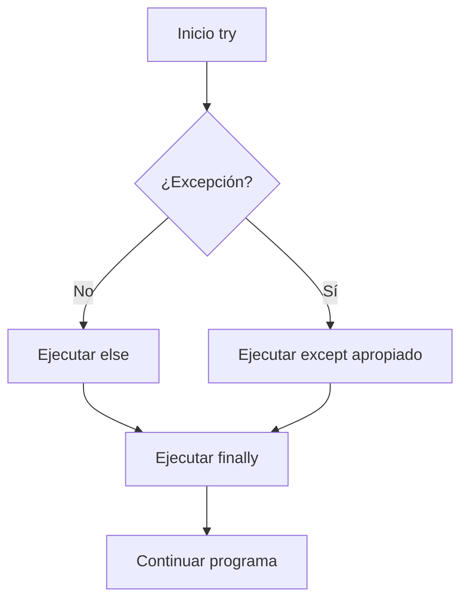

(excepciones-capitulo)=
# Manejo de Excepciones

## Introducción y Motivación

En el mundo real, los programas enfrentan situaciones inesperadas: usuarios ingresan datos incorrectos, archivos no existen, conexiones de red fallan, memoria se agota. Un programa profesional debe anticipar estos problemas y manejarlos elegantemente, sin "romperse" ni perder datos.

Las **excepciones** son el mecanismo de Python para manejar errores de forma estructurada y controlada.

:::{important} ¿Por qué son importantes las excepciones?
Sin manejo de excepciones:
```python
# ❌ El programa se rompe abruptamente
edad = int(input("Edad: "))  # Usuario ingresa "abc"
# Traceback (most recent call last):
#   File "...", line 1, in <module>
# ValueError: invalid literal for int() with base 10: 'abc'
# PROGRAMA TERMINADO ☠️
```

Con manejo de excepciones:
```python
# ✓ El programa continúa funcionando
try:
    edad = int(input("Edad: "))
except ValueError:
    print("Error: ingrese un número válido")
    edad = 0
# PROGRAMA CONTINÚA ✓
```
:::

En este capítulo aprenderás:
- Entender qué son las excepciones
- Tipos comunes de excepciones en Python
- Capturar y manejar excepciones con try-except
- Usar else y finally
- Lanzar tus propias excepciones
- Crear excepciones personalizadas
- Debugging y técnicas de diagnóstico
- Validación robusta de datos
- Buenas prácticas profesionales

---

(que-son-excepciones)=
## ¿Qué son las Excepciones?

Una **excepción** es un evento que ocurre durante la ejecución de un programa y que interrumpe el flujo normal de instrucciones.

### Excepciones vs Errores de Sintaxis

```{code-cell} ipython3
# Error de sintaxis - no puede ejecutarse
if x = 5:  # SyntaxError: invalid syntax
    print(x)

# Excepción - se detecta durante la ejecución
x = 5
y = 0
resultado = x / y  # ZeroDivisionError
```

:::{note} Diferencia clave
- **Errores de sintaxis**: Python no puede ni empezar a ejecutar
- **Excepciones**: Ocurren durante la ejecución, pueden manejarse
:::

### Anatomía de una Excepción

Cuando ocurre una excepción, Python muestra un **traceback**:

```{code-cell} ipython3
def dividir(a, b):
    return a / b

def calcular():
    resultado = dividir(10, 0)
    return resultado

calcular()
```

**Salida:**
```
Traceback (most recent call last):
  File "programa.py", line 7, in <module>
    calcular()
  File "programa.py", line 5, in calcular
    resultado = dividir(10, 0)
  File "programa.py", line 2, in dividir
    return a / b
ZeroDivisionError: division by zero
```

**Partes del traceback:**
1. `Traceback (most recent call last):` - Inicio del seguimiento
2. Secuencia de llamadas (de más reciente a más antigua)
3. `ZeroDivisionError` - Tipo de excepción
4. `division by zero` - Mensaje descriptivo

---

(tipos-excepciones)=
## Tipos Comunes de Excepciones

Python tiene muchas excepciones built-in. Aquí las más importantes:

### ValueError

Valor inapropiado (tipo correcto, valor incorrecto):

```{code-cell} ipython3
# Conversión inválida
numero = int("abc")  # ValueError: invalid literal for int()

# Valor fuera de rango
import math
math.sqrt(-1)  # ValueError: math domain error

# Desempaquetado incorrecto
a, b = [1, 2, 3]  # ValueError: too many values to unpack
```

### TypeError

Tipo inapropiado:

```{code-cell} ipython3
# Operación entre tipos incompatibles
resultado = "texto" + 5  # TypeError: can only concatenate str

# Función llamada con tipo incorrecto
len(5)  # TypeError: object of type 'int' has no len()

# Índice no entero
lista = [1, 2, 3]
lista[1.5]  # TypeError: list indices must be integers
```

### KeyError

Clave no existe en diccionario:

```{code-cell} ipython3
persona = {"nombre": "Ana", "edad": 20}
ciudad = persona["ciudad"]  # KeyError: 'ciudad'

# También en .pop()
persona.pop("ciudad")  # KeyError: 'ciudad'
```

### IndexError

Índice fuera de rango:

```{code-cell} ipython3
lista = [1, 2, 3]
elemento = lista[10]  # IndexError: list index out of range

# También con índices negativos excesivos
elemento = lista[-10]  # IndexError: list index out of range
```

### AttributeError

Atributo o método no existe:

```{code-cell} ipython3
texto = "hola"
texto.append("mundo")  # AttributeError: 'str' has no attribute 'append'

numero = 42
numero.upper()  # AttributeError: 'int' object has no attribute 'upper'
```

### FileNotFoundError

Archivo no existe:

```{code-cell} ipython3
archivo = open("no_existe.txt", "r")
# FileNotFoundError: [Errno 2] No such file or directory: 'no_existe.txt'
```

### ZeroDivisionError

División por cero:

```{code-cell} ipython3
resultado = 10 / 0  # ZeroDivisionError: division by zero
resto = 10 % 0      # ZeroDivisionError: integer division or modulo by zero
```

### ImportError / ModuleNotFoundError

Módulo no encontrado:

```{code-cell} ipython3
import modulo_inexistente  # ModuleNotFoundError: No module named 'modulo_inexistente'

from math import funcion_inexistente  # ImportError: cannot import name 'funcion_inexistente'
```

### NameError

Variable no definida:

```{code-cell} ipython3
print(variable_no_definida)  # NameError: name 'variable_no_definida' is not defined
```

### IndentationError

Error de indentación (tipo especial de SyntaxError):

```{code-cell} ipython3
def funcion():
print("mal indentado")  # IndentationError: expected an indented block
```

### Jerarquía de Excepciones

Todas las excepciones heredan de `BaseException`:

```
BaseException
 ├── SystemExit
 ├── KeyboardInterrupt
 └── Exception
      ├── ArithmeticError
      │    ├── ZeroDivisionError
      │    └── OverflowError
      ├── LookupError
      │    ├── IndexError
      │    └── KeyError
      ├── ValueError
      ├── TypeError
      ├── OSError
      │    ├── FileNotFoundError
      │    └── PermissionError
      └── ... (muchas más)
```

:::{tip} Conocer la jerarquía
Entender la jerarquía te permite capturar grupos de excepciones:
```{code-cell} ipython3
try:
    # código
    pass
except LookupError:
    # Captura IndexError y KeyError
    pass
except ArithmeticError:
    # Captura ZeroDivisionError, OverflowError, etc.
    pass
```
:::

---

(try-except)=
## Try-Except: Manejo Básico

La estructura `try-except` permite capturar y manejar excepciones.

### Sintaxis Básica

```python
try:
    # Código que puede generar excepción
    numero = int(input("Ingrese un número: "))
    resultado = 10 / numero
    print(f"Resultado: {resultado}")
except:
    # Se ejecuta si ocurre CUALQUIER excepción
    print("Ocurrió un error")
```

:::{warning} Evitar `except` sin especificar
Capturar todas las excepciones sin especificar es mala práctica:
```{code-cell} ipython3
# ❌ Muy genérico, oculta errores inesperados
try:
    codigo()
except:
    pass  # ¿Qué error ocurrió? No sabemos

# ✓ Específico, solo maneja errores esperados
try:
    codigo()
except ValueError:
    print("Error de valor")
```
:::

### Capturar Excepción Específica

```python
try:
    edad = int(input("Edad: "))
except ValueError:
    print("Error: debe ingresar un número entero")
    edad = 0
```

### Capturar Múltiples Excepciones

**Opción 1: Varios except**
```python
try:
    numero = int(input("Número: "))
    resultado = 10 / numero
    archivo = open("datos.txt")
except ValueError:
    print("Error: número inválido")
except ZeroDivisionError:
    print("Error: no se puede dividir por cero")
except FileNotFoundError:
    print("Error: archivo no encontrado")
```

**Opción 2: Tuple de excepciones**
```python
try:
    numero = int(input("Número: "))
    resultado = 10 / numero
except (ValueError, ZeroDivisionError):
    print("Error en el cálculo")
```

### Capturar el Objeto Excepción

```python
try:
    numero = int(input("Número: "))
except ValueError as error:
    print(f"Error específico: {error}")
    print(f"Tipo: {type(error)}")
    print(f"Args: {error.args}")
```

**Salida (si usuario ingresa "abc"):**
```
Error específico: invalid literal for int() with base 10: 'abc'
Tipo: <class 'ValueError'>
Args: ("invalid literal for int() with base 10: 'abc'",)
```

### Ejemplo: Validación Robusta

```python
def solicitar_entero(mensaje, minimo=None, maximo=None):
    """Solicita un entero con validación.
    
    Args:
        mensaje: Mensaje para mostrar.
        minimo: Valor mínimo opcional.
        maximo: Valor máximo opcional.
    
    Returns:
        Entero válido.
    """
    while True:
        try:
            valor = int(input(mensaje))
            
            # Validar rango
            if minimo is not None and valor < minimo:
                print(f"Error: debe ser >= {minimo}")
                continue
            
            if maximo is not None and valor > maximo:
                print(f"Error: debe ser <= {maximo}")
                continue
            
            return valor
            
        except ValueError:
            print("Error: ingrese un número entero válido")

# Uso
edad = solicitar_entero("Edad (0-120): ", minimo=0, maximo=120)
print(f"Edad ingresada: {edad}")
```

---

(try-except-else-finally)=
## Try-Except-Else-Finally

Python ofrece cláusulas adicionales para control más fino.

### Else: Cuando NO Hay Excepción

`else` se ejecuta solo si NO ocurrió ninguna excepción:

```python
try:
    numero = int(input("Número: "))
    resultado = 10 / numero
except ValueError:
    print("Error: número inválido")
except ZeroDivisionError:
    print("Error: división por cero")
else:
    # Solo se ejecuta si NO hubo excepción
    print(f"Resultado exitoso: {resultado}")
```

### Finally: Siempre Se Ejecuta

`finally` se ejecuta SIEMPRE, haya o no excepción:

```{code-cell} ipython3
archivo = None
try:
    archivo = open("datos.txt", "r")
    contenido = archivo.read()
    print(contenido)
except FileNotFoundError:
    print("Archivo no encontrado")
finally:
    # Siempre cierra el archivo si se abrió
    if archivo:
        archivo.close()
        print("Archivo cerrado")
```

### Estructura Completa

```{code-cell} ipython3
try:
    # Código que puede generar excepción
    print("Intentando operación...")
    resultado = operacion_riesgosa()
except TipoError1:
    # Maneja TipoError1
    print("Error tipo 1")
except TipoError2:
    # Maneja TipoError2
    print("Error tipo 2")
else:
    # Solo si NO hubo excepción
    print("Operación exitosa")
finally:
    # SIEMPRE se ejecuta
    print("Limpieza de recursos")
```

**Flujo de ejecución:**



### Ejemplo: Lectura Segura de Archivo

```{code-cell} ipython3
def leer_archivo_seguro(nombre_archivo):
    """Lee un archivo de forma segura.
    
    Args:
        nombre_archivo: Nombre del archivo.
    
    Returns:
        Contenido del archivo o None si hay error.
    """
    archivo = None
    try:
        print(f"Abriendo {nombre_archivo}...")
        archivo = open(nombre_archivo, "r", encoding="utf-8")
        contenido = archivo.read()
        
    except FileNotFoundError:
        print(f"Error: {nombre_archivo} no existe")
        return None
        
    except PermissionError:
        print(f"Error: sin permisos para leer {nombre_archivo}")
        return None
        
    except UnicodeDecodeError:
        print(f"Error: problema de codificación en {nombre_archivo}")
        return None
        
    else:
        # Solo si la lectura fue exitosa
        print(f"Archivo leído: {len(contenido)} caracteres")
        return contenido
        
    finally:
        # Siempre cierra el archivo
        if archivo:
            archivo.close()
            print("Archivo cerrado")

# Uso
contenido = leer_archivo_seguro("datos.txt")
if contenido:
    print(contenido[:100])  # Primeros 100 caracteres
```

:::{note} Context managers vs finally
Para archivos, es mejor usar `with` (context manager):
```{code-cell} ipython3
# ✓ Más simple y seguro
try:
    with open("datos.txt", "r") as archivo:
        contenido = archivo.read()
except FileNotFoundError:
    print("Archivo no encontrado")
# El archivo se cierra automáticamente
```
:::

---

(lanzar-excepciones)=
## Lanzar Excepciones: raise

Podés lanzar excepciones intencionalmente con `raise`.

### Raise Básico

```{code-cell} ipython3
def dividir(a, b):
    """Divide a entre b.
    
    Raises:
        ValueError: Si b es cero.
    """
    if b == 0:
        raise ValueError("No se puede dividir por cero")
    return a / b

# Uso
try:
    resultado = dividir(10, 0)
except ValueError as e:
    print(f"Error: {e}")
```

### Raise con Diferentes Tipos

```{code-cell} ipython3
def validar_edad(edad):
    """Valida una edad.
    
    Args:
        edad: Edad a validar.
    
    Raises:
        TypeError: Si edad no es int.
        ValueError: Si edad está fuera de rango.
    """
    if not isinstance(edad, int):
        raise TypeError(f"Edad debe ser entero, no {type(edad).__name__}")
    
    if edad < 0:
        raise ValueError("Edad no puede ser negativa")
    
    if edad > 120:
        raise ValueError("Edad no puede ser mayor a 120")
    
    return True

# Uso
try:
    validar_edad("25")  # TypeError
except TypeError as e:
    print(e)

try:
    validar_edad(-5)  # ValueError
except ValueError as e:
    print(e)
```

### Re-lanzar Excepciones

Capturar, procesar y re-lanzar:

```{code-cell} ipython3
def procesar_archivo(nombre):
    """Procesa un archivo con logging.
    
    Raises:
        FileNotFoundError: Si el archivo no existe.
    """
    try:
        with open(nombre, "r") as archivo:
            return archivo.read()
    except FileNotFoundError:
        print(f"LOG: Intento fallido de abrir {nombre}")
        raise  # Re-lanza la misma excepción

# Uso
try:
    contenido = procesar_archivo("no_existe.txt")
except FileNotFoundError:
    print("Manejando en nivel superior")
```

### Raise from: Cadena de Excepciones

Preservar la excepción original:

```{code-cell} ipython3
def cargar_configuracion(archivo):
    """Carga configuración desde JSON.
    
    Raises:
        RuntimeError: Si hay error al cargar.
    """
    import json
    
    try:
        with open(archivo, "r") as f:
            return json.load(f)
    except (FileNotFoundError, json.JSONDecodeError) as e:
        # Lanza nueva excepción preservando la original
        raise RuntimeError(f"Error al cargar configuración") from e

# Uso
try:
    config = cargar_configuracion("config.json")
except RuntimeError as e:
    print(f"Error: {e}")
    print(f"Causa original: {e.__cause__}")
```

---

(excepciones-personalizadas)=
## Excepciones Personalizadas

Crear tus propias excepciones para errores específicos de tu dominio.

### Excepción Simple

```{code-cell} ipython3
class ErrorValidacion(Exception):
    """Excepción base para errores de validación."""
    pass

def validar_email(email):
    """Valida formato de email.
    
    Raises:
        ErrorValidacion: Si el email es inválido.
    """
    if "@" not in email:
        raise ErrorValidacion(f"Email inválido: {email}")
    return True

# Uso
try:
    validar_email("usuario.com")
except ErrorValidacion as e:
    print(f"Error: {e}")
```

### Jerarquía de Excepciones

```{code-cell} ipython3
class ErrorAplicacion(Exception):
    """Excepción base para la aplicación."""
    pass

class ErrorValidacion(ErrorAplicacion):
    """Error de validación de datos."""
    pass

class ErrorAutenticacion(ErrorAplicacion):
    """Error de autenticación."""
    pass

class ErrorPermiso(ErrorAplicacion):
    """Error de permisos."""
    pass

# Uso específico
def verificar_acceso(usuario, recurso):
    """Verifica acceso de usuario a recurso.
    
    Raises:
        ErrorAutenticacion: Si usuario no autenticado.
        ErrorPermiso: Si no tiene permisos.
    """
    if not usuario.autenticado:
        raise ErrorAutenticacion("Usuario no autenticado")
    
    if not usuario.tiene_permiso(recurso):
        raise ErrorPermiso(f"Sin permiso para {recurso}")

# Captura por jerarquía
try:
    verificar_acceso(usuario, "admin_panel")
except ErrorAutenticacion:
    print("Debe iniciar sesión")
except ErrorPermiso:
    print("Acceso denegado")
except ErrorAplicacion:
    # Captura cualquier error de la aplicación
    print("Error general de la aplicación")
```

### Excepciones con Atributos

```{code-cell} ipython3
class ErrorRangoEdad(Exception):
    """Excepción para edad fuera de rango."""
    
    def __init__(self, edad, minimo, maximo):
        self.edad = edad
        self.minimo = minimo
        self.maximo = maximo
        mensaje = f"Edad {edad} fuera de rango [{minimo}, {maximo}]"
        super().__init__(mensaje)

def registrar_persona(nombre, edad):
    """Registra una persona.
    
    Raises:
        ErrorRangoEdad: Si edad está fuera de rango.
    """
    EDAD_MIN = 0
    EDAD_MAX = 120
    
    if not (EDAD_MIN <= edad <= EDAD_MAX):
        raise ErrorRangoEdad(edad, EDAD_MIN, EDAD_MAX)
    
    return {"nombre": nombre, "edad": edad}

# Uso
try:
    persona = registrar_persona("Ana", 150)
except ErrorRangoEdad as e:
    print(f"Error: {e}")
    print(f"Edad ingresada: {e.edad}")
    print(f"Rango válido: [{e.minimo}, {e.maximo}]")
```

### Ejemplo Completo: Sistema de Validación

```{code-cell} ipython3
"""Sistema de validación con excepciones personalizadas."""

class ErrorValidacion(Exception):
    """Excepción base para validación."""
    pass

class ErrorEmail(ErrorValidacion):
    """Email inválido."""
    pass

class ErrorTelefono(ErrorValidacion):
    """Teléfono inválido."""
    pass

class ErrorDNI(ErrorValidacion):
    """DNI inválido."""
    pass

class Validador:
    """Validador de datos personales."""
    
    @staticmethod
    def email(email):
        """Valida email.
        
        Raises:
            ErrorEmail: Si es inválido.
        """
        if not isinstance(email, str):
            raise ErrorEmail("Email debe ser string")
        
        if "@" not in email or "." not in email:
            raise ErrorEmail(f"Formato de email inválido: {email}")
        
        partes = email.split("@")
        if len(partes) != 2 or not partes[0] or not partes[1]:
            raise ErrorEmail(f"Formato de email inválido: {email}")
        
        return True
    
    @staticmethod
    def telefono(telefono):
        """Valida teléfono argentino (10 dígitos).
        
        Raises:
            ErrorTelefono: Si es inválido.
        """
        # Limpiar caracteres no numéricos
        numeros = "".join(c for c in str(telefono) if c.isdigit())
        
        if len(numeros) != 10:
            raise ErrorTelefono(
                f"Teléfono debe tener 10 dígitos, tiene {len(numeros)}"
            )
        
        return True
    
    @staticmethod
    def dni(dni):
        """Valida DNI argentino (7-8 dígitos).
        
        Raises:
            ErrorDNI: Si es inválido.
        """
        try:
            dni_int = int(dni)
        except ValueError:
            raise ErrorDNI("DNI debe contener solo dígitos")
        
        if not (1_000_000 <= dni_int <= 99_999_999):
            raise ErrorDNI(
                f"DNI debe tener 7-8 dígitos, recibido: {dni}"
            )
        
        return True

def registrar_usuario(nombre, email, telefono, dni):
    """Registra un usuario validando sus datos.
    
    Returns:
        Dict con datos del usuario.
    
    Raises:
        ErrorValidacion: Si algún dato es inválido.
    """
    # Validar cada campo
    Validador.email(email)
    Validador.telefono(telefono)
    Validador.dni(dni)
    
    return {
        "nombre": nombre,
        "email": email,
        "telefono": telefono,
        "dni": dni
    }

# Uso
datos_usuarios = [
    ("Ana", "ana@example.com", "1134567890", "12345678"),
    ("Bruno", "bruno@email", "123", "999"),  # Errores
    ("Carlos", "carlos@test.com", "1198765432", "87654321"),
]

for nombre, email, tel, dni in datos_usuarios:
    try:
        usuario = registrar_usuario(nombre, email, tel, dni)
        print(f"✓ Usuario registrado: {nombre}")
    except ErrorEmail as e:
        print(f"✗ Error en email de {nombre}: {e}")
    except ErrorTelefono as e:
        print(f"✗ Error en teléfono de {nombre}: {e}")
    except ErrorDNI as e:
        print(f"✗ Error en DNI de {nombre}: {e}")
    except ErrorValidacion as e:
        print(f"✗ Error de validación en {nombre}: {e}")
```

---

(debugging)=
## Debugging y Diagnóstico

Técnicas para encontrar y corregir errores.

### Print Debugging

La técnica más simple y efectiva:

```{code-cell} ipython3
def calcular_promedio(numeros):
    print(f"DEBUG: numeros = {numeros}")  # Ver entrada
    print(f"DEBUG: len(numeros) = {len(numeros)}")
    
    total = sum(numeros)
    print(f"DEBUG: total = {total}")  # Ver intermedio
    
    promedio = total / len(numeros)
    print(f"DEBUG: promedio = {promedio}")  # Ver resultado
    
    return promedio

resultado = calcular_promedio([10, 20, 30])
```

:::{tip} Prefijo DEBUG
Usa un prefijo consistente para encontrar y eliminar prints fácilmente:
```{code-cell} ipython3
# Fácil de buscar y eliminar después
print("DEBUG: variable =", variable)
print(f"DEBUG: {nombre=}, {valor=}")  # Python 3.8+
```
:::

### Manejo de Información del Error

```{code-cell} ipython3
import sys
import traceback

def funcion_problematica():
    return 1 / 0

try:
    funcion_problematica()
except Exception as e:
    # Información del error
    print(f"Tipo: {type(e).__name__}")
    print(f"Mensaje: {str(e)}")
    print(f"Args: {e.args}")
    
    # Traceback completo
    print("\nTraceback:")
    traceback.print_exc()
    
    # Información del sistema
    print(f"\nPython: {sys.version}")
```

### Assert: Verificaciones de Desarrollo

`assert` verifica condiciones durante desarrollo:

```{code-cell} ipython3
def calcular_factorial(n):
    """Calcula factorial de n."""
    # Verificación de desarrollo
    assert isinstance(n, int), "n debe ser entero"
    assert n >= 0, "n debe ser no negativo"
    
    if n == 0 or n == 1:
        return 1
    
    resultado = 1
    for i in range(2, n + 1):
        resultado *= i
    
    # Verificación de postcondición
    assert resultado > 0, "Resultado debe ser positivo"
    
    return resultado

# Si assert falla, lanza AssertionError
try:
    calcular_factorial(-5)
except AssertionError as e:
    print(f"Error de assert: {e}")
```

:::{warning} Assert no es para validación de usuario
```{code-cell} ipython3
# ❌ NO usar assert para validar entrada de usuario
def dividir(a, b):
    assert b != 0, "divisor no puede ser cero"
    return a / b

# ✓ Usar if + raise para validación
def dividir(a, b):
    if b == 0:
        raise ValueError("divisor no puede ser cero")
    return a / b
```

Assert puede desactivarse con `python -O`, por lo que no es confiable para validación.
:::

### Logging: Registro Profesional

```{code-cell} ipython3
import logging

# Configurar logging
logging.basicConfig(
    level=logging.DEBUG,
    format='%(asctime)s - %(name)s - %(levelname)s - %(message)s',
    filename='app.log'
)

logger = logging.getLogger(__name__)

def procesar_datos(datos):
    """Procesa datos con logging."""
    logger.info(f"Procesando {len(datos)} elementos")
    
    try:
        resultado = []
        for i, item in enumerate(datos):
            logger.debug(f"Procesando item {i}: {item}")
            
            if item < 0:
                logger.warning(f"Valor negativo en posición {i}: {item}")
            
            resultado.append(item * 2)
        
        logger.info("Procesamiento completado exitosamente")
        return resultado
        
    except Exception as e:
        logger.error(f"Error durante procesamiento: {e}")
        logger.exception("Traceback completo:")  # Incluye traceback
        raise

# Uso
datos = [1, 2, -3, 4, 5]
procesar_datos(datos)
```

**Niveles de logging:**
- `DEBUG`: Información detallada para diagnóstico
- `INFO`: Confirmación de que todo funciona
- `WARNING`: Algo inesperado, pero el programa continúa
- `ERROR`: Error serio, funcionalidad afectada
- `CRITICAL`: Error crítico, programa puede terminar

---

(validacion-robusta)=
## Validación Robusta de Datos

Técnicas para validar entrada del usuario de forma profesional.

### Patrón de Validación Completa

```python
def solicitar_dato(
    mensaje,
    tipo=str,
    validador=None,
    mensaje_error="Valor inválido",
    max_intentos=3
):
    """Solicita y valida un dato del usuario.
    
    Args:
        mensaje: Mensaje para mostrar.
        tipo: Tipo de dato esperado (int, float, str).
        validador: Función de validación adicional.
        mensaje_error: Mensaje si validación falla.
        max_intentos: Intentos máximos antes de lanzar excepción.
    
    Returns:
        Dato validado del tipo correcto.
    
    Raises:
        ValueError: Si se agotan los intentos.
    """
    for intento in range(max_intentos):
        try:
            # Solicitar entrada
            entrada = input(mensaje)
            
            # Convertir a tipo
            valor = tipo(entrada)
            
            # Validación adicional
            if validador and not validador(valor):
                print(mensaje_error)
                continue
            
            return valor
            
        except ValueError:
            print(f"Error: debe ingresar un {tipo.__name__} válido")
            if intento < max_intentos - 1:
                print(f"Intentos restantes: {max_intentos - intento - 1}")
    
    raise ValueError("Máximo de intentos alcanzado")

# Ejemplos de uso

# 1. Edad con validación de rango
edad = solicitar_dato(
    "Edad: ",
    tipo=int,
    validador=lambda x: 0 <= x <= 120,
    mensaje_error="Edad debe estar entre 0 y 120"
)

# 2. Calificación
nota = solicitar_dato(
    "Nota: ",
    tipo=float,
    validador=lambda x: 0 <= x <= 10,
    mensaje_error="Nota debe estar entre 0 y 10"
)

# 3. Email
email = solicitar_dato(
    "Email: ",
    tipo=str,
    validador=lambda x: "@" in x and "." in x,
    mensaje_error="Email debe contener @ y ."
)
```

### Validaciones Comunes

```python
def validar_rango(valor, minimo, maximo):
    """Valida que valor esté en rango."""
    if not (minimo <= valor <= maximo):
        raise ValueError(
            f"Valor {valor} fuera de rango [{minimo}, {maximo}]"
        )
    return True

def validar_no_vacio(texto):
    """Valida que texto no esté vacío."""
    if not texto or not texto.strip():
        raise ValueError("El texto no puede estar vacío")
    return True

def validar_longitud(texto, min_len=None, max_len=None):
    """Valida longitud de texto."""
    longitud = len(texto)
    
    if min_len and longitud < min_len:
        raise ValueError(
            f"Texto demasiado corto (mínimo {min_len} caracteres)"
        )
    
    if max_len and longitud > max_len:
        raise ValueError(
            f"Texto demasiado largo (máximo {max_len} caracteres)"
        )
    
    return True

def validar_opciones(valor, opciones):
    """Valida que valor esté en lista de opciones."""
    if valor not in opciones:
        raise ValueError(
            f"Opción inválida. Opciones válidas: {opciones}"
        )
    return True

# Uso combinado
def solicitar_nombre():
    """Solicita nombre con validaciones."""
    while True:
        try:
            nombre = input("Nombre: ")
            validar_no_vacio(nombre)
            validar_longitud(nombre, min_len=2, max_len=50)
            return nombre.strip().title()
        except ValueError as e:
            print(f"Error: {e}")

def solicitar_opcion(opciones):
    """Solicita opción de lista."""
    print("Opciones:", ", ".join(opciones))
    while True:
        try:
            opcion = input("Seleccione: ")
            validar_opciones(opcion, opciones)
            return opcion
        except ValueError as e:
            print(f"Error: {e}")
```

---

(buenas-practicas-excepciones)=
## Buenas Prácticas

### 1. Ser Específico en Excepciones

```python
# ❌ Muy genérico
try:
    codigo()
except Exception:
    print("Error")

# ✓ Específico
try:
    edad = int(input("Edad: "))
except ValueError:
    print("Error: edad debe ser número entero")
```

### 2. No Silenciar Excepciones

```{code-cell} ipython3
# ❌ Silencia errores
try:
    codigo_importante()
except:
    pass  # ¡Error oculto!

# ✓ Maneja o propaga
try:
    codigo_importante()
except ValueError as e:
    logger.error(f"Error de valor: {e}")
    raise
```

### 3. Usar Jerarquía Correcta

```{code-cell} ipython3
# ❌ Captura amplia primero
try:
    codigo()
except Exception:  # Captura TODO
    pass
except ValueError:  # Nunca se ejecuta
    pass

# ✓ De específico a general
try:
    codigo()
except ValueError:
    pass
except TypeError:
    pass
except Exception:  # Solo si es necesario
    pass
```

### 4. Documentar Excepciones

```{code-cell} ipython3
def dividir(a, b):
    """Divide a entre b.
    
    Args:
        a: Dividendo.
        b: Divisor.
    
    Returns:
        Resultado de la división.
    
    Raises:
        TypeError: Si a o b no son números.
        ValueError: Si b es cero.
    """
    if not isinstance(a, (int, float)) or not isinstance(b, (int, float)):
        raise TypeError("Ambos argumentos deben ser números")
    
    if b == 0:
        raise ValueError("El divisor no puede ser cero")
    
    return a / b
```

### 5. EAFP vs LBYL

Python favorece **EAFP** (Easier to Ask for Forgiveness than Permission):

```{code-cell} ipython3
# LBYL - Look Before You Leap
if "clave" in diccionario:
    valor = diccionario["clave"]
else:
    valor = None

# EAFP - Easier to Ask for Forgiveness than Permission (Pythonic)
try:
    valor = diccionario["clave"]
except KeyError:
    valor = None

# Mejor: usar método .get()
valor = diccionario.get("clave")  # Retorna None si no existe
```

### 6. Excepciones en Funciones

```{code-cell} ipython3
# ✓ Lanzar excepciones en funciones para errores
def procesar_usuario(usuario_id):
    """Procesa un usuario.
    
    Raises:
        ValueError: Si usuario_id es inválido.
        RuntimeError: Si el usuario no existe.
    """
    if not isinstance(usuario_id, int) or usuario_id <= 0:
        raise ValueError("usuario_id debe ser entero positivo")
    
    usuario = buscar_usuario(usuario_id)
    if not usuario:
        raise RuntimeError(f"Usuario {usuario_id} no encontrado")
    
    return procesar(usuario)

# El código que llama decide cómo manejar
try:
    resultado = procesar_usuario(usuario_id)
except ValueError as e:
    print(f"ID inválido: {e}")
except RuntimeError as e:
    print(f"Error de procesamiento: {e}")
```

---

(ejercicios-excepciones)=
## Ejercicios

(ejercicio-6-1)=
### Ejercicio 6.1: Calculadora Robusta

Creá una calculadora que maneje todas las excepciones posibles.

**Funcionalidades:**
- Operaciones: +, -, *, /, //, %, **
- Validar entrada de números
- Manejar división por cero
- Manejar operadores inválidos
- Permitir múltiples cálculos
- Mostrar mensajes de error claros

**Ejemplo:**
```
Calculadora
1. 5 + 3 = 8
2. 10 / 0 = Error: división por cero
3. abc + 5 = Error: número inválido
```

---

(ejercicio-6-2)=
### Ejercicio 6.2: Validador de Formulario

Creá un sistema que valide un formulario de registro con excepciones personalizadas.

**Campos a validar:**
- Nombre: 2-50 caracteres, no vacío
- Email: formato válido (contiene @ y .)
- Edad: 18-100
- Teléfono: 10 dígitos
- Contraseña: mínimo 8 caracteres, al menos una mayúscula y un número

**Excepciones personalizadas:**
- `ErrorNombre`
- `ErrorEmail`
- `ErrorEdad`
- `ErrorTelefono`
- `ErrorContraseña`

---

(ejercicio-6-3)=
### Ejercicio 6.3: Lector de Archivos con Manejo de Errores

Creá funciones para leer diferentes tipos de archivos con manejo robusto de errores.

**Funciones:**
```{code-cell} ipython3
def leer_texto(archivo):
    """Lee archivo de texto."""
    pass

def leer_numeros(archivo):
    """Lee archivo con números (uno por línea)."""
    pass

def leer_csv_simple(archivo):
    """Lee CSV y retorna lista de listas."""
    pass
```

**Maneja:**
- Archivo no existe
- Sin permisos
- Formato incorrecto
- Encoding incorrecto

---

(ejercicio-6-4)=
### Ejercicio 6.4: Sistema de Login

Implementá un sistema de login con manejo de excepciones.

**Excepciones personalizadas:**
- `ErrorUsuarioNoExiste`
- `ErrorContraseñaIncorrecta`
- `ErrorCuentaBloqueada`
- `ErrorIntentosAgotados`

**Funcionalidades:**
- Máximo 3 intentos de login
- Bloquear cuenta tras 3 fallos
- Registrar intentos de login
- Mensajes específicos para cada error

---

(ejercicio-6-5)=
### Ejercicio 6.5: Procesador de Transacciones Bancarias

Creá un sistema que procese transacciones bancarias con validación exhaustiva.

**Excepciones:**
- `ErrorSaldoInsuficiente`
- `ErrorMontoInvalido`
- `ErrorCuentaInexistente`
- `ErrorLimiteExcedido`

**Operaciones:**
- Depósito (validar monto > 0)
- Retiro (validar saldo, monto, límite diario)
- Transferencia (validar ambas cuentas, saldo)

**Límites:**
- Retiro máximo: $50,000 por operación
- Límite diario: $100,000

---

(ejercicio-6-6)=
### Ejercicio 6.6: Parser de Configuración

Creá un parser que lea un archivo de configuración con formato clave=valor.

**Maneja:**
- Archivo no existe
- Formato incorrecto
- Claves duplicadas
- Valores inválidos (tipos)

**Ejemplo de archivo config.txt:**
```
nombre=MiApp
version=1.0
puerto=8080
debug=true
```

**Convierte tipos:**
- Números a int/float
- true/false a bool
- Resto a string

---

(ejercicio-6-7)=
### Ejercicio 6.7: Sistema de Reservas con Validación

Implementá un sistema de reservas (hotel, restaurant, etc.) con validación completa.

**Validaciones:**
- Fecha válida (formato, no pasada)
- Cantidad de personas (1-10)
- Horario válido (09:00-22:00)
- Disponibilidad

**Excepciones:**
- `ErrorFecha`
- `ErrorHorario`
- `ErrorCapacidad`
- `ErrorDisponibilidad`

---

(ejercicio-6-8)=
### Ejercicio 6.8: Conversor de Unidades Robusto

Creá un conversor de unidades con manejo completo de errores.

**Conversiones:**
- Temperatura: Celsius, Fahrenheit, Kelvin
- Longitud: metros, kilómetros, millas
- Peso: kilogramos, libras, onzas

**Valida:**
- Unidades válidas
- Números válidos
- Rangos físicos (ej: temperatura > -273.15°C)

**Excepciones:**
- `ErrorUnidadInvalida`
- `ErrorValorFueraDeRango`
- `ErrorConversionImposible`

---

(ejercicio-6-9)=
### Ejercicio 6.9: Evaluador de Expresiones Matemáticas

Creá un evaluador de expresiones matemáticas simples con manejo de errores.

**Soporta:**
- Operaciones: +, -, *, /, **
- Paréntesis
- Números decimales

**Maneja:**
- Sintaxis incorrecta
- División por cero
- Paréntesis desbalanceados
- Caracteres inválidos

**Ejemplo:**
```
Entrada: (5 + 3) * 2
Salida: 16

Entrada: 10 / 0
Error: División por cero

Entrada: 5 + * 3
Error: Sintaxis inválida
```

---

(ejercicio-6-10)=
### Ejercicio 6.10: Sistema de Gestión de Estudiantes con Validación Completa

Creá un sistema completo de gestión de estudiantes con todas las validaciones.

**Funcionalidades:**
- Agregar estudiante (nombre, DNI, email, edad, notas)
- Modificar notas
- Calcular promedios
- Listar estudiantes
- Guardar/cargar desde archivo JSON

**Validaciones:**
- Nombre: 2-50 caracteres
- DNI: único, 7-8 dígitos
- Email: formato válido, único
- Edad: 17-99
- Notas: 0-10

**Excepciones personalizadas:**
- `ErrorEstudianteExiste`
- `ErrorEstudianteNoExiste`
- `ErrorDNIDuplicado`
- `ErrorEmailDuplicado`
- `ErrorNota`

**Manejo de archivos:**
- Archivo corrupto
- Formato incorrecto
- Backup automático antes de guardar


---

(uso-ia-excepciones)=
## Uso Ético y Efectivo de la IA en Excepciones

:::{important} La IA: Tu Asistente de Aprendizaje, No Tu Reemplazo
Manejar errores correctamente es lo que separa código amateur de código profesional. La IA puede ayudarte a entender excepciones, pero **vos debés aprender a anticipar y manejar errores** en tu código.
:::

### Buenas Prácticas para Excepciones

#### Generar Ejercicios Adicionales

- *"Genera ejercicios sobre manejo de excepciones con try-except en Python"*
- *"Crea problemas que requieran validación robusta de entrada con manejo de errores"*
- *"Dame ejercicios que practiquen el uso de `finally` para limpieza de recursos"*

#### Interpretar Mensajes de Error

- *"Tengo este stack trace: [pega el error]. ¿Qué significa exactamente y cómo lo soluciono?"*
- *"Mi programa lanza `ValueError: invalid literal for int()`. ¿Qué está causando esto?"*
- *"¿Qué diferencia hay entre `ValueError`, `TypeError` y `KeyError`?"*

#### Diseñar Manejo de Errores

- *"Estoy validando entrada del usuario. ¿Debería usar try-except o if-else?"*
- *"Tengo varios tipos de errores posibles en esta función. ¿Cómo estructuro múltiples except?"*
- *"¿Cuándo debería usar `finally` versus simplemente poner código después del try-except?"*

#### Crear Excepciones Personalizadas

- *"¿Cuándo tiene sentido crear mi propia clase de excepción?"*
- *"¿Cómo nombro excepciones personalizadas siguiendo convenciones de Python?"*

#### Buenas Prácticas

- *"¿Es mala práctica usar `except Exception:`? ¿Por qué?"*
- *"¿Debería 'silenciar' errores con `pass` en un except?"*
- *"¿Cómo decido si capturar una excepción o dejar que se propague?"*

### Ejemplos Específicos de este Módulo

**Situación 1**: Debugging con stack trace

❌ **Incorrecto**:
```
Prompt: "Mi programa da error. Arreglalo.
[pega 200 líneas de código sin contexto]"
```

✅ **Correcto**:
```
Prompt: "Estoy convirtiendo entrada del usuario a entero:
edad = int(input("Edad: "))

Cuando ingreso 'abc', obtengo:
ValueError: invalid literal for int() with base 10: 'abc'

Entiendo QUÉ es el error, pero no sé DÓNDE poner el try-except.
¿Debería envolver solo la conversión o también el input?"
```

**Situación 2**: Diseño de validación

❌ **Incorrecto**:
```
Prompt: "Dame código que valide entrada de usuario para edad."
```

✅ **Correcto**:
```
Prompt: "Estoy validando edad del usuario. Identifiqué estos errores posibles:
- El usuario ingresa texto no numérico (ValueError)
- El usuario ingresa número negativo
- El usuario ingresa número > 150

¿Debería manejar el ValueError con try-except y el resto con if,
o hay mejor enfoque?"
```

### Filosofía del Manejo de Errores

:::{tip} Principios clave
1. **Específico es mejor que genérico**: Captura excepciones específicas, no `Exception` genérica
2. **Fail fast, fail loud**: No silencies errores sin buena razón
3. **Validación temprana**: Valida entradas lo antes posible
4. **Documenta las excepciones**: En docstrings, indica qué excepciones puede lanzar tu función
5. **Limpieza garantizada**: Usa `finally` o context managers para liberar recursos

**La IA puede ayudarte a entender estos principios**, pero vos debés aplicarlos.
:::

### Uso Avanzado: Revisión de Manejo de Errores

```
Prompt: "Revisa el manejo de errores en este código:
[tu código con try-except]

¿Hay alguna excepción que debería capturar y no lo hago?
¿Estoy capturando excepciones demasiado genéricas?
¿El mensaje de error al usuario es suficientemente claro?"
```

### Errores Comunes en este Módulo

:::{danger} No uses try-except para ocultar problemas
Un error común es usar try-except para "que el programa no se rompa" sin realmente resolver el problema:

```{code-cell} ipython3
# ¡MAL! Silencia el error sin resolverlo
try:
    resultado = operacion_peligrosa()
except:
    pass  # "Ya está, lo arreglé"

# BIEN: Maneja el error apropiadamente
try:
    resultado = operacion_peligrosa()
except ValueError as e:
    print(f"Error: entrada inválida - {e}")
    resultado = valor_por_defecto
```

**No uses excepciones para esconder errores**, úsalas para manejarlos correctamente.
:::

### Debugging con IA

La IA es especialmente útil para interpretar stack traces complejos:

```
Prompt: "Tengo este error y no entiendo el stack trace:
[pega el stack trace completo]

¿Podrías explicarme:
1. Dónde se originó el error
2. Qué significa cada parte del trace
3. Cuál es la causa probable
4. Qué debería verificar primero?"
```

Pero **siempre leé el stack trace vos mismo primero** e intenta entenderlo.

### Integración con Módulos Anteriores

El manejo de excepciones se integra con todo lo que aprendiste:

- **Funciones**: Las funciones deben documentar qué excepciones pueden lanzar
- **Estructuras de datos**: Acceder a índices o claves puede causar excepciones
- **Módulos**: Importar módulos puede fallar, archivos pueden no existir
- **Validación**: La validación robusta requiere manejo de excepciones

**La IA puede ayudarte a conectar estos conceptos**, pero vos debés verlos como un sistema integrado.

---


---

## Resumen

En este capítulo aprendiste sobre manejo de excepciones:

✓ **Qué son las excepciones**: Eventos que interrumpen el flujo normal  
✓ **Tipos comunes**: ValueError, TypeError, KeyError, IndexError, etc.  
✓ **Try-except**: Capturar y manejar excepciones  
✓ **Else y finally**: Control fino del flujo  
✓ **Raise**: Lanzar excepciones intencionalmente  
✓ **Excepciones personalizadas**: Crear tipos específicos de errores  
✓ **Debugging**: Print, logging, assert, traceback  
✓ **Validación robusta**: Patrones para validar entrada del usuario  
✓ **Buenas prácticas**: EAFP, ser específico, documentar  

Las excepciones son fundamentales para escribir código robusto y profesional que:
- No se "rompe" ante errores esperables
- Proporciona mensajes claros al usuario
- Facilita el debugging
- Separa código normal de manejo de errores
- Permite control granular del flujo

:::{important} Excepciones y código profesional
El manejo apropiado de excepciones es lo que diferencia un programa amateur de uno profesional:

**Código amateur:**
- Se rompe con entrada incorrecta
- Mensajes de error crípticos
- Pierde datos al fallar
- Difícil de debuggear

**Código profesional:**
- Maneja errores elegantemente
- Mensajes claros y útiles
- Preserva datos importantes
- Fácil de diagnosticar y corregir

Dominar las excepciones te convierte en un programador profesional.
:::

---

## Conclusión

Las excepciones son una herramienta poderosa que:

1. **Mejoran la robustez**: Tu programa no se rompe ante lo inesperado
2. **Mejoran la UX**: Mensajes claros en lugar de crashes
3. **Facilitan el debugging**: Información detallada sobre errores
4. **Separan concerns**: Código normal vs manejo de errores
5. **Permiten validación elegante**: Sin if/else anidados interminables

Con el conocimiento de este capítulo, podés:
- Escribir código que falle elegantemente
- Validar datos de forma robusta
- Crear sistemas de error personalizados
- Debuggear eficientemente
- Manejar archivos y recursos de forma segura
- Escribir código de calidad profesional

:::{tip} Practica con los ejercicios
Los 10 ejercicios de este capítulo cubren escenarios reales que encontrarás en tu carrera. Resolverlos te dará experiencia práctica invaluable en:
- Validación de datos del usuario
- Manejo de archivos
- Sistemas complejos con múltiples puntos de fallo
- Creación de jerarquías de excepciones
- Debugging y diagnóstico

¡Dedicá tiempo a resolverlos todos!
:::

**¡Éxitos escribiendo código robusto y profesional!** 🛡️💪
